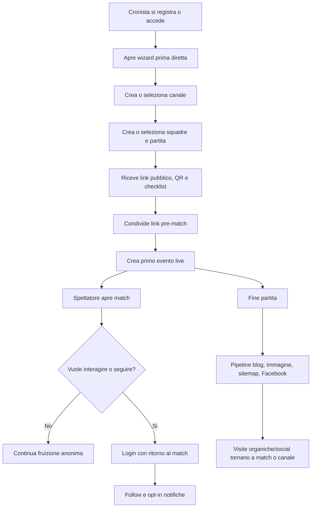

# Analisi Funzionale: Roadmap da Competitor Gap Analysis

## Summary

Questa analisi traduce `projects/competitor-gap-roadmap/analysis/product-owner-competitor-gap-analysis.md` in requisiti funzionali attivabili per Rugby Radio Live. L'obiettivo e chiudere il ciclo di adozione: un cronista deve arrivare rapidamente alla prima diretta condivisa, uno spettatore deve capire perche registrarsi e tornare, e il prodotto deve misurare il percorso da visita a engagement e valore per il club.

L'analisi usa come fonti principali la gap analysis, `Rugby Radio Live (product)`, i workflow `Cronista Telecronaca`, `Spettatore Partita`, `Riproduzione Audio Telecronaca`, l'articolo `Creazione Rapida Partita`, la pipeline post-partita e la documentazione AdSense/SEO.

## Business Goal

Incrementare adoption, retention e sostenibilita di RRL senza trasformarlo in un gestionale club completo. Il prodotto deve restare un live companion leggero per rugby amatoriale e giovanile, con focus su diretta rapida, esperienza spettatore, radio TTS, contenuti post-partita e misurazione.

## Actors

| Actor | Need | Primary outcomes |
| --- | --- | --- |
| Cronista | Creare e gestire una diretta con poca attenzione disponibile | Partita creata, link condiviso, primo evento registrato, spettatori attivati |
| Spettatore anonimo | Seguire una partita pubblica senza frizione | Vedere stato live, eventi, punteggio, audio quando disponibile |
| Spettatore registrato | Interagire e tornare | Follow, commenti, reazioni, voti, notifiche |
| Team manager / club | Rendere visibile il club e valorizzare sponsor/local community | Canale ricorrente, archivio, sponsor/supporto, contenuti post-partita |
| Admin operativo | Monitorare job, contenuti, backup e salute piattaforma | Stato pipeline, retry, health, alert e audit |

## Scope

### In Scope

- Estensione funzionale del percorso "prima diretta" sopra il wizard di creazione rapida gia esistente.
- CTA e conversione spettatore anonimo verso follow, login e notifiche.
- Affidabilita percepita della pagina live e della modalita radio.
- Tassonomia eventi prodotto per activation, retention, share, blog e monetizzazione.
- Dashboard o viste operative minime per funnel e pipeline post-partita.
- Requisiti funzionali per sponsor/supporto canale o partita.

### Out of Scope

- Streaming video live.
- Paywall sul live match.
- Rifacimento completo del gestionale club.
- Nuove comparazioni competitor con ricerca esterna.
- Decisioni tecniche su schema database, framework o architettura applicativa.

### Deferred

- Import CSV roster e storico stagioni completo.
- Preference center notifiche avanzato multi-canale.
- Pubblicazione social multi-piattaforma oltre Facebook.
- Admin console completa per tutti i job e tutte le policy operative.

## Target Process

## Functional Requirements

### FA-01 Prima Diretta Cronista

- The system shall expose a "prima diretta" path that starts from the existing quick match wizard.
- The system shall allow the cronista to choose whether the match is a demo or a real match.
- The system shall preserve the existing create-or-reference behavior for channel, home team and away team.
- The system shall show a pre-match checklist after successful match creation.
- The checklist shall include public match link, QR code, share action, first event action and radio availability status when known.
- The system shall provide a recoverable error state when quick match creation fails, without losing form data already entered by the user where feasible.
- The system shall record funnel events for wizard opened, step completed, match created, share clicked and first event created.

### FA-02 Spettatore Activation

- The public match page shall remain readable without account for core live information.
- The system shall present contextual CTA for follow, comment, vote or reaction when the spectator reaches an action requiring identity.
- When login is required, the system shall return the spectator to the original match and resume or re-offer the intended action.
- After a successful follow, the system shall offer notification opt-in with clear benefit copy.
- The system shall track view match, CTA click, login started, login completed, follow completed and notification enabled.

### FA-03 Live Trust and Freshness

- The public match page shall display current match state using visible labels such as scheduled, live, ended or unavailable.
- During live state, the page shall show last update time or equivalent freshness feedback.
- The page shall display connection or refresh degradation when data cannot be refreshed.
- Empty states shall explain whether the match has not started, has no events, or cannot currently load data.
- The system shall record feed refresh failures and live feed lag where measurable.

### FA-04 Radio Mobile Reliability

- The radio experience shall expose play, pause, resume and stop states consistently.
- The system shall show an actionable message when audio is unavailable because TTS, event audio or talker audio is missing.
- The radio player shall preserve playback state locally when storage is available and degrade cleanly when storage is unavailable.
- The system shall support measurement for radio play, pause, resume, event complete, audio error and queue lag.
- The product shall validate mobile browser, PWA and TWA behavior before treating lock screen or background playback as supported.

### FA-05 Analytics and Product Reporting

- The system shall maintain a product event taxonomy covering activation, live use, share, blog, follow, notification and return.
- Events shall include enough context to connect source channel, match, user state and entry path when privacy rules allow it.
- A weekly reporting view shall summarize cronista activation, spectator activation, notification opt-in, return to live, blog click-through and live match engagement.
- Reporting shall distinguish organic, social, share and blog entry paths when available.
- AdSense blog slot health shall include the expected slot `BLOG-HOME = 6223722056` for blog home, landing, indexes and match/post pages.

### FA-06 SEO and Post-Match Distribution

- The system shall identify top public URLs with impressions but low click-through.
- The product team shall maintain title/description improvement tasks for match, channel, team and blog surfaces.
- The post-match pipeline shall expose status for blog, image, static HTML, sitemap and Facebook publication.
- The system shall provide retry or clear operator action when a post-match publication step fails.
- Post-match content shall provide a shareable recap output suitable for club/community distribution.

### FA-07 Club Value and Monetization

- The system shall support configuration of a sponsor or support block at channel or match level.
- Sponsor/support content shall be optional and shall not block public live access.
- The public surface shall clearly separate sponsor/support content from match events.
- The system shall track sponsor/support impressions and clicks.
- The product shall not introduce a live match paywall until retention and engagement metrics justify testing it.

### FA-08 Operational Controls

- Admin/operator views shall show health status for critical content jobs and backup jobs.
- The system shall expose enough detail to identify failed post-match pipeline steps.
- The system shall record audit-relevant operator actions for retries, manual publication, sponsor changes and maintenance toggles.
- Backup/manutenzione requirements for retention, checksum, encryption and notifications remain open until business/technical decisions are made.

## Business Rules

- Public match consumption shall remain accessible without authentication.
- Authenticated identity is required for follow, comments, votes and personalized notifications.
- Quick match creation shall keep create-or-reference semantics for channel and teams.
- Blog static pages shall use `BLOG-HOME = 6223722056` as the only documented blog AdSense slot.
- Sponsor/support shall be additive and optional; it must not hide score, events or public match access.
- Radio is a TTS/audio playback feature, not realtime human audio streaming.
- Post-match content generation starts from a match reaching `FullTime`, according to the existing pipeline documentation.

## Acceptance Criteria

### Story 1 - Prima diretta

As a cronista, I want guided completion after quick match creation so that I can share and start my first live match confidently.

- Given I complete the quick match wizard, when creation succeeds, then I see a checklist with public link, QR/share, first event action and demo/real indication.
- Given creation fails, when the error is displayed, then previously entered channel/team/match values remain available where feasible.
- Given I click share from the checklist, then a `match_shared` event is recorded with match and source context.

### Story 2 - Spectator conversion

As an anonymous spectator, I want to return to the same match after login so that I can complete the action I started.

- Given I click follow on a public match while anonymous, when login completes, then I return to the same match.
- Given I return after login, then the system completes or re-prompts the follow action.
- Given follow succeeds, then the system offers notification opt-in.

### Story 3 - Live reliability

As a spectator, I want visible live status and freshness so that I trust the page during the match.

- Given a match is live, then the public page shows live state and last update feedback.
- Given refresh fails, then the page shows a non-blocking connection or refresh warning.
- Given the match has no events yet, then the empty state explains that the match has not started or no events are available.

### Story 4 - Radio reliability

As a spectator, I want predictable radio controls so that I can listen without guessing what failed.

- Given I press play, then the radio state changes to playing or shows an actionable error.
- Given event audio is missing, then the page explains that audio is unavailable for that event/talker.
- Given local storage is unavailable, then radio playback still works without persistent state.

### Story 5 - Product measurement

As a product owner, I want activation and distribution metrics so that I can decide what to improve next.

- Given a new user creates a quick match, then funnel events are available for wizard start, creation, share and first event.
- Given a blog visitor opens a match or channel, then the entry path can be reported as blog where feasible.
- Given a weekly report is generated, then it includes activation, follow, notification opt-in, return and blog click-through metrics.

### Story 6 - Monetization experiment

As a club owner or cronista, I want optional sponsor/support visibility so that the club can capture local value without blocking fans.

- Given a sponsor block is configured for a match or channel, then it appears on the public surface without hiding live content.
- Given a spectator clicks the sponsor/support link, then the click is tracked.
- Given no sponsor is configured, then the page layout remains coherent and no empty sponsor placeholder is shown.

## Data and Event Inventory

| Area | Minimum fields |
| --- | --- |
| Activation event | event name, timestamp, user state, user id if authenticated, match id, channel id, source |
| Quick match funnel | wizard session id, step id, create-or-reference choices, success/failure reason |
| Share event | match id, channel id, share surface, target channel when known, source page |
| Spectator conversion | entry path, intended action, login outcome, follow outcome, notification outcome |
| Radio event | match id, event id when available, action, audio availability, queue lag, error type |
| Blog/SEO event | URL, source, target match/channel/team, language, campaign/source when available |
| Sponsor/support event | sponsor id or block id, channel id, match id, impression/click, destination type |

## Non-Functional Considerations

- Mobile-first usability is mandatory for cronista and spectator journeys.
- Public pages should degrade gracefully during network refresh failures.
- Analytics must avoid storing unnecessary personal data.
- Radio support claims must be backed by device/browser validation.
- Post-match pipeline visibility should favor operator clarity over decorative reporting.
- Sponsor/support content must be clearly distinguishable from editorial or match content.

## Dependencies

- Existing quick match wizard and endpoint MTC-17.
- Existing public match, channel, team and radio pages.
- Existing authentication and login callback capability or equivalent redirect support.
- Existing GA/GSC/AdSense/product stats sources.
- Existing post-match blog/image/static/Facebook/sitemap jobs.
- Decision on owner for sponsor/support configuration and moderation.

## Risks and Open Questions

- Exact validation rules for duplicate channel/team names are not documented.
- Transactional guarantees for quick match creation are described as atomic but not detailed.
- Full moderation, rate limiting and policy rules for comments/reactions are not documented.
- Mobile background audio and lock screen behavior are not validated.
- KPI targets for activation, retention, CTR and revenue are not defined.
- Backup retention, checksum, encryption and operational notifications are not defined.
- It is not clear how much current usage is real user activity versus generated/test data.

## MVP Slice Recommendation

### Slice A - Activation and Measurement Foundation

Build first because it creates evidence for all later choices.

- Add first-live checklist after quick match creation.
- Add share/QR action and first-event prompt.
- Add viewer CTA/login-return/follow measurement.
- Implement minimal product event taxonomy.
- Produce weekly funnel report.

Success metric: new users completing quick match, first event and first share within 7 days.

### Slice B - Live Trust and Radio Validation

Build after Slice A or in parallel if radio is a strategic demo surface.

- Add live freshness and refresh degradation states.
- Validate radio on mobile browser/PWA/TWA.
- Add actionable radio unavailable states.
- Report radio queue lag and audio errors.

Success metric: longer live engagement and lower unexplained radio failure rate.

### Slice C - Distribution and Club Value

Build once activation data shows recurring use.

- Add post-match pipeline status and retry visibility.
- Add recap share output.
- Add sponsor/support block and click tracking.
- Keep AdSense slot monitoring for `BLOG-HOME = 6223722056`.

Success metric: more returning viewers from blog/social/share and first active sponsor/support configurations.

