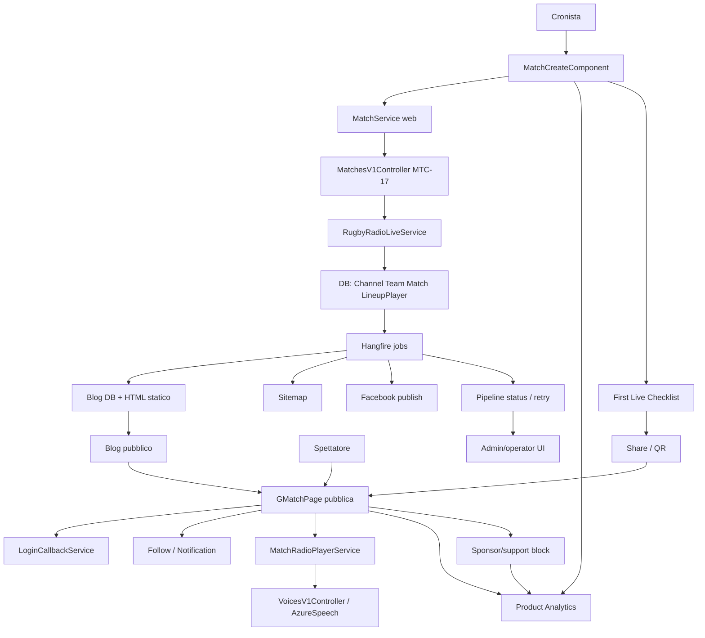

# Analisi Architetturale: Roadmap da Competitor Gap Analysis

## Context

Fonte funzionale: `projects/competitor-gap-roadmap/analysis/functional-analysis-competitor-gap-roadmap.md`.

Questa architettura traduce la roadmap funzionale in una proposta implementativa per Rugby Radio Live. L'obiettivo non e introdurre un nuovo prodotto parallelo, ma rinforzare i workflow gia esistenti: creazione rapida partita, fruizione pubblica match, radio TTS, analytics, pipeline post-partita, SEO, AdSense e primi esperimenti di valore club.

La soluzione si innesta sull'architettura documentata in `llm-wiki/wiki/architecture/Rugby Radio Live (architecture).md`:

- frontend web Angular per pagine autenticate e pubbliche;
- backend API .NET con controller `/v1`;
- servizi applicativi backend e repository;
- job Hangfire per blog, immagini, sitemap, social, manutenzione e backup;
- contenuti statici per blog e sitemap;
- integrazioni Firebase FCM, Azure Speech, Tailoor/Ollama AI, Facebook, AdSense, GA/GSC.

## Functional Drivers

- Ridurre il time-to-first-live-match usando il wizard rapido gia presente.
- Rendere affidabile la conversione spettatore anonimo verso login, follow e notifiche.
- Aumentare fiducia live tramite stato partita, freschezza feed e gestione refresh.
- Consolidare la modalita radio come esperienza TTS mobile-first.
- Rendere misurabili activation, share, blog, follow, notifiche, ritorno e sponsor/supporto.
- Rendere osservabile la pipeline post-partita.
- Preservare accesso pubblico al live match e non introdurre paywall.

## Architectural Decisions

| ID | Decision | Rationale |
| --- | --- | --- |
| ADR-01 | Estendere i componenti esistenti invece di creare un'app separata | I workflow sono gia distribuiti tra `MatchCreateComponent`, `GMatchPage`, `MatchRadioPlayerService`, API match e job Hangfire. |
| ADR-02 | MVP analytics frontend-first con evento canonico condiviso | La gap analysis chiede misurazione prima di grandi cambi backend. L'evento puo essere inviato dal frontend e aggregato con fonti esistenti. |
| ADR-03 | Nessun paywall live nella prima fase | Regola business esplicita: sponsor/supporto deve essere additivo e non bloccare la fruizione pubblica. |
| ADR-04 | Pipeline post-partita osservabile tramite stato job/Blog esistenti prima di introdurre orchestrazione nuova | I job Hangfire e i flag `Blog` coprono gia parti del ciclo; conviene esporre stato e retry prima di riprogettare. |
| ADR-05 | Radio resta frontend-first per MVP | La wiki radio documenta gia assenza di nuove API backend e nessuno streaming server-side. |
| ADR-06 | Lo slot blog AdSense resta configurazione controllata, non regola hardcoded sparsa | `BLOG-HOME = 6223722056` e una regola di piattaforma da validare su template e HTML generati. |

## Proposed Architecture

La proposta introduce tre cross-cutting capabilities:

1. **Product telemetry**: evento canonico condiviso da frontend, API e job dove necessario.
2. **Operational visibility**: lettura stato pipeline, errori job e retry controllati.
3. **Club value surface**: sponsor/supporto configurabile senza impatto su accesso pubblico.

## Component Design

### Frontend Web

#### `MatchCreateComponent`

Componente da estendere per Slice A.

Responsabilita aggiunte:

- esporre un percorso "prima diretta" sopra il wizard a tre step gia esistente;
- permettere marcatura demo/reale se il dato e disponibile o gestibile come preferenza UI;
- mostrare checklist post-creazione con link pubblico, QR, share, primo evento e stato radio noto;
- preservare dati inseriti quando la creazione fallisce;
- inviare eventi `quick_match_started`, `quick_match_step_completed`, `match_created`, `match_shared`.

Confine: la creazione contestuale di canale/squadre/partita rimane in `RugbyRadioLiveService`.

#### `GMatchPage`

Pagina pubblica partita da estendere per activation spettatore, live trust e sponsor/supporto.

Responsabilita aggiunte:

- stato partita visibile: scheduled/live/ended/unavailable;
- freshness: ultimo aggiornamento o indicatore equivalente;
- warning non bloccante su refresh fallito;
- empty state differenziati per match non iniziato, nessun evento, errore dati;
- CTA contestuali per follow/comment/vote/reaction quando serve login;
- delega a `LoginCallbackService` per ritorno al match e ripresa azione;
- sponsor/support block opzionale, separato dal feed eventi;
- eventi analytics per view, CTA, login intent, follow, notification opt-in, sponsor impression/click.

#### `LoginCallbackService`

Da usare come punto di coordinamento per l'intended action.

Responsabilita suggerite:

- serializzare route target e azione richiesta prima del login;
- ripristinare pagina e tab dopo login;
- completare o riproporre follow/comment/vote/reaction;
- inviare esito `login_completed` e `intended_action_resumed`.

Se il service non supporta gia tutte queste responsabilita, introdurre un piccolo modello `LoginIntent`.

#### `MatchRadioPlayerService`

Da mantenere come engine radio frontend-first.

Responsabilita aggiunte/da verificare:

- stati coerenti play/pause/resume/stop;
- messaggi actionable per TTS, MP3 o talker non disponibili;
- degradazione quando localStorage non e disponibile;
- eventi `radio_play`, `radio_pause`, `radio_resume`, `radio_event_play_complete`, `radio_event_audio_error`, `radio_queue_lag`;
- validazione mobile/PWA/TWA prima di dichiarare supporto background/lock screen.

#### Admin/Operator UI

Prima slice: una vista leggera, non una console completa.

Responsabilita:

- mostrare stato pipeline per blog, immagine, static HTML, sitemap, Facebook;
- mostrare ultimo esito job, timestamp, errore sintetico e retry disponibile quando sicuro;
- mostrare stato AdSense blog slot atteso;
- mostrare health backup/manutenzione dove i dati sono gia disponibili.

## Backend API

### `MatchesV1Controller`

Endpoint MTC-17 resta il contratto di creazione rapida.

Possibili estensioni:

- restituire nel `MatchDto` o in un wrapper compatibile i dati necessari alla checklist: match id, channel id, public URL components, status iniziale;
- confermare error contract per validazioni e duplicati;
- mantenere endpoint pubblici leggibili senza token;
- preservare authorization sugli endpoint di gestione e notifiche.

### `RugbyRadioLiveService`

Mantiene l'orchestrazione `WizardFastAddChannelAsync`.

Punti architetturali:

- il create-or-reference rimane il confine server-side per canale e squadre;
- valutare se introdurre un risultato strutturato con metadata di creazione vs recupero;
- se si misura backend-side, emettere evento applicativo dopo commit riuscito, non prima;
- chiarire garanzia transazionale con `IUnitOfWork`.

### Authentication and User Services

`AuthV1Controller`, `UserV1Controller`, `UserService (api)` e `UserService (web)` restano owner dei flussi account.

Necessita architetturale:

- callback sicura dopo login;
- nessun redirect aperto verso domini non ammessi;
- token notifiche collegato all'utente autenticato;
- eventi analytics senza dati personali non necessari.

## Background Processing

### Pipeline Post-Partita

Job coinvolti:

- `CreateMatchBlogJob`;
- `CreateMatchImageJob`;
- `CreateMatchBlogHtmlJob`;
- `FacebookJob`;
- `GenerateSeoSitemapJob`.

Proposta:

- introdurre una vista di stato pipeline derivata da `Match`, `Blog`, flag esistenti e stato Hangfire;
- aggiungere retry manuale solo per step idempotenti o gia protetti da flag come `Blog.IsBlogStatic` e `Blog.IsFacebookPosted`;
- registrare eventi operativi per successo/fallimento step;
- non introdurre subito un orchestratore centrale se gli attuali job ricorrenti sono sufficienti.

Rischio noto: alcuni job documentano `[AutomaticRetry(Attempts = 0)]`; la UI di retry deve essere esplicita e auditata.

### Backup and Maintenance

Per `MaintenanceJob`, `UsbBackupJob`, `HangfireDashboard`, `AdminMaintenancePage`:

- mantenere prima la sola osservabilita;
- rinviare decisioni su retention, checksum, cifratura e notifiche fino a requisiti operativi definiti;
- se si aggiunge retry/azione manuale, registrare audit.

## Data And APIs

### Product Analytics Event

Contratto logico suggerito:

| Field | Purpose |
| --- | --- |
| `eventName` | Nome canonico evento |
| `timestampUtc` | Ordinamento e reporting |
| `userState` | anonymous/authenticated/admin |
| `userIdHash` | Facoltativo; solo se conforme a privacy interna |
| `matchId` | Correlazione partita |
| `channelId` | Correlazione canale |
| `source` | organic/share/blog/social/direct/admin |
| `surface` | quick-match/g-match/g-radio/blog/admin |
| `intent` | follow/comment/vote/reaction/share/support |
| `status` | started/completed/failed |
| `errorCode` | Per fallimenti tecnici o validazioni |

MVP consigliato: usare il canale analytics gia esistente lato frontend; valutare persistenza server-side solo se serve una dashboard proprietaria non coperta da GA/Firebase/Metabase.

### Quick Match Checklist Model

Contratto UI minimo:

| Field | Source |
| --- | --- |
| `matchId` | `MatchDto` |
| `channelId` | `MatchDto` / channel relation |
| `publicMatchUrl` | derivato frontend da route `/g-match/{matchId}` |
| `qrPayload` | stesso URL pubblico |
| `isDemo` | campo nuovo o stato UI se non persistito |
| `radioAvailability` | derivato da talker/eventi/audio noti, altrimenti unknown |

### Login Intent Model

Contratto logico:

| Field | Purpose |
| --- | --- |
| `returnUrl` | Route match originale |
| `matchId` | Match target |
| `tabId` | Tab da ripristinare |
| `action` | follow/comment/vote/reaction/notification |
| `payloadRef` | Riferimento non sensibile a commento/rating se riproponibile |
| `createdAtUtc` | Scadenza intent |

Archiviazione MVP: sessionStorage/localStorage con TTL breve. Persistenza backend solo se necessaria per continuita cross-device.

### Sponsor/Support Model

Opzione minima:

| Field | Notes |
| --- | --- |
| `id` | Identificativo block |
| `scopeType` | channel o match |
| `scopeId` | channelId o matchId |
| `label` | Nome sponsor/supporto |
| `destinationUrl` | Link esterno validato |
| `imageUrl` | Facoltativo |
| `isActive` | Pubblicazione |
| `createdByUserId` | Audit |
| `createdAtUtc`, `updatedAtUtc` | Audit |

Trade-off:

- **Configurazione DB dedicata**: piu pulita per reporting e owner/admin, richiede migration.
- **Configurazione JSON su entita esistente**: piu rapida, ma fragile per query e audit.

Raccomandazione: DB dedicato se lo sponsor/supporto diventa esperimento misurato; evitare hardcoding nei template.

### Pipeline Status Read Model

Read model derivabile:

| Step | Possible signal |
| --- | --- |
| Blog text | numero record `Blog` per match/lingua |
| Image | presenza asset o esito job immagine |
| Static HTML | `Blog.IsBlogStatic` |
| Sitemap | timestamp generazione sitemap |
| Facebook | `Blog.IsFacebookPosted` |
| AdSense blog slot | scan template/static generation config, non runtime per ogni richiesta |

## Non-Functional Considerations

### Security and Privacy

- Public match read remains anonymous.
- Mutating actions remain authenticated and authorized.
- Login callback must validate return URL against allowed internal routes.
- Sponsor destination URLs must be validated to prevent unsafe redirects or malicious content.
- Analytics should avoid unnecessary personal data and use hashed or anonymous identifiers where possible.
- Admin retry/manual publish actions require authorization and audit.

### Performance

- Live freshness must not increase polling frequency blindly.
- Analytics sending should be non-blocking and batched where possible.
- Sponsor/support block should not delay match feed rendering.
- Pipeline status dashboard should read precomputed/cheap signals, not scan filesystem deeply on every request.

### Availability and Degradation

- Public match page must render core data even if analytics, sponsor config or AdSense fails.
- Radio must degrade to clear unavailable states when audio/TTS/localStorage fails.
- Post-match jobs can fail independently; status view must show partial completion.
- Blog static pages remain independent from runtime API availability where possible.

### Observability

- Frontend: activation, CTA, radio and sponsor events.
- Backend: quick match success/failure, pipeline job outcome, retry/manual action audit.
- Admin: status views for job recency, failure reason, retry availability.
- AdSense: explicit check that generated blog templates use `BLOG-HOME = 6223722056`.

### Accessibility and UX

- Checklist, CTA, freshness status and radio controls must be understandable on mobile.
- QR/share controls need text alternatives.
- Live status and connection warnings should not rely only on color.
- Sponsor content must be visually separated but not disruptive.

## Deployment And Rollout

### Slice A - Activation and Measurement Foundation

1. Add event taxonomy constants/client helper.
2. Extend `MatchCreateComponent` with checklist after successful quick match.
3. Add share/QR event tracking.
4. Add login intent handling for follow.
5. Add weekly reporting query/dashboard using available analytics source.

Rollout:

- hide new checklist behind feature flag/config if available;
- ship telemetry first in passive mode;
- compare quick match completion and first event before/after.

### Slice B - Live Trust and Radio Validation

1. Add live freshness and refresh failure states in `GMatchPage`.
2. Verify radio state messages in `MatchRadioPlayerService` consumers.
3. Run device matrix for Chrome Android, Safari iOS/PWA and TWA.
4. Add radio error and queue lag reporting to weekly dashboard.

Rollout:

- no backend migration expected;
- release UI states progressively;
- document supported mobile behavior only after validation.

### Slice C - Distribution and Club Value

1. Add pipeline status read model and admin/operator view.
2. Add safe retry for selected post-match steps.
3. Add sponsor/support config model and public block.
4. Add sponsor/support impression/click tracking.
5. Keep AdSense blog slot monitoring in generation QA.

Rollout:

- start sponsor/support on selected channels only;
- keep feature disabled by default until moderation/ownership rules are decided;
- avoid paywall experiments until retention metrics are stable.

## Risks And Trade-Offs

| Risk | Impact | Mitigation |
| --- | --- | --- |
| Quick match transactional behavior unclear | Partial entities could confuse checklist and metrics | Verify `IUnitOfWork` behavior before adding backend events or recovery UI assumptions |
| Analytics fragmentation across GA/Firebase/Metabase | Product metrics may be inconsistent | Define canonical event names and one reporting owner |
| Login intent can become unsafe redirect | Security issue | Restrict return URLs to internal routes and expire intent |
| Pipeline retry is not always idempotent | Duplicate posts/social publications | Retry only steps with flags/guards; audit manual actions |
| Sponsor/support introduces moderation burden | Trust and brand risk | Start with owner/admin controlled fields, URL validation and disable-by-default rollout |
| Radio mobile behavior varies by browser | Broken promise to users | Treat background/lock screen as validated capability, not assumed capability |
| AdSense slot drift can return in generated files | Revenue/measurement inconsistency | Add template/static output check for `6223722056` in blog generation QA |

## Requirement Traceability

| Functional requirement | Architectural element |
| --- | --- |
| FA-01 Prima Diretta Cronista | `MatchCreateComponent`, `MatchService (web)`, `MatchesV1Controller` MTC-17, `RugbyRadioLiveService`, checklist UI, product analytics |
| FA-02 Spettatore Activation | `GMatchPage`, CTA components, `LoginCallbackService`, `UserService (web)`, match follow endpoint, notification token flow |
| FA-03 Live Trust and Freshness | `GMatchPage`, polling state, refresh error state, analytics feed lag |
| FA-04 Radio Mobile Reliability | `MatchRadioPlayerService`, `MatchRadioStorageService`, `VoiceService (web)`, `VoicesV1Controller`, Azure Speech |
| FA-05 Analytics and Product Reporting | analytics helper/event taxonomy, Firebase/GA/Metabase reporting, optional backend event capture |
| FA-06 SEO and Post-Match Distribution | `CreateMatchBlogJob`, `CreateMatchBlogHtmlJob`, `CreateMatchImageJob`, `FacebookJob`, `GenerateSeoSitemapJob`, pipeline status view |
| FA-07 Club Value and Monetization | sponsor/support model, public block in match/channel pages, click tracking, AdSense slot QA |
| FA-08 Operational Controls | Admin/operator UI, Hangfire status, job retry actions, audit logging |

## Open Questions

- Qual e il canale analytics canonico per la dashboard settimanale: Firebase, GA, Metabase o tabella applicativa?
- `MatchDto` contiene gia tutti i dati necessari per link pubblico, canale e stato radio o serve estenderlo?
- La scelta demo/reale deve essere persistita nel dominio o puo restare solo evento/flag UI?
- Quali ruoli possono configurare sponsor/supporto: owner canale, co-owner, admin?
- Quali URL sponsor sono ammessi e chi modera logo/testo?
- Quali step pipeline sono idempotenti e sicuri per retry manuale?
- Quale retention operativa serve per log analytics, audit e backup?
- Quali KPI target definiscono il successo delle slice A/B/C?

