# Analisi funzionale - Job HF Fix

## Fonte

Idea analizzata: `projects/job-hf-fix/notes/idea-job-hf-fix.md`

Contesto wiki consultato:

- `llm-wiki/wiki/backend/api/jobs/MaintenanceJob (api).md`
- `llm-wiki/wiki/backend/api/jobs/FakeLeagueAgentJob (api).md`
- `llm-wiki/wiki/backend/api/jobs/FakeLastYearAgentJob (api).md`
- `llm-wiki/wiki/concepts/Fake Agent (concept).md`
- `llm-wiki/wiki/concepts/Partita (concept).md`
- `llm-wiki/wiki/concepts/Squadra (concept).md`
- `llm-wiki/wiki/concepts/Operativita Backend (concept).md`
- `llm-wiki/wiki/backend/api/entities/Match (api).md`
- `llm-wiki/wiki/backend/api/entities/Team (api).md`
- `llm-wiki/wiki/backend/api/services/MatchService (api).md`
- `llm-wiki/wiki/backend/api/services/TeamService (api).md`
- `llm-wiki/wiki/backend/api/entities/Channel (api).md`
- `llm-wiki/wiki/backend/api/services/ChannelService (api).md`
- `llm-wiki/wiki/backend/api/jobs/CreateMatchImageJob (api).md`
- `llm-wiki/wiki/backend/api/jobs/CreateChannelImageJob (api).md`
- `llm-wiki/wiki/backend/api/jobs/RepairMatchImageJob (api).md`
- `llm-wiki/wiki/concepts/Generazione Immagini (concept).md`
- `llm-wiki/wiki/concepts/Radio Canale (concept).md`
- `llm-wiki/wiki/comparisons/Mappatura Job e Side Effects (comparison).md`

Nota: i file `llm-wiki/wiki/index.md` e `llm-wiki/wiki/summary.md` indicati dalle istruzioni di progetto non risultano presenti nel workspace. L'analisi usa quindi le pagine tematiche wiki esistenti.

## Sintesi

Il Job HF Fix introduce un controllo ricorrente Hangfire, eseguito ogni ora, per individuare e correggere anomalie note nei dati operativi di Rugby Radio Live.

Il primo obiettivo e chiudere automaticamente partite rimaste impropriamente nello stato `InProgress` oltre una soglia di 5 giorni. Il secondo obiettivo e correggere team creati senza nome dai Fake Agent, ricostruendo il contesto dal canale e riutilizzando la procedura di generazione nomi prevista dal flusso Fake Agent. Il terzo e quarto obiettivo sono riparare partite e radio/canali prive di immagine, riusando le logiche gia previste in creazione o nei job immagini esistenti. Il quinto e sesto obiettivo sono correggere radio/canali senza nome e utenti senza nickname, riusando le procedure Fake Agent dedicate.

Il job nasce come contenitore evolutivo: potra essere arricchito nel tempo con nuove verifiche collettive, pur mantenendo ogni controllo indipendente, idempotente e non bloccante rispetto agli altri.

## Obiettivi

- Ridurre dati incoerenti prodotti da simulazioni Fake Agent o prove utente incomplete.
- Evitare che partite abbandonate restino pubblicamente o operativamente "in corso" per periodi indefiniti.
- Riparare team senza nome senza intervento manuale.
- Riparare partite senza immagine di copertina riusando il flusso esistente di assegnazione immagine partita.
- Riparare radio/canali senza immagine di copertina riusando il flusso esistente di associazione immagine canale.
- Riparare radio/canali senza nome riusando la procedura Fake Agent di generazione nome canale.
- Riparare utenti senza nickname riusando la procedura Fake Agent di generazione nickname utente.
- Rendere i controlli periodici estendibili a nuove anomalie future.
- Evitare che il fallimento su una singola riga interrompa l'intero job.

## Attori e stakeholder

| Attore | Interesse |
|---|---|
| Amministratore | Ridurre interventi manuali di pulizia dati e avere un sistema piu stabile. |
| Cronista | Non vedere partite di test o abbandonate confondersi con partite realmente live. |
| Spettatore | Consultare liste e pagine pubbliche senza partite falsamente in corso o team anonimi. |
| Prodotto RRL | Mantenere qualita percepita dei dati pubblici e delle metriche aggregate. |
| Sistema Fake Agent | Correggere in modo differito anomalie transitorie prodotte durante la generazione dati. |

## Stato attuale

La wiki documenta che:

- `Match.Status` ammette almeno `Scheduled=10`, `InProgress=20`, `Halftime=25`, `FullTime=30`.
- `Match` contiene `Date` e `DateUtc`, oltre a punteggio, minuto, statistiche e relazione con canale e squadre.
- `Team` contiene `ChannelId`, `Name`, `LogoUrl` e `Nickname`.
- `Match` contiene `ImageUrl`, usato come immagine di copertina partita.
- `Channel` contiene `Name` e `ImageUrl`; nel dominio prodotto "radio" e "canale" sono sinonimi.
- `User` contiene `Nickname`, usato come nome pubblico dell'utente.
- I Fake Agent generano dati artificiali per canali, squadre, giocatori, partite ed eventi tramite job Hangfire.
- La wiki documenta job immagini separati: `CreateMatchImageJob` genera immagini WebP di pool, `RepairMatchImageJob` assegna immagini alle partite senza copertina, `CreateChannelImageJob` genera immagini canale.
- Molti job Hangfire documentati hanno `[AutomaticRetry(Attempts = 0)]`, quindi i fallimenti non vengono ritentati automaticamente da Hangfire.
- I job operativi esistenti sono usati per manutenzione, backup e side effect differiti.

Il requisito segnala sei anomalie ricorrenti:

- partite create o simulate che non vengono mai terminate;
- team creati dai Fake Agent senza nome a causa di generazione incompleta o fallita.
- partite presenti a database senza immagine;
- radio/canali presenti a database senza immagine.
- radio/canali presenti a database senza nome;
- utenti presenti a database senza nickname.

## Ambito

### In scope MVP

- Nuovo job ricorrente Hangfire schedulato ogni ora.
- Recupero delle partite con stato `InProgress`.
- Chiusura forzata delle partite `InProgress` quando la data di riferimento supera i 5 giorni.
- Recupero dei team senza nome.
- Ricostruzione del contesto del team a partire dal canale associato.
- Invocazione della stessa logica/procedura di generazione nomi usata dai Fake Agent.
- Skip non bloccante del singolo team quando la generazione nome fallisce per indisponibilita API o errore temporaneo.
- Prosecuzione del job sugli elementi successivi anche in presenza di errori puntuali.
- Recupero delle partite con `ImageUrl` assente, nullo o vuoto.
- Associazione dell'immagine alle partite senza immagine secondo le logiche esistenti quando viene creata o riparata una partita.
- Recupero delle radio/canali con `ImageUrl` assente, nullo o vuoto.
- Associazione dell'immagine alle radio/canali senza immagine secondo le logiche esistenti quando viene creata una radio/canale.
- Skip non bloccante della singola partita o radio/canale quando non e disponibile una immagine sorgente, una API esterna non risponde o il salvataggio fallisce.
- Recupero delle radio/canali con `Name` assente, nullo o vuoto.
- Invocazione della stessa logica/procedura di generazione nome canale usata dai Fake Agent.
- Aggiornamento conservativo del solo `Channel.Name` quando la generazione produce un valore valido.
- Recupero degli utenti con `Nickname` assente, nullo o vuoto.
- Invocazione della stessa logica/procedura di generazione nickname utente usata dai Fake Agent.
- Aggiornamento conservativo del solo `User.Nickname` quando la generazione produce un valore valido.
- Skip non bloccante della singola radio/canale o del singolo utente quando la generazione fallisce per API non disponibile, risposta non valida o salvataggio fallito.
- Logging operativo minimo delle correzioni effettuate e degli skip.

### Out of scope

- Dashboard amministrativa dedicata alla bonifica dati.
- Correzione manuale massiva da UI.
- Nuovi stati partita oltre a quelli gia documentati.
- Modifica del workflow cronista.
- Modifica della creazione partita lato utente.
- Modifica strutturale del modello `Team`.
- Retry Hangfire automatico obbligatorio per l'intero job.
- Cancellazione di partite, team, eventi o canali anomali.
- Rigenerazione massiva di loghi, giocatori o formazioni.
- Pubblicazione social o generazione automatica di post a seguito della sola riparazione immagine.
- Compositing o conversioni Instagram non gia previste dalle logiche esistenti richiamate.

### Estensioni future

- Nuovi controlli collettivi su altre anomalie dati.
- Reportistica periodica sulle correzioni applicate.
- Parametrizzazione amministrativa di soglie e frequenze.
- Distinzione esplicita tra anomalie provenienti da Fake Agent e anomalie prodotte da utenti reali.

## Target funzionale

```mermaid
flowchart TD
  A["Trigger orario Hangfire"] --> B["Avvia Job HF Fix"]
  B --> C["Controllo partite in corso"]
  C --> D{"Partita InProgress da oltre 5 giorni?"}
  D -->|Si| E["Imposta stato FullTime"]
  D -->|No| F["Lascia invariata"]
  E --> G["Registra correzione"]
  F --> H["Controllo team senza nome"]
  G --> H
  H --> I{"Team senza nome trovato?"}
  I -->|Si| J["Recupera contesto dal canale"]
  J --> K["Genera nome con procedura Fake Agent"]
  K --> L{"Generazione riuscita?"}
  L -->|Si| M["Aggiorna team"]
  L -->|No| N["Skip riga e log non bloccante"]
  I -->|No| O["Controllo partite senza immagine"]
  M --> O
  N --> O
  O --> P{"Partita senza ImageUrl trovata?"}
  P -->|Si| Q["Associa immagine con logica esistente"]
  P -->|No| R["Controllo radio senza immagine"]
  Q --> R
  R --> S{"Radio/canale senza ImageUrl trovata?"}
  S -->|Si| T["Associa immagine con logica esistente"]
  S -->|No| U["Controllo radio senza nome"]
  T --> U
  U --> V{"Radio/canale senza Name trovata?"}
  V -->|Si| W["Genera nome canale con procedura Fake Agent"]
  V -->|No| X["Controllo utenti senza nickname"]
  W --> X
  X --> Y{"Utente senza Nickname trovato?"}
  Y -->|Si| Z["Genera nickname con procedura Fake Agent"]
  Y -->|No| AA["Termina job"]
  Z --> AA
```

## Requisiti funzionali

| ID | Requisito |
|---|---|
| FR-01 | Il sistema deve eseguire il Job HF Fix come job ricorrente Hangfire ogni ora. |
| FR-02 | Il job deve recuperare le partite con `Status = InProgress`. |
| FR-03 | Il job deve identificare le partite `InProgress` la cui data di riferimento e antecedente di oltre 5 giorni rispetto all'esecuzione. |
| FR-04 | Il job deve chiudere forzatamente le partite identificate impostando lo stato a `FullTime`. |
| FR-05 | Il job non deve modificare partite `Scheduled`, `Halftime` o gia `FullTime`, salvo diversa decisione futura. |
| FR-06 | Il job non deve modificare partite `InProgress` entro la soglia dei 5 giorni. |
| FR-07 | Il job deve recuperare i team con nome assente, nullo o composto solo da spazi. |
| FR-08 | Per ogni team senza nome, il job deve recuperare il canale associato tramite `ChannelId`. |
| FR-09 | Il job deve usare il contesto del canale per invocare la procedura di generazione nomi gia prevista dal flusso Fake Agent. |
| FR-10 | Quando la generazione nome produce un risultato valido, il job deve aggiornare il team con il nome generato. |
| FR-11 | Quando la generazione nome fallisce per errore API, timeout o risposta non valida, il job deve saltare il team corrente senza interrompere gli altri controlli. |
| FR-12 | Un team saltato deve restare eleggibile per una successiva esecuzione oraria del job. |
| FR-13 | Il job deve registrare almeno numero di partite chiuse, numero di team corretti, numero di team saltati e principali motivi di errore. |
| FR-14 | Il job deve essere idempotente: riesecuzioni ravvicinate non devono produrre correzioni duplicate o stati incoerenti. |
| FR-15 | L'aggiunta futura di nuovi controlli non deve impedire l'esecuzione indipendente dei controlli gia presenti. |
| FR-16 | Il job deve recuperare le partite con `ImageUrl` nullo, vuoto o composto solo da spazi. |
| FR-17 | Per ogni partita senza immagine, il job deve applicare la logica esistente di associazione immagine prevista per la creazione o riparazione della partita. |
| FR-18 | Quando l'associazione immagine partita riesce, il job deve valorizzare `Match.ImageUrl` e preservare gli altri dati partita non coinvolti. |
| FR-19 | Quando l'associazione immagine partita fallisce per immagine sorgente non disponibile, errore filesystem, API esterna non disponibile o salvataggio fallito, il job deve saltare la partita corrente senza interrompere gli altri controlli. |
| FR-20 | Il job deve recuperare le radio/canali con `ImageUrl` nullo, vuoto o composto solo da spazi. |
| FR-21 | Per ogni radio/canale senza immagine, il job deve applicare la logica esistente di associazione immagine prevista per la creazione della radio/canale. |
| FR-22 | Quando l'associazione immagine radio/canale riesce, il job deve valorizzare `Channel.ImageUrl` e preservare owner, `PublicId`, nome, colori e impostazioni esistenti. |
| FR-23 | Quando l'associazione immagine radio/canale fallisce per immagine sorgente non disponibile, errore filesystem, API esterna non disponibile o salvataggio fallito, il job deve saltare il canale corrente senza interrompere gli altri controlli. |
| FR-24 | Un elemento saltato per immagine mancante deve restare eleggibile per una successiva esecuzione oraria del job. |
| FR-25 | Il riepilogo del job deve distinguere conteggi ed errori per partite senza immagine e radio/canali senza immagine. |
| FR-26 | Il job deve recuperare le radio/canali con `Name` nullo, vuoto o composto solo da spazi. |
| FR-27 | Per ogni radio/canale senza nome, il job deve applicare la logica esistente di generazione nome canale prevista dal flusso Fake Agent. |
| FR-28 | Quando la generazione nome canale produce un risultato valido, il job deve aggiornare `Channel.Name` preservando owner, `PublicId`, immagine, colori, layout e impostazioni esistenti. |
| FR-29 | Quando la generazione nome canale fallisce per errore API, timeout o risposta non valida, il job deve saltare il canale corrente senza interrompere gli altri controlli. |
| FR-30 | Il job deve recuperare gli utenti con `Nickname` nullo, vuoto o composto solo da spazi. |
| FR-31 | Per ogni utente senza nickname, il job deve applicare la logica esistente di generazione nickname utente prevista dal flusso Fake Agent. |
| FR-32 | Quando la generazione nickname produce un risultato valido, il job deve aggiornare `User.Nickname` preservando email, password, avatar, provider, lingua, timezone, stato e token esistenti. |
| FR-33 | Quando la generazione nickname fallisce per errore API, timeout o risposta non valida, il job deve saltare l'utente corrente senza interrompere gli altri controlli. |
| FR-34 | Radio/canali e utenti saltati per generazione non disponibile devono restare eleggibili per una successiva esecuzione oraria del job. |
| FR-35 | Il riepilogo del job deve distinguere conteggi ed errori per radio/canali senza nome e utenti senza nickname. |

## Regole di business

- Una partita `InProgress` da piu di 5 giorni e considerata anomala e deve essere chiusa forzatamente.
- Lo stato target della chiusura forzata e `FullTime`.
- La soglia di 5 giorni si applica rispetto alla data partita documentata dal dominio; la scelta tra `Date` e `DateUtc` deve essere confermata in fase tecnica.
- Il job non corregge punteggio, minuto, statistiche, eventi, blog o immagini della partita chiusa.
- Un team senza nome e un team con `Name` nullo, vuoto o composto solo da whitespace.
- La correzione del nome team deve preservare `ChannelId`, `LogoUrl`, `Nickname` e altre informazioni esistenti non coinvolte.
- Una partita senza immagine e una partita con `ImageUrl` nullo, vuoto o composto solo da whitespace.
- Una radio/canale senza immagine e un `Channel` con `ImageUrl` nullo, vuoto o composto solo da whitespace.
- Una radio/canale senza nome e un `Channel` con `Name` nullo, vuoto o composto solo da whitespace.
- Un utente senza nickname e uno `User` con `Nickname` nullo, vuoto o composto solo da whitespace.
- Le riparazioni immagine devono riusare logiche esistenti di associazione/generazione, evitando una procedura parallela non allineata al dominio.
- La riparazione immagine non deve modificare stato partita, punteggio, eventi, squadre, owner canale, layout canale o dati non necessari.
- La correzione del nome canale deve preservare owner, co-owner, `PublicId`, immagine, colori, header e impostazioni esistenti.
- La correzione del nickname utente deve preservare email, password, avatar, provider, lingue, timezone, stato, token e canali collegati.
- Gli errori temporanei della procedura di generazione nomi non sono errori bloccanti dell'intero job.
- Gli errori temporanei delle procedure immagine non sono errori bloccanti dell'intero job.
- Gli errori temporanei delle procedure di generazione nome canale o nickname utente non sono errori bloccanti dell'intero job.
- Il job deve preferire correzioni conservative: nessuna cancellazione e nessuna rigenerazione di dati non richiesti.
- Ogni controllo deve poter essere rieseguito senza assumere che l'esecuzione precedente sia terminata con successo su tutte le righe.

## Flussi principali

### UC-01 - Chiusura partita bloccata in corso

Precondizioni:

- Esiste una partita con `Status = InProgress`.
- La data di riferimento della partita supera la soglia di 5 giorni rispetto all'esecuzione del job.

Flusso:

1. Hangfire avvia il Job HF Fix.
2. Il job recupera le partite `InProgress`.
3. Il job calcola l'eta della partita rispetto alla data di riferimento.
4. Il job identifica la partita come anomala.
5. Il job imposta `Status = FullTime`.
6. Il job salva la modifica.
7. Il job registra la correzione nel log operativo.

Postcondizioni:

- La partita non risulta piu in corso.
- La partita non viene cancellata.
- Eventi, punteggio e statistiche restano invariati.

### UC-02 - Partita in corso ancora entro soglia

1. Il job recupera una partita `InProgress`.
2. La data di riferimento non supera i 5 giorni.
3. Il job lascia invariata la partita.
4. Il job prosegue con le altre righe.

### UC-03 - Correzione team senza nome riuscita

Precondizioni:

- Esiste un team con `Name` nullo, vuoto o whitespace.
- Il team e associato a un canale valido.
- La procedura di generazione nome restituisce un nome valido.

Flusso:

1. Il job recupera il team senza nome.
2. Il job recupera il canale associato.
3. Il job costruisce il contesto richiesto dalla generazione nomi Fake Agent.
4. Il job invoca la procedura di generazione nome.
5. Il job riceve un nome valido.
6. Il job aggiorna `Team.Name`.
7. Il job salva la modifica.
8. Il job registra la correzione.

Postcondizioni:

- Il team ha un nome valorizzato.
- Il team resta associato allo stesso canale.

### UC-04 - Generazione nome non disponibile

1. Il job recupera un team senza nome.
2. Il job prova a generare il nome.
3. La chiamata fallisce per API non disponibile, timeout, errore transitorio o risposta non valida.
4. Il job registra lo skip non bloccante.
5. Il team resta senza nome.
6. Il job prosegue con il team successivo.
7. Alla prossima esecuzione oraria, lo stesso team viene nuovamente eleggibile.

### UC-05 - Team senza canale valido

1. Il job recupera un team senza nome.
2. Il canale associato non esiste o non e recuperabile.
3. Il job non puo costruire il contesto necessario.
4. Il job registra errore o skip con motivo specifico.
5. Il job prosegue senza aggiornare il team.

### UC-06 - Correzione partita senza immagine riuscita

Precondizioni:

- Esiste una partita con `ImageUrl` nullo, vuoto o whitespace.
- La logica esistente di associazione immagine partita ha una immagine sorgente disponibile o puo generarne una secondo il flusso previsto.

Flusso:

1. Il job recupera la partita senza immagine.
2. Il job richiama o replica in modo centralizzato la logica esistente di associazione immagine partita.
3. Il sistema associa una immagine valida alla partita.
4. Il sistema aggiorna `Match.ImageUrl`.
5. Il job salva la modifica e registra la correzione.

Postcondizioni:

- La partita ha una immagine di copertina valorizzata.
- Stato, punteggio, eventi, squadre e statistiche restano invariati.

### UC-07 - Correzione radio/canale senza immagine riuscita

Precondizioni:

- Esiste una radio/canale con `ImageUrl` nullo, vuoto o whitespace.
- La logica esistente di associazione immagine canale ha una immagine sorgente disponibile o puo generarne una secondo il flusso previsto.

Flusso:

1. Il job recupera la radio/canale senza immagine.
2. Il job richiama o replica in modo centralizzato la logica esistente di associazione immagine canale.
3. Il sistema associa una immagine valida alla radio/canale.
4. Il sistema aggiorna `Channel.ImageUrl`.
5. Il job salva la modifica e registra la correzione.

Postcondizioni:

- La radio/canale ha una immagine di copertina valorizzata.
- Owner, co-owner, `PublicId`, nome e layout restano invariati.

### UC-08 - Immagine non associabile

1. Il job recupera una partita o radio/canale senza immagine.
2. Il job prova ad associare una immagine tramite la logica esistente.
3. L'operazione fallisce per pool immagini vuoto, API esterna non disponibile, errore filesystem, risposta non valida o salvataggio fallito.
4. Il job registra lo skip non bloccante con motivo specifico.
5. L'elemento resta senza immagine.
6. Il job prosegue con gli altri elementi.
7. Alla prossima esecuzione oraria, lo stesso elemento resta eleggibile.

### UC-09 - Correzione radio/canale senza nome riuscita

Precondizioni:

- Esiste una radio/canale con `Name` nullo, vuoto o whitespace.
- La procedura Fake Agent di generazione nome canale restituisce un nome valido.

Flusso:

1. Il job recupera la radio/canale senza nome.
2. Il job recupera, se disponibile, un team del canale come contesto di generazione.
3. Il job invoca la procedura Fake Agent di generazione nome canale.
4. Il sistema riceve un nome valido.
5. Il sistema aggiorna `Channel.Name`.
6. Il job salva la modifica e registra la correzione.

Postcondizioni:

- La radio/canale ha un nome valorizzato.
- Owner, co-owner, `PublicId`, immagine, colori, header e impostazioni restano invariati.

### UC-10 - Correzione utente senza nickname riuscita

Precondizioni:

- Esiste un utente con `Nickname` nullo, vuoto o whitespace.
- La procedura Fake Agent di generazione nickname utente restituisce un nickname valido.

Flusso:

1. Il job recupera l'utente senza nickname.
2. Il job invoca la procedura Fake Agent di generazione nickname utente.
3. Il sistema riceve un nickname valido.
4. Il sistema aggiorna `User.Nickname`.
5. Il job salva la modifica e registra la correzione.

Postcondizioni:

- L'utente ha un nickname valorizzato.
- Email, password, avatar, provider, lingue, timezone, stato, token e canali collegati restano invariati.

## Flussi alternativi ed errori

- Se il job non trova partite anomale, registra zero correzioni e prosegue con il controllo team.
- Se il job non trova team senza nome, termina senza side effect sui team.
- Se il salvataggio di una singola correzione fallisce, il job deve registrare l'errore e proseguire dove tecnicamente possibile.
- Se la procedura Fake Agent restituisce un nome vuoto o non valido, il team viene trattato come non corretto e resta eleggibile per la prossima esecuzione.
- Se la procedura Fake Agent restituisce un nome canale o nickname utente vuoto, troppo lungo o non valido, l'elemento viene trattato come non corretto e resta eleggibile per la prossima esecuzione.
- Se la logica immagini non trova immagini disponibili nel pool o non riesce a generarne una, l'elemento viene trattato come non corretto e resta eleggibile per la prossima esecuzione.
- Se l'immagine viene associata da altro processo tra lettura e aggiornamento, il job non deve sovrascriverla senza necessita; deve verificare o salvare in modo conservativo.
- Se una partita viene gia chiusa da utente o altro processo tra lettura e aggiornamento, il job non deve riportarla a `FullTime` in modo incoerente; deve verificare o salvare in modo conservativo.
- Se due esecuzioni del job si sovrappongono, il risultato finale deve restare coerente: partite chiuse una sola volta e team valorizzati una sola volta.

## Dati e campi coinvolti

| Entity | Campo | Uso |
|---|---|---|
| `Match` | `Id` | Identificazione partita da correggere e logging. |
| `Match` | `Status` | Filtro `InProgress` e aggiornamento a `FullTime`. |
| `Match` | `Date` | Candidato per calcolo soglia 5 giorni. |
| `Match` | `DateUtc` | Candidato preferibile per calcolo soglia coerente con esecuzione server. |
| `Match` | `ImageUrl` | Rilevazione e correzione immagine partita mancante. |
| `Team` | `Id` | Identificazione team da correggere e logging. |
| `Team` | `ChannelId` | Recupero contesto canale. |
| `Team` | `Name` | Campo da rilevare come mancante e valorizzare. |
| `Team` | `LogoUrl` | Da preservare invariato. |
| `Team` | `Nickname` | Da preservare invariato salvo diversa logica Fake Agent gia esistente. |
| `Channel` | `Id` | Identificazione radio/canale da correggere e logging. |
| `Channel` | dati contestuali | Input per generazione nome, dettaglio da confermare in fase tecnica. |
| `Channel` | `ImageUrl` | Rilevazione e correzione immagine radio/canale mancante. |
| `Channel` | `Name` | Rilevazione e correzione nome radio/canale mancante. |
| `Channel` | `PublicId`, `UserId`, layout | Dati da preservare durante la riparazione immagine e nome. |
| `User` | `Id` | Identificazione utente da correggere e logging. |
| `User` | `Nickname` | Rilevazione e correzione nickname utente mancante. |
| `User` | email, password, avatar, provider, lingua, timezone, stato | Dati da preservare durante la correzione nickname. |

## Integrazioni e side effect

- Hangfire: schedulazione ricorrente oraria.
- Repository o servizi backend per lettura/scrittura di `Match`, `Team`, `Channel` e `User`.
- Procedura Fake Agent per generazione nomi team.
- Procedura Fake Agent per generazione nome canale.
- Procedura Fake Agent per generazione nickname utente.
- Eventuale API esterna usata dalla procedura Fake Agent.
- Logiche esistenti di associazione/generazione immagini partita e radio/canale.
- Filesystem di storage immagini, se coinvolto dalla logica esistente.
- Eventuale Tailoor Painter AI, se la logica immagini richiamata lo prevede.
- Logging applicativo/Hangfire per esiti e anomalie.

Side effect previsti:

- Aggiornamento DB di `Match.Status`.
- Aggiornamento DB di `Team.Name`.
- Aggiornamento DB di `Match.ImageUrl`.
- Aggiornamento DB di `Channel.ImageUrl`.
- Aggiornamento DB di `Channel.Name`.
- Aggiornamento DB di `User.Nickname`.
- Eventuale copia, spostamento o scrittura file immagine secondo le logiche immagini esistenti.
- Chiamate esterne solo per la generazione dei nomi team, nomi canale e nickname utente, se le procedure Fake Agent le prevedono.
- Chiamate esterne per immagini solo se gia previste dalla logica di associazione/generazione esistente.
- Nessun invio notifiche e nessuna pubblicazione social richiesta dal requisito.

## Requisiti non funzionali

- Il job deve essere idempotente.
- Il job deve essere resiliente agli errori per singola riga.
- Il job deve completare in tempi compatibili con una frequenza oraria.
- Il job deve evitare chiamate esterne non necessarie quando non esistono team senza nome.
- Il job deve evitare operazioni filesystem o chiamate immagini non necessarie quando non esistono partite o radio/canali senza immagine.
- Il job deve produrre log sufficienti a diagnosticare correzioni e skip.
- Il job non deve introdurre side effect pubblici rumorosi, come notifiche agli utenti o pubblicazioni.
- Il job deve usare criteri temporali coerenti e non dipendenti dal fuso orario locale dell'utente.
- Il job deve poter essere esteso con nuovi controlli senza aumentare il rischio di regressione sui controlli esistenti.

## Criteri di accettazione

### AC-01 - Schedulazione oraria

Dato il backend Hangfire configurato,
quando l'applicazione e in esecuzione,
allora il Job HF Fix viene schedulato per esecuzione ricorrente ogni ora.

### AC-02 - Chiusura partita oltre soglia

Dato una partita con `Status = InProgress` e data di riferimento piu vecchia di 5 giorni,
quando il Job HF Fix viene eseguito,
allora la partita viene aggiornata a `Status = FullTime`.

### AC-03 - Nessuna chiusura entro soglia

Dato una partita con `Status = InProgress` e data di riferimento entro 5 giorni,
quando il Job HF Fix viene eseguito,
allora la partita resta `InProgress`.

### AC-04 - Nessuna modifica a stati non target

Dato una partita con stato diverso da `InProgress`,
quando il Job HF Fix viene eseguito,
allora il job non modifica lo stato della partita.

### AC-05 - Correzione team senza nome

Dato un team con `Name` nullo, vuoto o whitespace e canale valido,
quando la procedura di generazione nomi restituisce un nome valido,
allora il job valorizza `Team.Name` con il nome generato.

### AC-06 - Preservazione dati team

Dato un team senza nome con `ChannelId`, `LogoUrl` o `Nickname` valorizzati,
quando il job corregge il nome,
allora quei campi restano invariati salvo effetti gia previsti e documentati dalla procedura Fake Agent.

### AC-07 - Skip non bloccante su errore API

Dato un team senza nome,
quando la procedura di generazione nomi fallisce per indisponibilita API o errore temporaneo,
allora il job registra lo skip, non aggiorna il team e prosegue con gli altri elementi.

### AC-08 - Riprocessabilita team saltato

Dato un team saltato per errore temporaneo,
quando il Job HF Fix viene eseguito in una successiva ricorrenza e la generazione riesce,
allora il team viene corretto.

### AC-09 - Idempotenza

Dato che il Job HF Fix viene eseguito due volte consecutivamente sugli stessi dati gia corretti,
quando la seconda esecuzione termina,
allora non produce modifiche duplicate ne ritorna dati a uno stato precedente.

### AC-10 - Logging riepilogativo

Dato una esecuzione del Job HF Fix,
quando il job termina,
allora e disponibile un riepilogo con conteggio di partite chiuse, team corretti, team saltati, immagini partita corrette, immagini radio/canale corrette, skip ed errori principali.

### AC-11 - Correzione partita senza immagine

Dato una partita con `ImageUrl` nullo, vuoto o whitespace,
quando il Job HF Fix viene eseguito e la logica esistente riesce ad associare una immagine,
allora la partita viene aggiornata con `Match.ImageUrl` valorizzato.

### AC-12 - Preservazione dati partita durante riparazione immagine

Dato una partita senza immagine con stato, punteggio, eventi e squadre valorizzati,
quando il job associa l'immagine,
allora quei dati restano invariati.

### AC-13 - Skip non bloccante immagine partita

Dato una partita senza immagine,
quando l'associazione immagine fallisce per risorsa non disponibile, errore API, errore filesystem o salvataggio fallito,
allora il job registra lo skip, non modifica la partita e prosegue con gli altri elementi.

### AC-14 - Correzione radio/canale senza immagine

Dato una radio/canale con `ImageUrl` nullo, vuoto o whitespace,
quando il Job HF Fix viene eseguito e la logica esistente riesce ad associare una immagine,
allora la radio/canale viene aggiornata con `Channel.ImageUrl` valorizzato.

### AC-15 - Preservazione dati radio/canale durante riparazione immagine

Dato una radio/canale senza immagine con owner, `PublicId`, nome e layout valorizzati,
quando il job associa l'immagine,
allora quei dati restano invariati.

### AC-16 - Skip non bloccante immagine radio/canale

Dato una radio/canale senza immagine,
quando l'associazione immagine fallisce per risorsa non disponibile, errore API, errore filesystem o salvataggio fallito,
allora il job registra lo skip, non modifica il canale e prosegue con gli altri elementi.

### AC-17 - Riprocessabilita elementi senza immagine

Dato una partita o radio/canale saltata per errore temporaneo durante la riparazione immagine,
quando il Job HF Fix viene eseguito in una successiva ricorrenza e l'associazione immagine riesce,
allora l'elemento viene corretto.

### AC-18 - Correzione radio/canale senza nome

Dato una radio/canale con `Name` nullo, vuoto o whitespace,
quando il Job HF Fix viene eseguito e la procedura Fake Agent genera un nome valido,
allora la radio/canale viene aggiornata con `Channel.Name` valorizzato.

### AC-19 - Preservazione dati radio/canale durante correzione nome

Dato una radio/canale senza nome con owner, `PublicId`, immagine e layout valorizzati,
quando il job corregge il nome,
allora quei dati restano invariati.

### AC-20 - Skip non bloccante nome radio/canale

Dato una radio/canale senza nome,
quando la generazione nome fallisce per API non disponibile, timeout o risposta non valida,
allora il job registra lo skip, non modifica il canale e prosegue con gli altri elementi.

### AC-21 - Correzione utente senza nickname

Dato un utente con `Nickname` nullo, vuoto o whitespace,
quando il Job HF Fix viene eseguito e la procedura Fake Agent genera un nickname valido,
allora l'utente viene aggiornato con `User.Nickname` valorizzato.

### AC-22 - Preservazione dati utente durante correzione nickname

Dato un utente senza nickname con email, password, avatar, provider, lingua, timezone, stato e token valorizzati,
quando il job corregge il nickname,
allora quei dati restano invariati.

### AC-23 - Skip non bloccante nickname utente

Dato un utente senza nickname,
quando la generazione nickname fallisce per API non disponibile, timeout o risposta non valida,
allora il job registra lo skip, non modifica l'utente e prosegue con gli altri elementi.

## Assunzioni

- Il nuovo job sara implementato come job Hangfire backend, coerente con i job gia documentati.
- La chiusura forzata a `FullTime` non deve generare automaticamente blog, immagini, notifiche o altri side effect della pipeline contenuti.
- Per il calcolo dei 5 giorni e preferibile usare `DateUtc`, ma la scelta effettiva deve essere confermata verificando il codice e il significato operativo dei campi `Date` e `DateUtc`.
- La procedura di generazione nomi Fake Agent e riutilizzabile senza creare una nuova logica parallela.
- Le logiche esistenti di immagine partita e canale sono riutilizzabili o centralizzabili senza creare una nuova logica divergente.
- Per "radio senza immagine" si intende `Channel.ImageUrl` mancante, coerentemente con il concept `Radio Canale`.
- Per "radio/canale senza nome" si intende `Channel.Name` mancante, coerentemente con il concept `Radio Canale`.
- Per "utente senza nickname" si intende `User.Nickname` mancante.
- Il requisito "misure collettive" indica una famiglia di controlli periodici, non una singola correzione una tantum.

## Rischi

| Rischio | Impatto | Mitigazione |
|---|---|---|
| Uso del campo data sbagliato per soglia 5 giorni | Alto | Confermare in fase tecnica semantica di `Date` e `DateUtc`; usare un criterio UTC coerente. |
| Chiusura di una partita realmente in corso ma molto lunga o con data errata | Medio | Limitare la regola a `InProgress` oltre 5 giorni e loggare ogni chiusura con matchId e data. |
| Side effect indesiderati su pipeline post partita | Medio | Aggiornare solo lo stato, senza invocare pipeline blog/social/immagini salvo decisione esplicita. |
| API generazione nomi instabile | Medio | Skip per riga, nessun fallimento globale, riprocessamento alla prossima ora. |
| Sovrapposizione esecuzioni Hangfire | Medio | Rendere il job idempotente e valutare lock/disallow concurrent execution in fase tecnica. |
| Team senza canale o con contesto insufficiente | Basso/Medio | Loggare motivo specifico e lasciare la riga non modificata. |
| Pool immagini vuoto o API immagini non disponibile | Medio | Skip per riga, riepilogo errore e riprocessamento alla prossima ora. |
| Sovrascrittura di immagini impostate da utente o altro processo | Medio | Filtrare solo `ImageUrl` mancante e riverificare prima del salvataggio. |
| Side effect social o conversioni non richieste nel riuso dei job immagini | Medio | Richiamare solo la parte di associazione immagine necessaria, escludendo pubblicazioni. |
| API generazione nome canale o nickname instabile | Medio | Skip per riga, nessun fallimento globale, riprocessamento alla prossima ora. |
| Valori generati oltre i limiti di validazione | Medio | Validare lunghezza massima prima del salvataggio: `Channel.Name` 50, `User.Nickname` 20. |
| Crescita del job con troppi controlli futuri | Medio | Tenere controlli modulari, indipendenti e con riepilogo separato. |

## Domande aperte

1. La soglia dei 5 giorni deve essere calcolata su `Match.Date`, `Match.DateUtc`, `Ts` o altra data operativa?
2. Una partita chiusa forzatamente deve mantenere `Minute`, `HalfMinutes`, punteggio e statistiche correnti senza normalizzazione?
3. La chiusura forzata deve attivare qualche flusso esistente di fine partita, oppure deve limitarsi al cambio stato?
4. La generazione nome team deve valorizzare solo `Name` o anche `Nickname` quando mancante?
5. I team senza canale valido devono restare solo loggati o devono essere segnalati in un canale operativo separato?
6. Serve un limite massimo di righe processate per singola esecuzione oraria?
7. Il job deve avere retry Hangfire disabilitato come molti job esistenti, oppure retry controllato solo per errori infrastrutturali?
8. Per le partite senza immagine bisogna riusare direttamente `RepairMatchImageJob` o estrarre una funzione condivisa di associazione immagine?
9. Per le radio/canali senza immagine esiste una procedura di associazione DB gia usata in creazione, oppure serve centralizzarla in `ChannelService`?
10. La riparazione immagine deve generare nuove immagini se il pool e vuoto, oppure deve limitarsi ad associare immagini gia disponibili?
11. Serve un limite massimo separato per partite e radio/canali senza immagine processate a ogni esecuzione?
12. Per i canali senza nome, quando non esistono team di contesto, il prompt deve usare un fallback generico o saltare il canale?
13. Il nickname utente generato deve essere sempre AI-based o puo usare un fallback deterministico locale in caso di API non disponibile?

## Decisioni consigliate

- Usare `DateUtc` come riferimento temporale se il codice conferma che rappresenta l'orario partita normalizzato.
- Limitare la chiusura forzata al solo cambio `Status = FullTime`, senza attivare altri side effect.
- Considerare team senza nome sia `null` sia stringa vuota/whitespace.
- Aggiornare solo `Team.Name` nel primo MVP.
- Per le partite senza immagine, preferire il riuso/estrazione della logica di `RepairMatchImageJob` invece di duplicare selezione, copia e aggiornamento `ImageUrl`.
- Per radio/canali senza immagine, centralizzare la logica usata in creazione canale prima di richiamarla dal job.
- Per radio/canali senza nome, estrarre la logica Fake Agent `GetChannelName` in un servizio riusabile e validare `Channel.Name` massimo 50 caratteri.
- Per utenti senza nickname, estrarre la logica Fake Agent `GetUserNickname` in un servizio riusabile e validare `User.Nickname` massimo 20 caratteri.
- Evitare che la riparazione immagine attivi job Instagram, social publishing o notifiche.
- Loggare gli skip con motivo distinto: API non disponibile, risposta non valida, canale mancante, salvataggio fallito.
- Rendere ogni controllo indipendente, cosi un errore nella correzione team non impedisce la chiusura partite e viceversa.
- Valutare un meccanismo anti-concorrenza in fase tecnica per evitare due esecuzioni simultanee.

## Prossimo passo consigliato

Preparare una analisi tecnica o architetturale focalizzata su:

- naming e posizione del nuovo job Hangfire;
- query di selezione per partite e team;
- scelta definitiva del campo data per la soglia;
- riuso della logica Fake Agent di generazione nomi;
- riuso o centralizzazione delle logiche di associazione immagini partita e radio/canale;
- riuso o centralizzazione delle logiche Fake Agent per nome canale e nickname utente;
- strategia di logging;
- gestione concorrenza;
- test unitari o integrazione minima per i quattro controlli MVP.
