# Analisi architetturale - Job HF Fix

## Contesto

Fonte funzionale: `projects/job-hf-fix/analysis/analisi-funzionale-job-hf-fix.md`.

Il Job HF Fix introduce un controllo ricorrente Hangfire, eseguito ogni ora, per correggere anomalie operative note sui dati Rugby Radio Live:

- partite rimaste in stato `InProgress` oltre 5 giorni;
- team senza nome generati da flussi Fake Agent incompleti o falliti.
- partite senza immagine di copertina (`Match.ImageUrl`);
- radio/canali senza immagine di copertina (`Channel.ImageUrl`).
- radio/canali senza nome (`Channel.Name`);
- utenti senza nickname (`User.Nickname`).

L'implementazione e nel backend `src/RugbyRadio/HF`, con accesso ai repository e servizi della libreria `Lib.Repositories`. Il frontend Angular `src/RugbyRadioWeb` non richiede modifiche per l'MVP.

## Driver funzionali

- Capacita core: bonifica periodica conservativa di dati inconsistenti.
- Attori impattati: amministratore, cronista, spettatore, prodotto RRL, sistema Fake Agent.
- Workflow principali:
  - Hangfire avvia il job ogni ora.
  - Il job chiude partite `InProgress` con `DateUtc` antecedente alla soglia di 5 giorni.
  - Il job recupera team con `Name` nullo, vuoto o whitespace.
  - Per ogni team senza nome, recupera il canale e genera un nome riusando la procedura Fake Agent.
  - Il job recupera partite senza `ImageUrl` e associa un'immagine riusando la logica esistente di riparazione/creazione immagine partita.
  - Il job recupera radio/canali senza `ImageUrl` e associa un'immagine riusando la logica esistente di creazione immagine canale.
  - Il job recupera radio/canali senza `Name` e genera un nome riusando la procedura Fake Agent.
  - Il job recupera utenti senza `Nickname` e genera un nickname riusando la procedura Fake Agent.
  - Errori puntuali su singole righe producono skip e log, non fallimento globale.
- Regole business:
  - stato target partita: `MatchStatus.FullTime`;
  - nessuna cancellazione;
  - nessuna rigenerazione di eventi, punteggio, statistiche, blog, notifiche o pubblicazioni social;
  - aggiornamento MVP del solo `Team.Name`;
  - aggiornamento immagine limitato a `Match.ImageUrl` e `Channel.ImageUrl`, con side effect filesystem solo se gia previsti dalla logica esistente;
  - aggiornamento nome canale limitato a `Channel.Name`;
  - aggiornamento nickname utente limitato a `User.Nickname`;
  - team saltati restano eleggibili alla ricorrenza successiva;
  - partite e radio/canali saltati per immagine non associabile restano eleggibili alla ricorrenza successiva.
- Assunzione tecnica: usare `Match.DateUtc` come data di riferimento, per coerenza con i filtri temporali gia presenti in `MatchRepository` e con l'esecuzione server.

## Architettura proposta

Introdurre un nuovo job backend `HfFixJob` in `src/RugbyRadio/HF/Jobs/HfFixJob.cs`.

Il job deve essere un orchestratore leggero composto da controlli indipendenti:

1. `CloseStaleInProgressMatchesAsync`
2. `FixUnnamedTeamsAsync`
3. `FixMatchImagesAsync`
4. `FixChannelImagesAsync`
5. `FixUnnamedChannelsAsync`
6. `FixUsersWithoutNicknameAsync`

Ogni controllo deve gestire i propri errori, aggiornare contatori locali e restituire un esito riepilogativo. Il metodo pubblico esposto a Hangfire resta `ExecuteAsync`, coerente con i job esistenti.

Pattern consigliato:

- ereditarieta da `BaseCoreJob`, come `MaintenanceJob`;
- attributo `[AutomaticRetry(Attempts = 0)]`, coerente con molti job operativi gia documentati;
- attributo `[DisableConcurrentExecution(timeoutInSeconds: 3600)]`, gia usato in job con side effect importanti come `UsbBackupJob` e `GenerateSeoSitemapJob`;
- registrazione tramite `Hangfire.RecurringJobAdmin`, gia abilitata in `HF/Program.cs` con `UseRecurringJobAdmin(Assembly.GetExecutingAssembly())`;
- cron orario configurato sul job secondo il pattern RecurringJobAdmin gia usato nel progetto.

## Component design

### Job Hangfire

Nuovo componente:

- namespace: `HF.Jobs`;
- file: `src/RugbyRadio/HF/Jobs/HfFixJob.cs`;
- responsabilita: orchestrare controlli di bonifica, non contenere query complesse duplicate quando possono stare nei repository.

Dipendenze minime:

- `IUnitOfWork`;
- `IMatchRepository`;
- `ITeamRepository`;
- `IChannelRepository`;
- `IUserRepository`;
- nuovo servizio o helper per generazione nomi Fake Agent.
- nuovo servizio o helper per generazione nomi canale Fake Agent;
- nuovo servizio o helper per generazione nickname utente Fake Agent;
- nuovo servizio o helper per assegnazione immagine partita;
- nuovo servizio o helper per assegnazione immagine canale.

Il job non deve dipendere da controller API ne simulare chiamate HTTP verso l'applicazione. Le correzioni devono passare da repository/unit of work nello stesso processo HF.

### Repository match

Estendere `IMatchRepository` e `MatchRepository` con un metodo dedicato:

```csharp
Task<IList<Match>> FindStaleInProgressAsync(DateTime thresholdUtc, int take);
Task<IList<Match>> FindWithoutImageAsync(int take);
```

Query consigliata per partite bloccate:

- `!x.IsDeleted`;
- `x.Status == MatchStatus.InProgress`;
- `x.DateUtc < thresholdUtc`;
- ordinamento per `DateUtc ASC`;
- limite batch configurabile o costante.

Il requisito funzionale cita solo `InProgress`; `Halftime` resta fuori dall'MVP. La UI oggi tratta `Halftime` come live in alcuni filtri, ma includerlo sarebbe una decisione funzionale aggiuntiva.

Query consigliata per partite senza immagine:

- `!x.IsDeleted`;
- `x.ImageUrl == null || x.ImageUrl.Trim() == ""`;
- include minimo dei dati richiesti dalla logica immagine esistente, se non gia ricaricati internamente;
- ordinamento deterministico per `Ts`, `DateUtc` o `Id`;
- limite batch separato.

### Repository team

Estendere `ITeamRepository` e `TeamRepository` con:

```csharp
Task<IList<Team>> FindUnnamedIncludeChannelAsync(int take);
```

Query consigliata:

- `!x.IsDeleted`;
- `x.Name == null || x.Name.Trim() == ""`;
- include del `Channel`, oppure recupero canale separato via `IChannelRepository` se si preferisce ridurre l'include;
- ordinamento deterministico per `Ts` o `Id`;
- limite batch.

Per compatibilita EF/SQL Server, valutare `x.Name == null || x.Name == "" || x.Name.Trim() == ""` oppure `string.IsNullOrWhiteSpace` solo se tradotto correttamente dal provider.

### Repository channel

Estendere `IChannelRepository` e `ChannelRepository` con:

```csharp
Task<IList<Channel>> FindWithoutImageAsync(int take);
Task<IList<Channel>> FindUnnamedAsync(int take);
```

Query consigliata:

- `!x.IsDeleted`;
- `x.ImageUrl == null || x.ImageUrl.Trim() == ""`;
- ordinamento deterministico per `Ts` o `Id`;
- limite batch separato.

Il dominio usa "radio" e "canale" come sinonimi, quindi il controllo radio senza immagine deve lavorare sull'entita `Channel`.

Query consigliata per canali senza nome:

- `!x.IsDeleted`;
- `x.Name == null || x.Name.Trim() == ""`;
- ordinamento deterministico per `Ts` o `Id`;
- limite batch separato.

### Repository user

Estendere `IUserRepository` e `UserRepository` con:

```csharp
Task<IList<User>> FindWithoutNicknameAsync(int take);
```

Query consigliata:

- `!x.IsDeleted`;
- `x.Nickname == null || x.Nickname.Trim() == ""`;
- ordinamento deterministico per `Ts` o `Id`;
- limite batch separato.

Il controllo deve lavorare sull'entita `User`, senza passare da controller o servizi di profilo utente, per evitare side effect non richiesti.

### Generazione nome Fake Agent

La classe `FakeAgent` contiene gia `GetTeamName(IList<Team> currentTeams)`, ma oggi e metodo `protected` dentro una classe orientata alla simulazione completa. Per evitare ereditarieta artificiale nel nuovo job, estrarre la logica in un servizio riusabile:

- nuovo namespace: `HF.Services`;
- interfaccia: `IFakeTeamNameGenerator`;
- implementazione: `FakeTeamNameGenerator`.

Contratto proposto:

```csharp
Task<string?> GenerateTeamNameAsync(IList<Team> currentChannelTeams, CancellationToken cancellationToken = default);
```

Il servizio deve riusare:

- prompt `HF/Prompts/FakeAgents/GetTeamName.txt`;
- `TailoorTalkerHelper.Call`;
- stesso `TalkerId` attuale dei Fake Agent, da rendere costante condivisa o configurazione;
- esclusione dei nomi recenti gia presenti in `TeamRepository.FindAllAsync`.

Dopo l'estrazione, `FakeAgent.GetTeamName` dovrebbe delegare allo stesso servizio. In alternativa meno invasiva per l'MVP, si puo creare un metodo interno riusabile statico, ma il servizio e preferibile per testabilita e DI.

### Generazione nome canale Fake Agent

La classe `FakeAgent` contiene gia `GetChannelName(Team team)`, oggi metodo privato orientato al flusso completo di simulazione. Per riusarlo nel job senza ereditarieta artificiale, estrarre la logica in:

- namespace: `HF.Services`;
- interfaccia: `IFakeChannelNameGenerator`;
- implementazione: `FakeChannelNameGenerator`.

Contratto proposto:

```csharp
Task<string?> GenerateChannelNameAsync(Team? contextTeam);
```

Il servizio deve riusare:

- prompt `HF/Prompts/FakeAgents/GetChannelName.txt`;
- `TailoorTalkerHelper.Call` / `TalkerHelper.Call` secondo helper attuale;
- esclusione dei nomi canale recenti gia presenti in `ChannelRepository.FindAllAsync`;
- validazione `Channel.Name` massimo 50 caratteri.

Se il canale senza nome non ha team di contesto con nome valido, l'MVP puo usare fallback testuale neutro (`Rugby`) per non bloccare la bonifica; eventuali policy piu restrittive possono essere introdotte dopo osservazione dati.

### Generazione nickname utente Fake Agent

La classe `FakeAgent` contiene gia `GetUserNickname()`, oggi metodo privato usato durante la creazione utenti fake. Per il job, estrarre la logica in:

- namespace: `HF.Services`;
- interfaccia: `IFakeUserNicknameGenerator`;
- implementazione: `FakeUserNicknameGenerator`.

Contratto proposto:

```csharp
Task<string?> GenerateUserNicknameAsync();
```

Il servizio deve riusare:

- prompt `HF/Prompts/FakeAgents/GetUserNickname.txt`;
- `TailoorTalkerHelper.Call` / `TalkerHelper.Call` secondo helper attuale;
- esclusione dei nickname recenti gia presenti in `UserRepository.FindAllAsync`;
- scelta casuale del genere, come nel Fake Agent;
- validazione `User.Nickname` massimo 20 caratteri.

### Assegnazione immagine partita

`RepairMatchImageJob` documenta gia il comportamento di riparazione partite senza copertina:

- selezione di un'immagine casuale dal pool `MatchImageNewUrl`;
- copia come `-original`;
- spostamento come definitiva;
- aggiornamento `Match.ImageUrl`;
- compositing con tabellino visuale tramite `MatchService`/ImageSharp.

Per evitare duplicazione nel nuovo job, estrarre la parte riusabile in un servizio applicativo backend, ad esempio:

- namespace: `HF.Services` o `Lib.Services.Images`;
- interfaccia: `IMatchImageAssigner`;
- implementazione: `MatchImageAssigner`.

Contratto proposto:

```csharp
Task<ImageAssignResult> AssignMatchImageAsync(Match match, CancellationToken cancellationToken = default);
```

`ImageAssignResult` deve distinguere almeno:

- `Assigned`;
- `SkippedNoSourceImage`;
- `SkippedAlreadyHasImage`;
- `SkippedInvalidMatchData`;
- `Failed`.

`RepairMatchImageJob` e `HfFixJob` dovrebbero usare lo stesso servizio, cosi la semantica resta unica. Se il refactoring di `RepairMatchImageJob` e troppo ampio per il primo commit, `HfFixJob` puo chiamare una funzione estratta nello stesso assembly HF, ma la duplicazione della logica filesystem va evitata.

### Assegnazione immagine radio/canale

La wiki documenta `CreateChannelImageJob` come generatore di immagini WebP per canali e `ChannelService` come servizio che puo avere side effect di spostamento file immagine. Non e ancora deducibile dalla wiki quale metodo DB associ oggi l'immagine generata a un `Channel`.

Architettura consigliata:

- centralizzare la logica in un servizio `IChannelImageAssigner`;
- riusare la stessa procedura di creazione/associazione immagine prevista dal flusso canale;
- aggiornare solo `Channel.ImageUrl`;
- preservare `PublicId`, `UserId`, owner, nome, colori e layout.

Contratto proposto:

```csharp
Task<ImageAssignResult> AssignChannelImageAsync(Channel channel, CancellationToken cancellationToken = default);
```

Il servizio deve evitare side effect social o conversioni Instagram. Se il pool canale e vuoto o Tailoor Painter non risponde, deve restituire uno skip/failure puntuale e lasciare il canale eleggibile per l'esecuzione successiva.

### Persistenza e transazioni

Usare salvataggi per singola riga o per piccoli batch per rispettare il requisito di resilienza:

- partita corretta: update + `SaveChangesAsync`;
- team corretto: update + `SaveChangesAsync`;
- immagine partita associata: update `Match.ImageUrl` + eventuale filesystem + `SaveChangesAsync`;
- immagine canale associata: update `Channel.ImageUrl` + eventuale filesystem + `SaveChangesAsync`;
- errore su una riga: log e continua.

La granularita per singola riga sacrifica un po' di performance ma riduce il rischio di perdere tutte le correzioni per un singolo errore. Per un job orario di bonifica e il trade-off piu adatto.

## Dati e API

Non sono richieste nuove API HTTP pubbliche o endpoint amministrativi.

Modifiche dati:

- nessuna migration obbligatoria;
- nessuna nuova tabella;
- aggiornamento `Matches.Status`;
- aggiornamento `Teams.Name`;
- aggiornamento `Matches.ImageUrl`;
- aggiornamento `Channels.ImageUrl`.
- aggiornamento `Channels.Name`;
- aggiornamento `Users.Nickname`.

Contratti repository da aggiungere:

```csharp
// Lib.Repositories.MatchBox.IMatchRepository
Task<IList<Match>> FindStaleInProgressAsync(DateTime thresholdUtc, int take);
Task<IList<Match>> FindWithoutImageAsync(int take);

// Lib.Repositories.TeamBox.ITeamRepository
Task<IList<Team>> FindUnnamedIncludeChannelAsync(int take);

// Lib.Repositories.ChannelBox.IChannelRepository
Task<IList<Channel>> FindWithoutImageAsync(int take);
Task<IList<Channel>> FindUnnamedAsync(int take);

// Lib.Repositories.UserBox.IUserRepository
Task<IList<User>> FindWithoutNicknameAsync(int take);
```

Valori di configurazione consigliati:

- `HfFix:StaleMatchDays`, default `5`;
- `HfFix:MaxMatchesPerRun`, default `100`;
- `HfFix:MaxTeamsPerRun`, default `50`;
- `HfFix:MaxMatchImagesPerRun`, default `50`;
- `HfFix:MaxChannelImagesPerRun`, default `50`.
- `HfFix:MaxChannelsPerRun`, default `50`;
- `HfFix:MaxUsersPerRun`, default `50`.

Se si vuole restare aderenti allo stile attuale, questi valori possono partire come costanti nel job; la configurazione e consigliata per evitare deploy futuri solo per tuning operativo.

## Flusso di esecuzione

```mermaid
flowchart TD
  A["Hangfire: trigger orario"] --> B["HfFixJob.ExecuteAsync"]
  B --> C["CloseStaleInProgressMatchesAsync"]
  C --> D["Query Match InProgress oltre soglia UTC"]
  D --> E{"Per ogni match"}
  E --> F["Ricontrolla Status e DateUtc"]
  F --> G["Status = FullTime"]
  G --> H["SaveChanges + log"]
  H --> I["FixUnnamedTeamsAsync"]
  I --> J["Query Team senza nome"]
  J --> K{"Per ogni team"}
  K --> L["Recupera contesto canale e team correnti"]
  L --> M["GenerateTeamNameAsync"]
  M --> N{"Nome valido?"}
  N -->|Si| O["Team.Name = nome; SaveChanges"]
  N -->|No| P["Skip con motivo"]
  O --> Q["FixMatchImagesAsync"]
  P --> Q
  Q --> R["Query Match senza ImageUrl"]
  R --> S{"Per ogni match"}
  S --> T["IMatchImageAssigner.AssignMatchImageAsync"]
  T --> U["Save/log oppure skip"]
  U --> V["FixChannelImagesAsync"]
  V --> W["Query Channel senza ImageUrl"]
  W --> X{"Per ogni channel"}
  X --> Y["IChannelImageAssigner.AssignChannelImageAsync"]
  Y --> Z["Save/log oppure skip"]
  Z --> AA["FixUnnamedChannelsAsync"]
  AA --> AB["Query Channel senza Name"]
  AB --> AC{"Per ogni channel"}
  AC --> AD["IFakeChannelNameGenerator.GenerateChannelNameAsync"]
  AD --> AE["Save/log oppure skip"]
  AE --> AF["FixUsersWithoutNicknameAsync"]
  AF --> AG["Query User senza Nickname"]
  AG --> AH{"Per ogni user"}
  AH --> AI["IFakeUserNicknameGenerator.GenerateUserNicknameAsync"]
  AI --> AJ["Save/log oppure skip"]
  AJ --> AK["Riepilogo finale"]
```



## Non-functional considerations

### Sicurezza e autorizzazioni

Il job gira backend-side, senza user context e senza endpoint pubblico. Non deve bypassare policy utente per modifiche arbitrarie: il perimetro e limitato a record anomali rilevati da regole deterministiche.

Il logging non deve includere prompt completi o payload AI se possono contenere dati non necessari; sono sufficienti ID, contatori e motivi di skip.

### Performance e scalabilita

La frequenza oraria richiede query indicizzabili:

- `Matches(Status, DateUtc, IsDeleted)`;
- `Teams(Name, IsDeleted)` o indice filtrato equivalente se supportato.
- `Matches(ImageUrl, IsDeleted)` o indice filtrato equivalente se supportato;
- `Channels(ImageUrl, IsDeleted)` o indice filtrato equivalente se supportato.

Se il volume dati cresce, introdurre batch limit e ordinamento deterministico. Il job non deve chiamare Tailoor se non esistono team senza nome o elementi senza immagine.

### Affidabilita

`[DisableConcurrentExecution]` riduce il rischio di overlap tra esecuzioni. L'idempotenza resta comunque necessaria:

- prima di salvare una partita, verificare che sia ancora `InProgress` e oltre soglia;
- prima di salvare un team, verificare che `Name` sia ancora mancante;
- prima di associare una immagine partita, verificare che `Match.ImageUrl` sia ancora mancante;
- prima di associare una immagine canale, verificare che `Channel.ImageUrl` sia ancora mancante;
- prima di salvare un nome canale, verificare che `Channel.Name` sia ancora mancante;
- prima di salvare un nickname utente, verificare che `User.Nickname` sia ancora mancante;
- non rigenerare nomi per team gia corretti da un'altra esecuzione o da un utente;
- non rigenerare nomi canale o nickname per elementi gia corretti da un'altra esecuzione o da un utente;
- non sovrascrivere immagini gia associate da un'altra esecuzione, da un job esistente o da un utente.

### Osservabilita

Log minimi:

- inizio/fine job;
- soglia usata e batch limit;
- conteggio partite candidate, chiuse, fallite;
- conteggio team candidati, corretti, saltati;
- conteggio partite senza immagine candidate, corrette, saltate, fallite;
- conteggio radio/canali senza immagine candidati, corretti, saltati, falliti;
- conteggio radio/canali senza nome candidati, corretti, saltati, falliti;
- conteggio utenti senza nickname candidati, corretti, saltati, falliti;
- motivi skip: canale mancante, nome vuoto da AI, nickname vuoto da AI, valore oltre limite validazione, pool immagine vuoto, errore Tailoor, errore filesystem, errore salvataggio.

Inviare a Sentry solo eccezioni infrastrutturali o errori inattesi aggregati; gli skip attesi non devono diventare rumore di alert.

### Manutenibilita

Il job deve restare un contenitore di controlli indipendenti. Con quattro controlli gia previsti, conviene valutare presto una piccola interfaccia interna `IHfFixCheck` se l'orchestratore supera una dimensione leggibile o se i test diventano troppo accoppiati.

## Deployment e rollout

1. Aggiungere repository methods e test.
2. Estrarre `IFakeTeamNameGenerator` e aggiornare `FakeAgent` a usarlo.
3. Estrarre `IMatchImageAssigner` da `RepairMatchImageJob` o da una funzione condivisa equivalente.
4. Centralizzare `IChannelImageAssigner` sulla logica esistente di creazione/associazione immagine canale.
5. Estrarre `IFakeChannelNameGenerator` dalla logica `FakeAgent.GetChannelName`.
6. Estrarre `IFakeUserNicknameGenerator` dalla logica `FakeAgent.GetUserNickname`.
7. Aggiungere `HfFixJob`.
8. Configurare cron orario manualmente da dashboard Hangfire, come decisione gia indicata nelle risposte alle open question.
9. Rilasciare in UAT con batch limit basso.
10. Verificare dashboard Hangfire, log, file generati/spostati e numero di righe corrette.
11. Portare in produzione mantenendo `[AutomaticRetry(Attempts = 0)]` e anti-concorrenza.

Non sono richieste migrazioni, deploy frontend o feature flag UI.

## Rischi e trade-off

| Rischio | Impatto | Decisione/mitigazione |
|---|---:|---|
| Chiusura di partita realmente ancora live ma datata male | Medio | Regola conservativa solo su `InProgress` oltre 5 giorni, log dettagliato, nessun altro side effect. |
| `DateUtc` non valorizzata correttamente su dati storici | Alto | Confermare con dati reali prima del rilascio; in caso di anomalie usare fallback esplicito documentato. |
| Sovrapposizione job | Medio | `[DisableConcurrentExecution]` piu ricontrollo stato prima del salvataggio. |
| Tailoor non disponibile | Medio | Skip per riga, elemento riesaminato alla prossima ora. |
| Duplicazione logica Fake Agent | Medio | Estrarre servizio condiviso `IFakeTeamNameGenerator`. |
| Pool immagini partita/canale vuoto | Medio | Skip per riga con motivo distinto; non fallire l'intero job. |
| Errore filesystem durante copia/spostamento immagini | Medio/Alto | Operazioni atomiche dove possibile, log esplicito, salvataggio DB solo dopo esito coerente del file. |
| Duplicazione logica immagini rispetto ai job esistenti | Medio | Estrarre `IMatchImageAssigner` e `IChannelImageAssigner` riusabili. |
| Sovrascrittura di immagini aggiunte da altro processo | Medio | Filtrare solo `ImageUrl` mancante e ricontrollare prima dell'update. |
| Attivazione accidentale di pipeline Instagram/social | Medio | Separare assegnazione immagine da conversione/pubblicazione; non chiamare job social. |
| Nome canale o nickname generato oltre i limiti DB/validator | Medio | Normalizzare e scartare valori oltre 50 per `Channel.Name` e oltre 20 per `User.Nickname`. |
| Canale senza team di contesto | Basso/Medio | Usare fallback neutro nel prompt o skip con motivo distinto, in base alla policy scelta. |
| Crescita incontrollata del job | Medio | Ogni controllo indipendente; valutare interfaccia `IHfFixCheck` quando aumentano i controlli. |
| Query whitespace non tradotta bene da EF | Basso | Testare la query su SQL Server; se necessario usare normalizzazione lato DB o filtro in due fasi con batch ragionevole. |

## Requirement traceability

| Requisito AF | Decisione architetturale |
|---|---|
| FR-01 | Nuovo `HfFixJob` ricorrente Hangfire orario, scansionato da RecurringJobAdmin. |
| FR-02, FR-03 | `IMatchRepository.FindStaleInProgressAsync(thresholdUtc, take)`. |
| FR-04 | Aggiornamento conservativo `Match.Status = MatchStatus.FullTime`. |
| FR-05, FR-06 | Query e ricontrollo su solo `InProgress`; esclusi `Scheduled`, `Halftime`, `FullTime`. |
| FR-07 | `ITeamRepository.FindUnnamedIncludeChannelAsync(take)`. |
| FR-08 | Include o recupero `Channel` via `IChannelRepository`. |
| FR-09 | Estrazione servizio `IFakeTeamNameGenerator` da logica Fake Agent. |
| FR-10 | Update del solo `Team.Name` con nome valido. |
| FR-11, FR-12 | Try/catch per singola riga, skip non bloccante, nessun marker che escluda future ricorrenze. |
| FR-13 | Riepilogo log con contatori e motivi principali. |
| FR-14 | Ricontrollo stato/nome prima del salvataggio e anti-concorrenza Hangfire. |
| FR-15 | Controlli separati, estendibili in metodi/classi indipendenti. |
| FR-16 | `IMatchRepository.FindWithoutImageAsync(take)` con filtro `ImageUrl` nullo/vuoto/whitespace. |
| FR-17, FR-18 | `IMatchImageAssigner.AssignMatchImageAsync` riusato dal job, aggiornamento conservativo di `Match.ImageUrl`. |
| FR-19, FR-24 | Risultato `ImageAssignResult`, try/catch per singola partita, nessun marker che escluda future ricorrenze. |
| FR-20 | `IChannelRepository.FindWithoutImageAsync(take)` con filtro `ImageUrl` nullo/vuoto/whitespace. |
| FR-21, FR-22 | `IChannelImageAssigner.AssignChannelImageAsync`, aggiornamento conservativo di `Channel.ImageUrl`. |
| FR-23, FR-24 | Risultato `ImageAssignResult`, try/catch per singolo canale, nessun marker che escluda future ricorrenze. |
| FR-25 | Riepilogo log separato per match image e channel image: candidati, corretti, saltati, falliti. |
| FR-26 | `IChannelRepository.FindUnnamedAsync(take)` con filtro `Name` nullo/vuoto/whitespace. |
| FR-27, FR-28 | `IFakeChannelNameGenerator.GenerateChannelNameAsync`, aggiornamento conservativo del solo `Channel.Name`. |
| FR-29, FR-34 | Try/catch per singolo canale, skip non bloccante, nessun marker che escluda future ricorrenze. |
| FR-30 | `IUserRepository.FindWithoutNicknameAsync(take)` con filtro `Nickname` nullo/vuoto/whitespace. |
| FR-31, FR-32 | `IFakeUserNicknameGenerator.GenerateUserNicknameAsync`, aggiornamento conservativo del solo `User.Nickname`. |
| FR-33, FR-34 | Try/catch per singolo utente, skip non bloccante, nessun marker che escluda future ricorrenze. |
| FR-35 | Riepilogo log separato per canali senza nome e utenti senza nickname: candidati, corretti, saltati, falliti. |

## Piano di test

- Unit test repository match:
  - include solo `InProgress` oltre soglia;
  - esclude `InProgress` entro soglia;
  - esclude `Scheduled`, `Halftime`, `FullTime`;
  - esclude record cancellati;
  - include match con `ImageUrl` null/vuoto/whitespace;
  - esclude match con immagine valorizzata o cancellati.
- Unit test repository team:
  - include `Name = null`, `""`, whitespace;
  - esclude team cancellati e team con nome valido;
  - carica o permette recupero del canale.
- Unit test repository channel:
  - include canali con `ImageUrl` null/vuoto/whitespace;
  - esclude canali cancellati e canali con immagine valorizzata.
  - include canali con `Name` null/vuoto/whitespace;
  - esclude canali cancellati e canali con nome valido.
- Unit test repository user:
  - include utenti con `Nickname` null/vuoto/whitespace;
  - esclude utenti cancellati e utenti con nickname valido.
- Unit test servizi immagine:
  - `IMatchImageAssigner` aggiorna `Match.ImageUrl` quando la sorgente e disponibile;
  - `IMatchImageAssigner` non sovrascrive immagine gia presente;
  - `IMatchImageAssigner` restituisce skip quando pool sorgente vuoto o dati partita insufficienti;
  - `IChannelImageAssigner` aggiorna `Channel.ImageUrl` quando la sorgente e disponibile;
  - `IChannelImageAssigner` preserva owner, `PublicId`, nome e layout;
  - `IChannelImageAssigner` restituisce skip quando pool sorgente vuoto o API immagine non disponibile.
- Unit test job:
  - chiude partita candidata e preserva punteggio/minuto/statistiche;
  - non interrompe il controllo team se una partita fallisce;
  - aggiorna solo `Team.Name`;
  - skip quando generatore restituisce null/vuoto;
  - skip quando Tailoor solleva eccezione;
  - non interrompe i controlli immagini se il controllo team fallisce;
  - associa immagine a partita candidata e preserva gli altri campi;
  - associa immagine a canale candidato e preserva gli altri campi;
  - aggiorna solo `Channel.Name`;
  - skip quando il generatore nome canale restituisce null/vuoto o valore oltre limite;
  - aggiorna solo `User.Nickname`;
  - skip quando il generatore nickname utente restituisce null/vuoto o valore oltre limite;
  - skip non bloccante su errore filesystem o pool immagini vuoto;
  - idempotenza su seconda esecuzione.
- Test integrazione leggero:
  - esecuzione `HfFixJob.ExecuteAsync` con database test, fake `IFakeTeamNameGenerator`, fake `IMatchImageAssigner` e fake `IChannelImageAssigner`.

## Open questions

1. La schedulazione oraria deve essere definita via attributo RecurringJobAdmin sul job o configurata manualmente da dashboard Hangfire?
2. `DateUtc` e sempre valorizzato in modo affidabile sulle partite create dai Fake Agent storici?
3. I team senza canale devono restare solo loggati o serve una segnalazione operativa separata?
4. Il nome generato deve rispettare una lunghezza massima esplicita oltre alla validazione esistente di `TeamValidator`?
5. Il job deve correggere anche `Halftime` oltre 5 giorni in una seconda iterazione?
6. Serve rendere configurabili soglia e batch size subito, o e accettabile partire con costanti?
7. Per le partite senza immagine, il primo rilascio deve estrarre subito la logica da `RepairMatchImageJob` o creare prima un servizio condiviso usato solo da `HfFixJob`?
8. Per radio/canali senza immagine, qual e il metodo di creazione/associazione immagine oggi usato dal flusso canale nel codice?
9. Se il pool immagini e vuoto, il job deve limitarsi allo skip oppure puo invocare il generatore Tailoor per creare nuove immagini?
10. Il job deve processare prima le partite senza immagine o prima i canali senza immagine quando entrambi i batch sono pieni?
11. Per i canali senza nome, quando non esistono team di contesto, il job deve usare fallback generico o saltare il canale?
12. Per gli utenti senza nickname, sono ammessi fallback deterministici locali o solo generazione Fake Agent?
13. I nuovi controlli nome canale e nickname utente devono rispettare lo stesso ordine dell'idea dopo i controlli immagine?

## Risposte Open questions

1. manualmente da dashboard Hangfire
2. si
3. solo loggati
4. non deve superare il massimo impostato per il campo name dei team
5. no come seconda iterazione separata; deve terminare la partita se e `InProgress` oltre soglia anche quando risulta nel primo tempo
6. vanno bene costanti
7. da decidere in fase tecnica verificando il codice di `RepairMatchImageJob`
8. da verificare nel codice di `ChannelService` e nei flussi di creazione canale
9. da decidere; raccomandazione architetturale: skip nel primo MVP se il pool e vuoto
10. da decidere; raccomandazione architetturale: mantenere l'ordine documentato, prima match image poi channel image
11. usare fallback generico `Rugby` nel prompt per evitare blocco quando mancano team di contesto, mantenendo skip se la risposta non e valida
12. solo generazione Fake Agent nel primo MVP, senza fallback deterministico locale
13. si, mantenere l'ordine dell'idea aggiornata: radio/canali senza nome dopo radio senza immagine, utenti senza nickname per ultimo
