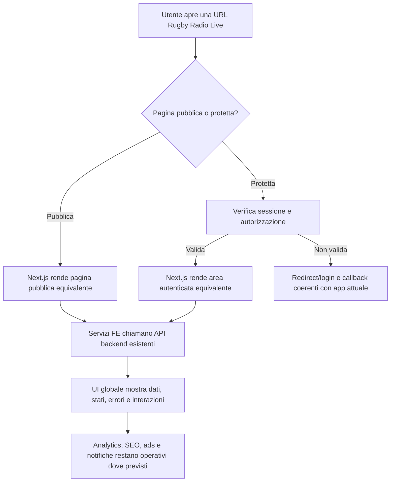

# Analisi funzionale - Migrazione WebApp Next.js Tailwind

## Fonte

Idea analizzata: `projects/nextjs-tailwind-migration/notes/idea-nextjs-tailwind.md`

Contesto wiki consultato:

- `llm-wiki/wiki/architecture/Rugby Radio Live (architecture).md`
- `llm-wiki/wiki/business/product/Rugby Radio Live (product).md`
- `llm-wiki/wiki/comparisons/Mappatura Frontend Pubblico e Autenticato (comparison).md`
- `llm-wiki/wiki/comparisons/Mappatura Componenti UI Condivisi (comparison).md`
- `llm-wiki/wiki/comparisons/Mappatura SEO e Analytics (comparison).md`
- `llm-wiki/wiki/comparisons/Mappatura Pagine e API (comparison).md`
- `llm-wiki/wiki/comparisons/Mappatura Servizi FE e BE (comparison).md`
- `llm-wiki/wiki/workflows/Autenticazione Utente (workflow).md`
- `llm-wiki/wiki/workflows/Cronista Telecronaca (workflow).md`
- `llm-wiki/wiki/workflows/Spettatore Partita (workflow).md`

Nota: i file `llm-wiki/wiki/index.md` e `llm-wiki/wiki/summary.md` indicati dalle istruzioni non risultano presenti nel workspace. L'analisi usa quindi le pagine tematiche wiki esistenti.

## Sintesi

La proposta richiede la creazione di una nuova WebApp `RugbyRadioWebNext` basata su Next.js e Tailwind CSS, con le stesse funzionalita e pagine dell'attuale `RugbyRadioWeb` Angular.

Il valore principale della migrazione non e cambiare prodotto o flussi utente, ma ottenere una nuova base frontend piu adatta a rendering moderno, SEO, composizione UI e manutenzione del design system. La migrazione deve preservare il comportamento applicativo esistente: pubblico, autenticato, PWA/TWA dove applicabile, multilingua, analytics, AdSense, notifiche, gestione canali, gestione partite, telecronaca, interazioni spettatore e superfici statiche/SEO.

Il secondo obiettivo esplicito dell'idea e sistemare il design system attuale, oggi percepito come spezzato in piu componenti, trasformandolo in un sistema globale e coerente. Dal punto di vista funzionale, questo significa che componenti condivisi, varianti visuali, stati, token e pattern di pagina devono essere governati da una libreria UI comune, non ricostruiti localmente pagina per pagina.

## Obiettivi

- Creare la nuova WebApp `RugbyRadioWebNext` usando Next.js e Tailwind CSS.
- Riprodurre tutte le pagine e funzionalita documentate per `RugbyRadioWeb`.
- Mantenere invariati i workflow di cronista, spettatore e utente autenticato.
- Preservare le integrazioni frontend verso API backend esistenti.
- Migrare e razionalizzare il design system in un layer globale.
- Migliorare la manutenibilita delle UI condivise senza introdurre regressioni funzionali.
- Mantenere o migliorare la superficie SEO pubblica e la misurazione analytics.
- Consentire una migrazione progressiva, verificabile per pagina e per workflow.

## Attori e stakeholder

| Attore | Interesse |
|---|---|
| Spettatore | Continuare a seguire partite pubbliche, eventi, commenti, emoji, voti, audio e contenuti collegati senza perdita di funzionalita. |
| Cronista | Continuare a creare e gestire telecronache da telefono con pochi click. |
| Utente registrato | Mantenere login, profilo, preferenze, follow, feedback e cancellazione account. |
| Amministratore / gestore prodotto | Ridurre duplicazione UI, migliorare qualita visiva e mantenere controllo su SEO, analytics e monetizzazione. |
| Backend / Operations | Conservare contratti API e configurazioni operative gia esistenti, minimizzando impatto sul backend. |
| Frontend / QA | Avere parita funzionale misurabile e un design system centrale da verificare. |

## Stato attuale

La wiki e il workspace documentano l'app esistente come `src/RugbyRadioWeb`, una PWA Angular 18/TypeScript ospitata su Firebase Hosting. L'app comunica con API REST ASP.NET Core e usa servizi frontend dedicati per dominio.

Le superfici frontend sono organizzate in:

- pagine pubbliche di discovery e fruizione: `HomePage`, `GMatchPage`, `GMatchesPage`, `GChannelPage`, `GChannelsPage`, `GTeamPage`, `GStatsPage`, `GFeedbackPage`;
- pagine pubbliche di autenticazione: `LoginPage`, `RegistrationPage`, `ResetPasswordPage`;
- pagine autenticate account/profilo: `ProfilePage`, `DangerPage`, `FavoritesPage`;
- pagine operative autenticate: `ChannelsPage`, `ChannelPage`, `MatchPage`;
- pagina amministrativa documentata: `AdminMaintenancePage`.

I servizi frontend chiamano API backend tramite un layer applicativo:

| Servizio FE | API backend |
|---|---|
| `UserService` | `AuthV1Controller`, `UserV1Controller` |
| `MatchService` | `MatchesV1Controller`, `MatchEventsV1Controllers`, `MatchLineupsV1Controller` |
| `ChannelService` | `ChannelsV1Controller` |
| `ChannelUserService` | `ChannelUsersV1Controller` |
| `TeamService` | `TeamsV1Controller` |
| `PlayerService` | `PlayersV1Controller` |
| `LineupService` | `MatchLineupsV1Controller` |
| `BlogService` | `BlogV1Controller` |
| `StatsService` | `StatsV1Controller` |
| `VoiceService` | `VoicesV1Controller` |

I componenti UI condivisi gia documentati includono controlli atomici, feedback, layout, liste, tab, share, ads, skeleton, paginazione e ricerca. La wiki segnala pero che non e deducibile una tassonomia completa di varianti visuali, accessibilita, focus management o test visuali.

## Target funzionale

La nuova WebApp `RugbyRadioWebNext` deve essere funzionalmente equivalente all'attuale `RugbyRadioWeb` dal punto di vista degli utenti e dei workflow.

La migrazione deve mantenere lo stesso dominio funzionale, ma puo cambiare tecnologia, organizzazione dei componenti e implementazione interna del rendering. Eventuali vantaggi tecnici di Next.js, come rendering server-side, static generation o route file-based, devono essere trattati come scelte architetturali successive e non devono alterare contratti utente o API senza decisione esplicita.

## Ambito

### In scope MVP

- Creazione progetto `RugbyRadioWebNext` accanto a `RugbyRadioWeb`.
- Setup Next.js, TypeScript e Tailwind CSS.
- Definizione del design system globale: token, colori, tipografia, spaziature, breakpoint, varianti componenti, stati e regole di composizione.
- Migrazione dei componenti condivisi equivalenti:
  - bottoni;
  - alert;
  - toast;
  - skeleton;
  - header pagina;
  - tab;
  - share;
  - search;
  - paginazione;
  - ads;
  - bottom navigation, se confermata nel perimetro runtime.
- Migrazione delle pagine pubbliche e autenticate documentate nella wiki.
- Migrazione dei servizi frontend verso le API backend esistenti.
- Gestione autenticazione, token, sessione, route protette e callback post-login.
- Gestione i18n per le lingue attualmente supportate dall'app.
- Conservazione delle integrazioni analytics/Firebase documentate dove funzionalmente previste.
- Conservazione AdSense e placement pubblicitari esistenti dove applicabili.
- Conservazione metadata SEO, canonical, Open Graph/Twitter, JSON-LD e sitemap/robots dove applicabili al nuovo hosting.
- Compatibilita mobile, desktop, PWA e TWA se la pubblicazione Android resta dipendente dalla web app.
- Piano di verifica di parita pagina-per-pagina e workflow-per-workflow.

### Out of scope MVP

- Modifica dei contratti API backend.
- Riscrittura dei workflow di dominio: canali, partite, telecronaca, commenti, voti, reaction, follow, TTS.
- Cambio di identita visuale o rebranding di Rugby Radio Live.
- Nuove funzionalita prodotto non presenti in `RugbyRadioWeb`.
- Migrazione del backend ASP.NET Core, Hangfire, storage, blog statico o sitemap service.
- Sostituzione dei provider Firebase, Google Analytics, AdSense o push notification, salvo necessita tecniche approvate.
- Pubblicazione immediata in produzione senza fase di confronto parallelo.
- Rimozione dell'app Angular prima del completamento della parita funzionale.

### Estensioni future

- Rendering server-side o static generation selettiva per pagine pubbliche SEO ad alto valore.
- Storybook o documentazione interattiva del design system.
- Visual regression testing automatizzato su componenti e pagine.
- Feature flag per confronto controllato Angular/Next su route specifiche.
- Consolidamento o revisione della strategia PWA/TWA dopo validazione della nuova app.
- Miglioramento accessibilita documentato con checklist WCAG e test keyboard/screen reader.

## Requisiti funzionali

### RF-01 - Parita pagine

La WebApp Next.js deve esporre pagine equivalenti a tutte le pagine frontend documentate nella wiki per `RugbyRadioWeb`.

La parita deve includere:

- route o URL equivalenti, salvo decisione esplicita di redirect/canonical;
- dati mostrati;
- azioni disponibili;
- stati di caricamento;
- empty state;
- error state;
- messaggi utente;
- permessi e redirect;
- metadata SEO per pagine pubbliche.

### RF-02 - Parita workflow spettatore

Lo spettatore deve poter:

- aprire home, canali, squadre, liste partite e pagina partita pubblica;
- leggere punteggio, eventi e contenuti collegati;
- usare interazioni pubbliche e ibride gia esistenti;
- autenticarsi quando un'azione lo richiede;
- rientrare nel contesto originario dopo login;
- usare audio TTS quando disponibile per AI-Talker e lingua selezionati;
- vedere annunci e contenuti SEO/pubblici dove gia previsti.

### RF-03 - Parita workflow cronista

Il cronista autenticato deve poter:

- accedere alle superfici protette;
- gestire canali di competenza;
- creare o aprire partite;
- configurare squadre, giocatori e lineup dove gia previsto;
- generare eventi di telecronaca;
- vedere feedback di successo, errore e caricamento coerenti con l'app attuale;
- non subire variazioni funzionali nella velocita operativa del flusso da telefono.

### RF-04 - Parita autenticazione e profilo

La nuova app deve conservare:

- login email/password;
- Google OAuth dove gia disponibile;
- registrazione;
- reset password con OTP;
- profilo utente;
- gestione token/sessione;
- guard per pagine protette;
- cancellazione account tramite `DangerPage`;
- feedback utente tramite toast o alert globali.

### RF-05 - Servizi frontend equivalenti

La nuova app deve avere un layer servizi equivalente ai servizi frontend documentati, anche se con implementazione Next.js differente.

I servizi devono:

- chiamare gli stessi controller backend;
- conservare mapping DTO e trasformazioni necessarie;
- gestire errori HTTP in modo coerente;
- centralizzare base URL, token, header e logging applicativo;
- evitare chiamate API duplicate causate dal passaggio tra rendering server/client.

### RF-06 - Design system globale

Il design system deve essere definito come layer condiviso e globale.

Il sistema deve includere almeno:

- token colore;
- token tipografici;
- scala spaziature;
- breakpoints;
- radius e shadow;
- stati interattivi;
- stati disabled/loading/error/success;
- componenti base e relative varianti;
- pattern per pagina pubblica, pagina autenticata e pannelli operativi.

I componenti di pagina non devono ridefinire localmente varianti visuali gia presenti nel design system, salvo casi motivati.

### RF-07 - Componenti UI condivisi equivalenti

La nuova app deve offrire equivalenti funzionali per i componenti condivisi gia documentati:

- Icon;
- EntityButton;
- EntityAlert;
- EntityToast;
- EntityPageHeader;
- EntitySkeleton;
- EntityPagination;
- EntitySearch;
- EntityTabs;
- EntityShare;
- EntityAds;
- liste card canale/partita;
- componenti match principali.

La migrazione puo rinominare i componenti, ma deve mantenere responsabilita e consumer funzionali.

### RF-08 - SEO e metadata

Le pagine pubbliche devono conservare o migliorare:

- title;
- meta description;
- canonical;
- Open Graph;
- Twitter card;
- JSON-LD dove gia previsto;
- robots/sitemap strategy;
- gestione URL pubbliche indicizzabili;
- compatibilita con contenuti statici e blog gia prodotti fuori dal runtime Angular.

La migrazione non deve ridurre la superficie SEO pubblica documentata senza decisione esplicita.

### RF-09 - Analytics, ads e monetizzazione

La nuova app deve mantenere:

- tracciamento page view e principali eventi prodotto gia previsti;
- integrazione Google Analytics/Firebase documentata;
- inserimento AdSense nelle superfici pubbliche equivalenti;
- comportamento non bloccante in caso di SDK analytics non configurato o non disponibile;
- coerenza dei placement pubblicitari rispetto alle pagine migrate.

### RF-10 - Multilingua

La nuova app deve supportare le lingue gia presenti nell'app attuale: IT, EN, FR, ES, JA.

La migrazione deve conservare:

- chiavi traduzione equivalenti o mapping tracciabile;
- selezione e persistenza lingua dove gia previste;
- contenuti statici multilingua dove applicabili;
- fallback leggibile in caso di chiave mancante.

### RF-11 - PWA, notifiche e integrazione mobile

Se la nuova app sostituisce la web app pubblicata, deve preservare:

- installabilita PWA dove gia prevista;
- manifest e icone;
- service worker/caching compatibile con il comportamento attuale;
- token FCM e ricezione notifiche dove supportato;
- compatibilita con Android TWA se la TWA continua a puntare alla stessa web app.

### RF-12 - Migrazione controllata

La migrazione deve consentire confronto tra Angular e Next.js prima dello switch definitivo.

Il sistema/progetto deve supportare:

- ambiente o URL separato per `RugbyRadioWebNext`;
- confronto pagina-per-pagina;
- verifica manuale dei workflow critici;
- rollback operativo alla web app Angular finche la nuova app non e validata;
- tracciamento delle pagine migrate e residue.

## Business rules

- La nuova app non cambia il significato di "radio": RRL resta una piattaforma di telecronaca testuale con AI-Talker e audio TTS dove previsto, non una emittente audio live.
- Le pagine pubbliche devono restare accessibili senza login salvo azioni documentate come ibride o protette.
- Le pagine operative per cronista e gestione contenuti devono restare protette da autenticazione.
- Follow, like, commenti, voti e altre interazioni che oggi richiedono account devono continuare a richiedere account.
- Il backend resta source of truth per permessi, proprieta, dati partita, canale, eventi, commenti, voti e notifiche.
- Il design system globale deve essere fonte unica per varianti UI ricorrenti.
- Le modifiche visuali non devono impedire l'uso rapido da telefono durante la telecronaca.

## Dati e integrazioni

### Dati

La migrazione frontend non introduce nuove entita di dominio obbligatorie. Deve riusare DTO e contratti equivalenti per:

- utenti e token;
- canali;
- squadre;
- partite;
- eventi partita;
- lineup;
- giocatori;
- commenti;
- reaction;
- rating;
- blog;
- statistiche;
- audio TTS.

### Integrazioni

| Integrazione | Comportamento atteso |
|---|---|
| API REST RRL | Stessi endpoint e semantica applicativa dell'app Angular. |
| Firebase / Google Analytics | Tracking e SDK non devono bloccare la navigazione se non disponibili. |
| Firebase FCM | Token e notifiche devono restare compatibili se la nuova app sostituisce la PWA. |
| Google OAuth | Login OAuth deve restare disponibile dove gia previsto. |
| AdSense | Placement pubblicitari pubblici equivalenti. |
| Storage/audio URL | Audio TTS deve costruire URL fruibili come nell'app attuale. |
| Blog/statiche/sitemap | Le superfici statiche e SEO devono restare raggiungibili e coerenti con canonical/robots. |

## Requisiti non funzionali

- La nuova app deve essere responsive su mobile e desktop.
- Le pagine operative da cronista devono restare efficienti su smartphone in condizioni da bordo campo.
- La nuova app deve evitare regressioni percepibili nei workflow principali.
- Il design system deve ridurre duplicazione e conflitti visuali.
- Le pagine pubbliche devono essere compatibili con crawler e social preview secondo la strategia SEO scelta.
- Errori runtime client e chiamate API fallite devono essere osservabili.
- Build, lint e test minimi devono essere eseguibili in modo ripetibile.
- La migrazione deve preservare sicurezza lato client: token non esposti inutilmente, route protette, nessun dato sensibile in HTML pubblico renderizzato server-side.

## Flussi principali

### Flusso pubblico spettatore

1. Lo spettatore apre una URL pubblica.
2. La pagina Next.js mostra contenuto equivalente alla pagina Angular corrispondente.
3. Il sistema carica dati da API backend esistenti o da contenuto statico, secondo pagina.
4. Lo spettatore consulta partita, canale, squadra, statistiche o contenuti editoriali.
5. Se avvia una interazione protetta, il sistema chiede login e conserva il contesto.
6. Dopo login, lo spettatore torna alla pagina o azione originaria.

### Flusso cronista

1. Il cronista apre una pagina protetta.
2. Se non autenticato, viene inviato al login.
3. Dopo autenticazione, accede a canali e partite di competenza.
4. Crea o modifica dati partita secondo permessi backend.
5. Genera eventi di telecronaca tramite API esistenti.
6. La UI mostra stato aggiornato, errori, loading e conferme senza cambiare workflow.

### Flusso design system

1. Il team definisce token e componenti globali.
2. Ogni pagina migrata usa componenti condivisi invece di varianti locali.
3. Nuovi componenti vengono aggiunti al design system solo se riusabili o necessari.
4. La verifica confronta stato normale, loading, empty, error, mobile e desktop.

## Criteri di accettazione

### CA-01 - Creazione progetto

Dato il repository RRL,
quando viene creato `RugbyRadioWebNext`,
allora il progetto deve compilare con Next.js, TypeScript e Tailwind CSS senza dipendere dal progetto Angular per l'esecuzione runtime.

### CA-02 - Inventory parita

Dato l'elenco delle pagine documentate nella wiki,
quando viene prodotta la matrice di migrazione,
allora ogni pagina deve avere stato, route target, dipendenze API, componenti principali e gap residui.

### CA-03 - Pagine pubbliche

Dato un utente non autenticato,
quando apre le pagine pubbliche migrate,
allora vede dati e azioni equivalenti all'app Angular, con login richiesto solo per azioni protette.

### CA-04 - Pagine protette

Dato un utente non autenticato,
quando apre una pagina protetta,
allora viene indirizzato al login e, dopo autenticazione valida, torna al contesto richiesto se applicabile.

### CA-05 - Telecronaca cronista

Dato un cronista autenticato con permessi validi,
quando crea o aggiorna una partita e inserisce eventi,
allora il backend riceve chiamate equivalenti a quelle dell'app Angular e la UI riflette il risultato.

### CA-06 - Design system globale

Dato un componente migrato,
quando usa colore, spacing, typography, radius, stato loading o variante button/tab/alert,
allora deve derivare dal design system globale e non da definizioni locali duplicate.

### CA-07 - SEO

Dato una pagina pubblica migrata,
quando viene ispezionato l'head,
allora title, description, canonical e metadata social devono essere presenti o motivatamente non applicabili.

### CA-08 - Analytics e ads

Dato una pagina pubblica migrata,
quando l'utente naviga e interagisce,
allora gli eventi analytics e gli slot ads equivalenti devono essere attivati senza bloccare la UX in caso di configurazione mancante.

### CA-09 - Multilingua

Dato un utente che seleziona una lingua supportata,
quando naviga tra pagine migrate,
allora testi UI e contenuti localizzati devono usare la lingua selezionata o fallback coerente.

### CA-10 - Regressione mobile

Dato un cronista su smartphone,
quando usa i flussi di gestione partita e inserimento eventi,
allora il numero di passaggi e l'accessibilita dei controlli principali non devono peggiorare rispetto all'app Angular.

## Rischi

| Rischio | Impatto | Mitigazione |
|---|---|---|
| Ambito troppo grande per una migrazione unica | Alto | Procedere per slice: shell, design system, pagine pubbliche, auth, pagine operative. |
| Perdita di SEO durante cambio routing/rendering | Alto | Inventory URL, redirect/canonical, test metadata e confronto Search Console post-rilascio. |
| Duplicazione design system anche nella nuova app | Medio | Definire token/componenti prima della migrazione massiva delle pagine. |
| Differenze tra rendering server e client | Medio | Classificare componenti client-only, storage/browser API e SDK Firebase prima dell'uso server-side. |
| Regressione PWA/TWA | Medio | Validare manifest, service worker, FCM e comportamento Android prima dello switch. |
| Contratti API non formalizzati completamente | Medio | Usare servizi esistenti, DTO e test di chiamata come riferimento, piu mappatura wiki. |
| Aumento complessita temporanea | Medio | Mantenere Angular e Next separati finche non esiste piano di switch e rollback. |
| Accessibilita non documentata | Medio | Introdurre checklist minima su focus, tastiera, aria-label e contrasto nel design system. |

## Assunzioni

- `RugbyRadioWebNext` verra creato come nuovo progetto sotto `src/`, accanto a `src/RugbyRadioWeb`.
- Il backend ASP.NET Core e i controller API non cambiano per l'MVP.
- Le URL pubbliche canoniche devono restare equivalenti o essere redirette in modo esplicito.
- Il design visuale deve restare riconoscibile come Rugby Radio Live, non essere ripensato da zero.
- La migrazione Next.js non implica automaticamente SSR per ogni pagina; ogni pagina deve essere classificata in base a dati, SEO, autenticazione e uso di API browser.
- L'app Angular rimane disponibile fino al completamento della parita funzionale.

## Open questions

- Quali URL pubbliche devono restare identiche e quali possono cambiare con redirect?
- La nuova app dovra essere pubblicata su Firebase Hosting, Cloudflare, server Node dedicato o altra destinazione?
- La TWA Android dovra puntare alla nuova app al primo rilascio o in una fase successiva?
- Quali pagine hanno priorita MVP: pubbliche SEO, flusso cronista, oppure area account?
- Il design system deve essere documentato in Storybook, in wiki o solo nel codice?
- Quali metriche definiscono "stesse funzionalita": checklist manuale, test end-to-end, screenshot diff, tracking eventi?
- Le pagine statiche in `assets/static` restano HTML separati o vengono migrate in route Next.js?
- Il blog statico resta fuori dalla nuova app o viene integrato in una strategia Next.js?
- Quale livello di SSR/SSG e richiesto per le pagine pubbliche?
- Esistono vincoli di versione Next.js/Tailwind da adottare per sicurezza, hosting o compatibilita?

## Slice consigliate

### Slice 1 - Fondazione e inventory

- Creare progetto `RugbyRadioWebNext`.
- Definire routing target e matrice parita con le 18 pagine documentate.
- Definire setup env, base API URL, lint/build e convenzioni cartelle.
- Inventariare storage/browser API, Firebase, FCM, AdSense e componenti client-only.

### Slice 2 - Design system globale

- Definire Tailwind theme e token globali.
- Creare componenti base equivalenti: Button, Icon, Alert, Toast, Skeleton, Tabs, Search, Pagination, Share, Ads.
- Documentare varianti e stati minimi.
- Verificare mobile/desktop con pagine demo o prima pagina pilota.

### Slice 3 - Pagine pubbliche SEO

- Migrare Home, liste pubbliche, pagine canale/team/match pubbliche e stats.
- Applicare metadata, canonical, social preview e analytics.
- Validare comportamento non autenticato e azioni ibride con callback login.

### Slice 4 - Auth e account

- Migrare login, registrazione, reset password, profilo, preferiti, feedback e danger.
- Validare token, persistenza sessione, redirect e stati errore.

### Slice 5 - Flusso cronista

- Migrare ChannelsPage, ChannelPage e MatchPage.
- Validare gestione canale, creazione partita, lineup, eventi, blog e feedback UI.
- Eseguire test manuale end-to-end da mobile.

### Slice 6 - PWA, TWA, ads e switch

- Validare manifest, service worker, FCM, AdSense e analytics.
- Preparare piano redirect/canonical.
- Pubblicare ambiente parallelo.
- Eseguire confronto finale e switch controllato.

## Prossimo passo consigliato

Produrre una task list tecnica a partire da questa AF, con una matrice di migrazione pagina-per-pagina. La prima attivita utile e creare l'inventory `Angular page -> Next route -> API services -> componenti DS -> stati da testare -> note SEO/auth`, per ridurre l'ambiguita prima dello scaffold del progetto.
