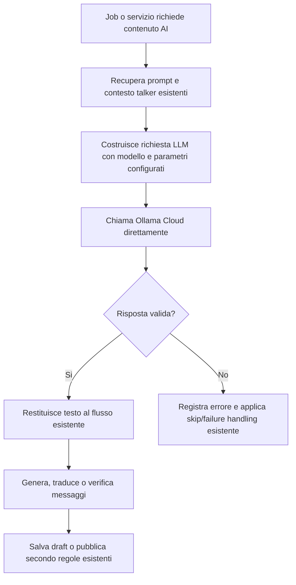

# Analisi funzionale - Migrazione Ollama Cloud

## Fonte

Idea analizzata: `projects/ollama-cloud-migration/notes/idea-migrazione-ollama-cloud.md`

Contesto wiki consultato:

- `llm-wiki/wiki/backend/api/services/AiOllamaService (api).md`
- `llm-wiki/wiki/backend/api/integrations/OllamaAI (api).md`
- `llm-wiki/wiki/backend/api/services/SystemMessageService (api).md`
- `llm-wiki/wiki/concepts/Sistema Messaggi Telecronaca AI (concept).md`
- `llm-wiki/wiki/concepts/AI-Talker (concept).md`
- `llm-wiki/wiki/backend/api/jobs/CreateMatchEventJob (api).md`
- `llm-wiki/wiki/backend/api/jobs/CreateMatchEventAdminJob (api).md`

Nota: i file `llm-wiki/wiki/index.md` e `llm-wiki/wiki/summary.md` indicati da analisi precedenti non risultano presenti nel workspace. L'analisi usa quindi le pagine tematiche wiki esistenti.

## Sintesi

La migrazione Ollama Cloud sostituisce il passaggio tramite API Tailoor per le chiamate LLM con una chiamata diretta a Ollama Cloud, preservando il comportamento funzionale dei prompt e il meccanismo esistente di recupero dei prompt per talker.

Il cambiamento deve essere trasparente per cronisti, spettatori e amministratori: i messaggi di telecronaca AI devono continuare a essere generati, tradotti, verificati e pubblicati con gli stessi criteri funzionali gia documentati. Il perimetro principale riguarda quindi il backend e i job Hangfire che usano `SystemMessageService` per generare contenuti AI.

La richiesta suggerisce l'introduzione di una classe dedicata alla chiamata diretta Ollama Cloud. Dal punto di vista funzionale, questa classe deve diventare il nuovo canale applicativo verso il provider LLM per i flussi interessati, senza cambiare la semantica dei prompt, dei talker, delle lingue e dei controlli di qualita.

## Obiettivi

- Eliminare la dipendenza funzionale dalle API Tailoor per le chiamate LLM interessate.
- Chiamare Ollama Cloud direttamente dal backend.
- Preservare i prompt attuali e il recupero dei prompt per talker.
- Mantenere invariati i flussi di generazione, traduzione, verifica e pubblicazione dei messaggi di telecronaca.
- Rendere configurabili modello e parametri LLM indicati dall'idea.
- Ridurre il rischio di regressioni sui testi prodotti dagli AI-Talker.
- Rendere osservabili errori, timeout e risposte non valide del nuovo provider.

## Attori e stakeholder

| Attore | Interesse |
|---|---|
| Amministratore | Continuare a generare e approvare messaggi AI senza cambiare operativita. |
| Cronista | Usare eventi e telecronaca senza impatti sul flusso partita. |
| Spettatore | Ricevere testi di telecronaca coerenti con AI-Talker e lingua selezionati. |
| Prodotto RRL | Mantenere qualita e varieta degli AI-Talker riducendo dipendenze esterne non desiderate. |
| Backend / Operazioni | Avere una integrazione LLM diretta, configurabile e diagnosticabile. |

## Stato attuale

L'idea descrive l'AS-IS come segue:

- le chiamate LLM vengono fatte attraverso API Tailoor;
- modello configurato: `gpt-oss:20b`;
- `TokenMax`: `5500`;
- `Coefficient`: `1`;
- `Options`: `{"NumCtx":8192,"MaxOutputTokens":2600}`.

La wiki documenta inoltre che:

- `SystemMessageService` genera, traduce, verifica e pubblica messaggi di telecronaca AI;
- i consumer principali sono `CreateMatchEventJob` e `CreateMatchEventAdminJob`;
- `CreateMatchEventJob` genera draft in 5 lingue e 10 stili telecronista, con soglie `verifyValue >= 80` e `verifyLanguageValue >= 70`;
- `CreateMatchEventJob` ha limite di 10 chiamate AI per esecuzione;
- `CreateMatchEventJob` salta casi con risposta AI vuota o malformata, placeholder giocatore mancante o prompt mancante;
- `SystemMessageService` usa sia `OllamaAI` sia `TailoorTalkerHelper`;
- `OllamaAI` e documentata come integrazione via SDK OllamaSharp verso istanza Ollama self-hosted, con URI e modelli configurabili da `Db/Ai-Talkers.json`;
- `AI-Talker` determina stile e lingua delle frasi di telecronaca, usando testi generati offline e salvati nel database.

## Target funzionale

Il target e sostituire il canale LLM mediato da Tailoor con un canale diretto Ollama Cloud per i flussi di generazione, traduzione e verifica dei messaggi, mantenendo invariato il modo in cui il sistema seleziona prompt, talker, lingua e criteri di validazione.

## Ambito

### In scope MVP

- Introduzione di un canale applicativo diretto verso Ollama Cloud.
- Configurazione del modello `gpt-oss:20b`.
- Configurazione dei parametri indicati dall'idea: `TokenMax = 5500`, `Coefficient = 1`, `NumCtx = 8192`, `MaxOutputTokens = 2600`.
- Riuso del meccanismo attuale di recupero prompt per talker.
- Riuso dei prompt attuali senza riscrittura funzionale.
- Sostituzione delle chiamate LLM oggi effettuate tramite API Tailoor nei flussi interessati.
- Mantenimento di generazione messaggi, traduzione, verifica coerenza e verifica lingua.
- Mantenimento delle soglie di verifica esistenti dove gia applicate.
- Gestione di risposte vuote, non valide, timeout ed errori provider senza bloccare l'intero batch oltre il comportamento attuale.
- Logging operativo minimo su provider usato, modello, esito chiamata, errore e durata.
- Possibilita di rollback configurativo verso il provider precedente, se ritenuto necessario in implementazione.

### Out of scope

- Modifica dei prompt di contenuto o del tono degli AI-Talker.
- Modifica del numero di lingue, stili o varianti generate.
- Modifica delle soglie di approvazione automatica dei draft.
- Introduzione di AI realtime durante la partita.
- Modifica dei flussi cronista o spettatore.
- Modifica della generazione audio TTS.
- Modifica delle entita `SystemMessage`, `SystemMessageDraft` o dei tipi evento, salvo necessita tecniche puntuali.
- Dashboard amministrativa dedicata alla configurazione Ollama Cloud.
- Migrazione storica o rigenerazione massiva dei messaggi gia pubblicati.

### Estensioni future

- Selettore amministrativo del provider LLM per ambiente o job.
- Metriche comparative tra Tailoor e Ollama Cloud su qualita, latenza e costo.
- Retry controllati con backoff per errori temporanei del provider.
- Circuit breaker o disabilitazione temporanea del provider in caso di errori ripetuti.
- Campagna di rigenerazione selettiva dei messaggi di bassa qualita.

## Requisiti funzionali

| ID | Requisito |
|---|---|
| FR-01 | Il sistema deve consentire ai flussi LLM interessati di chiamare Ollama Cloud direttamente. |
| FR-02 | Il sistema deve usare il modello configurato `gpt-oss:20b`, salvo override esplicito per ambiente. |
| FR-03 | Il sistema deve applicare i parametri LLM `TokenMax = 5500`, `Coefficient = 1`, `NumCtx = 8192`, `MaxOutputTokens = 2600` quando costruisce la richiesta a Ollama Cloud. |
| FR-04 | Il sistema deve continuare a recuperare i prompt per talker con il meccanismo gia esistente. |
| FR-05 | Il sistema non deve richiedere modifiche ai prompt attuali per completare la migrazione MVP. |
| FR-06 | Il sistema deve inviare a Ollama Cloud lo stesso contenuto funzionale oggi inviato al provider LLM mediato da Tailoor: prompt, contesto, lingua, talker e richiesta operativa. |
| FR-07 | `SystemMessageService` deve poter generare messaggi draft tramite il nuovo canale Ollama Cloud. |
| FR-08 | `SystemMessageService` deve poter tradurre messaggi tramite il nuovo canale Ollama Cloud. |
| FR-09 | `SystemMessageService` deve poter verificare coerenza del testo e coerenza della lingua tramite il nuovo canale Ollama Cloud, se tali verifiche oggi passano da Tailoor. |
| FR-10 | `CreateMatchEventJob` deve mantenere il limite funzionale di 10 chiamate AI per esecuzione, salvo diversa decisione futura. |
| FR-11 | Il sistema deve mantenere le soglie di verifica documentate: `verifyValue >= 80` e `verifyLanguageValue >= 70` per segnare un draft come verificato, dove applicabili. |
| FR-12 | In caso di risposta vuota, non parseabile o incompatibile con il formato atteso, il sistema deve applicare lo skip/failure handling gia previsto dal flusso attuale. |
| FR-13 | In caso di prompt mancante, il sistema deve continuare a marcare o gestire il caso come prompt mancante secondo il comportamento attuale. |
| FR-14 | In caso di timeout o errore HTTP da Ollama Cloud, il sistema deve registrare l'errore e non deve pubblicare contenuti incompleti o non verificati. |
| FR-15 | Il sistema deve preservare il comportamento di pubblicazione in `SystemMessage`: solo i messaggi approvati o verificati secondo le regole esistenti devono essere promossi. |
| FR-16 | Il sistema deve distinguere nei log le chiamate verso Ollama Cloud dalle eventuali chiamate verso altri provider. |
| FR-17 | Il sistema deve consentire configurazione separata per ambienti locali, test e produzione. |
| FR-18 | Il sistema deve evitare che credenziali, token o endpoint Ollama Cloud siano hardcoded in codice sorgente. |
| FR-19 | Il sistema deve mantenere compatibilita con i job Hangfire esistenti che consumano `SystemMessageService`. |
| FR-20 | La migrazione non deve modificare il comportamento frontend di scelta AI-Talker, visualizzazione telecronaca o TTS audio. |

## Regole di business

| ID | Regola |
|---|---|
| BR-01 | Il prompt per talker resta la fonte funzionale dello stile dell'AI-Talker. |
| BR-02 | La migrazione del provider LLM non deve cambiare il significato dei tipi evento partita. |
| BR-03 | I messaggi generati restano offline e salvati nel database prima dell'uso spettatore. |
| BR-04 | Una risposta LLM non valida non deve essere pubblicata come messaggio definitivo. |
| BR-05 | Il sistema deve continuare a preservare placeholder e varianti richieste dai messaggi esistenti, inclusi casi con giocatore maschile/femminile quando previsti. |
| BR-06 | La qualita minima per l'approvazione automatica resta governata dalle soglie esistenti, non dal provider usato. |
| BR-07 | La scelta del provider non deve essere visibile allo spettatore finale. |

## Stati ed errori

| Caso | Comportamento atteso |
|---|---|
| Ollama Cloud risponde con testo valido | Il flusso prosegue come oggi: parse, verifica, salvataggio draft o pubblicazione secondo regole esistenti. |
| Ollama Cloud risponde vuoto | Il singolo item viene saltato o marcato non valido secondo comportamento attuale; viene registrato log. |
| Ollama Cloud risponde in formato inatteso | Il sistema non pubblica il contenuto e registra errore di formato. |
| Timeout provider | Il sistema registra timeout e lascia il job gestire il batch secondo le regole attuali. |
| Errore autenticazione/configurazione | Il sistema registra errore bloccante di configurazione e non tenta pubblicazioni parziali non verificate. |
| Prompt talker mancante | Il sistema mantiene il comportamento attuale di prompt mancante e non genera messaggi con prompt alternativo implicito. |
| Modello non disponibile | Il sistema registra modello non disponibile e non usa automaticamente un modello diverso, salvo fallback configurato esplicitamente. |

## Dati e configurazioni

| Campo / Configurazione | Uso funzionale |
|---|---|
| Endpoint Ollama Cloud | URL del provider LLM diretto. |
| Credenziale Ollama Cloud | Autenticazione verso il provider; deve stare in configurazione sicura. |
| Model | Modello da usare, inizialmente `gpt-oss:20b`. |
| TokenMax | Limite funzionale indicato dall'idea: `5500`. |
| Coefficient | Parametro indicato dall'idea: `1`. |
| NumCtx | Contesto modello indicato dall'idea: `8192`. |
| MaxOutputTokens | Output massimo indicato dall'idea: `2600`. |
| Prompt talker | Prompt/stile esistente associato all'AI-Talker. |
| Lingua | Lingua target della generazione o traduzione. |
| Tipo evento | Codice evento usato per generare messaggio coerente. |
| Correlation id / job id | Identificatore utile per tracciare chiamate e batch. |

## Casi d'uso

### UC-01 - Generazione messaggi tramite Ollama Cloud

Precondizioni:

- Il job di generazione messaggi e avviato.
- Esiste un tipo evento eleggibile.
- Esiste un prompt valido per il talker richiesto.
- La configurazione Ollama Cloud e valida.

Flusso principale:

1. Il job richiede a `SystemMessageService` la generazione di nuovi messaggi.
2. Il sistema recupera prompt, lingua, talker e contesto evento.
3. Il sistema costruisce la richiesta LLM con modello e parametri configurati.
4. Il sistema invia la richiesta a Ollama Cloud.
5. Il sistema riceve una risposta valida.
6. Il sistema converte la risposta nel formato atteso dal flusso draft.
7. Il sistema salva i draft secondo regole esistenti.

Risultato:

- I messaggi draft sono disponibili per verifica e pubblicazione senza uso delle API Tailoor.

### UC-02 - Verifica messaggi tramite Ollama Cloud

Precondizioni:

- Esiste un messaggio draft da verificare.
- Il prompt/verificatore richiesto e disponibile.

Flusso principale:

1. Il sistema prepara la richiesta di verifica coerenza testo o lingua.
2. Il sistema chiama Ollama Cloud.
3. Il sistema interpreta il risultato della verifica.
4. Il sistema applica le soglie esistenti.
5. Il sistema marca il draft come verificato solo se le soglie sono rispettate.

Risultato:

- La verifica resta funzionalmente equivalente al flusso precedente.

### UC-03 - Errore provider durante batch

Precondizioni:

- Un job Hangfire sta processando piu eventi, lingue o talker.
- Ollama Cloud restituisce errore o timeout per una chiamata.

Flusso alternativo:

1. Il sistema registra provider, modello, operazione e motivo errore.
2. Il sistema non pubblica contenuti derivati dalla chiamata fallita.
3. Il sistema applica il comportamento di skip o fallimento gia previsto dal job.
4. Gli elementi non processati restano eleggibili per una successiva esecuzione, se previsto dal flusso attuale.

Risultato:

- L'errore non produce contenuti corrotti o incompleti.

## Requisiti non funzionali

| ID | Requisito |
|---|---|
| NFR-01 | Le credenziali Ollama Cloud devono essere gestite tramite configurazione sicura e non versionate. |
| NFR-02 | Le chiamate LLM devono avere timeout esplicito. |
| NFR-03 | I log devono permettere diagnosi di errori provider senza includere prompt completi o dati sensibili quando non necessario. |
| NFR-04 | La migrazione deve poter essere verificata in ambiente non produttivo prima del rilascio. |
| NFR-05 | Il comportamento deve essere idempotente rispetto ai job esistenti: una riesecuzione non deve duplicare pubblicazioni gia avvenute. |
| NFR-06 | Il nuovo canale deve essere testabile isolando la chiamata provider dal resto del flusso. |
| NFR-07 | La latenza del provider non deve bloccare indefinitamente i job Hangfire. |

## Criteri di accettazione

### AC-01 - Chiamata diretta a Ollama Cloud

Dato un flusso LLM configurato per Ollama Cloud,
quando il sistema genera un messaggio di telecronaca,
allora la richiesta viene inviata direttamente a Ollama Cloud e non alle API Tailoor.

### AC-02 - Prompt talker invariati

Dato un AI-Talker con prompt gia configurato,
quando viene generato un messaggio tramite Ollama Cloud,
allora il sistema usa lo stesso meccanismo di recupero prompt gia presente prima della migrazione.

### AC-03 - Parametri modello applicati

Dato il provider Ollama Cloud configurato,
quando il sistema costruisce la richiesta LLM,
allora usa modello `gpt-oss:20b`, `TokenMax = 5500`, `Coefficient = 1`, `NumCtx = 8192` e `MaxOutputTokens = 2600`, salvo override esplicito di ambiente.

### AC-04 - Generazione draft preservata

Dato un tipo evento eleggibile e un prompt valido,
quando il job genera messaggi,
allora vengono creati draft compatibili con il flusso esistente di `SystemMessageDraft`.

### AC-05 - Verifica qualita preservata

Dato un messaggio draft generato,
quando il sistema calcola coerenza testo e coerenza lingua,
allora il draft viene marcato verificato solo se rispetta le soglie esistenti.

### AC-06 - Errore provider non pubblica contenuti

Dato un timeout, errore HTTP o risposta vuota da Ollama Cloud,
quando il sistema processa la chiamata,
allora non viene pubblicato alcun messaggio definitivo derivato da quella risposta.

### AC-07 - Frontend invariato

Dato uno spettatore che seleziona un AI-Talker e consulta una partita,
quando la migrazione e attiva,
allora il comportamento frontend di telecronaca e TTS resta invariato.

### AC-08 - Log diagnostici

Dato una chiamata LLM completata o fallita,
quando il sistema registra l'esito,
allora il log permette di distinguere operazione, provider, modello, durata ed errore sintetico.

### AC-09 - Rollback configurativo

Dato un problema bloccante con Ollama Cloud in ambiente di rilascio,
quando viene applicata la configurazione di rollback prevista,
allora i flussi interessati possono tornare al provider precedente senza modifica dei prompt.

Nota: AC-09 e consigliato come criterio di sicurezza operativa; resta una decisione tecnica/prodotto se includerlo nell'MVP.

## Impatti su workflow

| Workflow | Impatto |
|---|---|
| Generazione messaggi telecronaca AI | Cambia provider LLM, ma non cambia risultato funzionale atteso. |
| Traduzione messaggi | Deve continuare a produrre lingue supportate con lo stesso processo. |
| Verifica messaggi | Deve continuare ad applicare soglie e marcature esistenti. |
| Pubblicazione messaggi | Nessun cambio funzionale previsto. |
| Cronaca partita | Nessun cambio per cronista. |
| Fruizione spettatore | Nessun cambio per spettatore. |
| TTS audio | Nessun cambio diretto; consuma messaggi gia pubblicati. |

## Assunzioni

- "AF" e inteso come analisi funzionale.
- Le chiamate da migrare sono quelle LLM oggi mediate da Tailoor nei flussi `SystemMessageService` / messaggi telecronaca AI.
- `AiOllamaService` per blog potrebbe gia chiamare Ollama via SDK e non essere parte primaria della migrazione, salvo consolidamento tecnico futuro.
- Il recupero prompt per talker e gia implementato e deve restare invariato.
- Ollama Cloud espone un'interfaccia compatibile o adattabile ai payload necessari.
- Il formato di risposta richiesto dai flussi esistenti deve rimanere compatibile con parser e validazioni attuali.

## Rischi

| Rischio | Impatto | Mitigazione |
|---|---|---|
| Differenza qualitativa tra output Tailoor e Ollama Cloud | Messaggi meno coerenti o meno aderenti al talker | Test comparativi su set di eventi campione e verifica soglie. |
| Formato risposta diverso | Parser esistenti falliscono o saltano troppi messaggi | Definire contratto di risposta e validare prima del salvataggio. |
| Prompt troppo legati al provider precedente | Output inattesi senza cambiare prompt | Eseguire dry run con prompt attuali e catalogare casi non conformi. |
| Timeout o latenza elevata | Job Hangfire piu lenti o incompleti | Timeout espliciti, limiti batch e logging durata. |
| Configurazione segreta errata | Blocco totale generazione AI | Health check o test configurazione in avvio/job diagnostico. |
| Assenza rollback | Rilascio rischioso se emergono regressioni | Mantenere provider precedente dietro configurazione fino a stabilizzazione. |
| Logging eccessivo di prompt | Esposizione contenuti o dati sensibili | Log sintetici e redazione prompt/risposte. |

## Open questions

1. Quali metodi di `SystemMessageService` usano ancora Tailoor e devono essere migrati nel primo rilascio?
2. La verifica qualita/coerenza deve passare anch'essa a Ollama Cloud o resta temporaneamente su Tailoor?
3. Ollama Cloud richiede credenziale, header o formato payload specifico diverso da Ollama self-hosted/OllamaSharp?
4. Il parametro `Coefficient` ha semantica funzionale specifica nel provider precedente o deve solo essere inoltrato/configurato?
5. Il rollback verso Tailoor e richiesto nell'MVP o basta migrazione one-way?
6. Sono richiesti test comparativi quantitativi prima del rilascio in produzione?
7. Il modello `gpt-oss:20b` e unico per tutti i talker/lingue o possono esistere override per specifici flussi?
8. Quale ambiente deve essere usato come prima validazione: locale, staging o produzione controllata?

## Decisioni consigliate

1. Trattare il cambio provider come migrazione infrastrutturale trasparente per prodotto e utenti.
2. Mantenere prompt e recupero prompt invariati nell'MVP.
3. Introdurre configurazione esplicita del provider LLM per ambiente.
4. Mantenere un fallback configurativo verso Tailoor almeno fino alla prima validazione completa.
5. Validare la migrazione su un set fisso di eventi, talker e lingue prima di abilitarla sui job ricorrenti.

## Slice MVP consigliata

- Creare/adattare una classe provider per chiamata diretta Ollama Cloud.
- Collegare `SystemMessageService` al nuovo provider solo per un sottoinsieme controllato di operazioni.
- Eseguire dry run su generazione messaggi senza pubblicazione automatica.
- Confrontare output, verifiche e percentuale di risposte valide.
- Abilitare il provider su job Hangfire dopo validazione.
- Monitorare errori, durata media e numero di draft generati/verificati nelle prime esecuzioni.

## Tracciabilita

| Fonte idea | Elemento AF |
|---|---|
| "Le chiamate LLM vengono fatte attraverso API Tailoor" | Stato attuale, FR-01, AC-01 |
| "Le chiamate LLM devono essere fatte chiamando Ollama Cloud direttamente" | Target funzionale, FR-01, AC-01 |
| "E' il caso di introdurre una classe per fare cio" | Sintesi, Slice MVP |
| "rispettato i prompt attuali" | FR-04, FR-05, AC-02 |
| "Il recupero dei prompt per talker rimane invariato" | FR-04, BR-01, AC-02 |
| Configurazione modello/token/options | FR-02, FR-03, AC-03, Dati e configurazioni |
