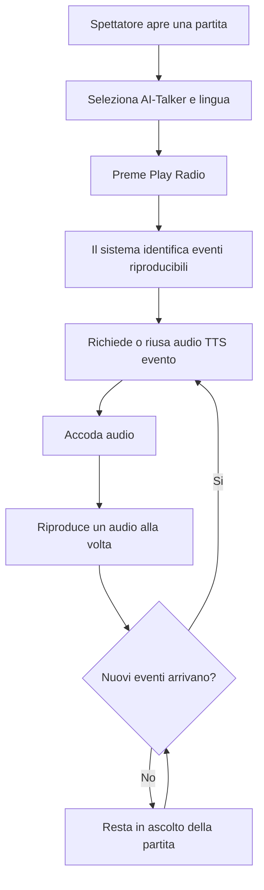

# Analisi funzionale - Modalita Radio Evento

## Fonte

Idea analizzata: `projects/radio-evento/notes/idea-radio.md`

Contesto wiki consultato:

- `llm-wiki/wiki/architecture/Rugby Radio Live (architecture).md`
- `llm-wiki/wiki/business/product/Rugby Radio Live (product).md`
- `llm-wiki/wiki/workflows/Riproduzione Audio Telecronaca (workflow).md`
- `llm-wiki/wiki/workflows/Spettatore Partita (workflow).md`
- `llm-wiki/wiki/concepts/TTS Audio (concept).md`
- `llm-wiki/wiki/concepts/AI-Talker (concept).md`
- `llm-wiki/wiki/concepts/Radio Canale (concept).md`
- `llm-wiki/wiki/concepts/Notifica (concept).md`
- `llm-wiki/wiki/concepts/Match Event Types (concept).md`
- `llm-wiki/wiki/frontend/web/components/GMatchEventsComponent (web).md`
- `llm-wiki/wiki/frontend/web/components/MatchEventsComponent (web).md`
- `llm-wiki/wiki/frontend/web/components/MatchCommentatorComponent (web).md`
- `llm-wiki/wiki/frontend/web/services/VoiceService (web).md`
- `llm-wiki/wiki/backend/api/integrations/FirebaseFCM (api).md`

Nota: i file `llm-wiki/wiki/index.md` e `llm-wiki/wiki/summary.md` indicati dalle istruzioni non risultano presenti nel workspace. L'analisi usa quindi le pagine tematiche wiki esistenti.

## Sintesi

La Modalita Radio Evento estende Rugby Radio Live da esperienza principalmente testuale con audio TTS on demand a esperienza di ascolto continuo della partita. Lo spettatore apre una partita, seleziona un AI-Talker, preme Play e ascolta automaticamente gli eventi generati dal cronista senza dover premere il pulsante audio su ogni evento.

Il principio funzionale da preservare e che il cronista non cambia operativita: continua a creare la partita e premere eventi. La piattaforma trasforma gli eventi gia esistenti in una coda audio lato spettatore, usando i testi offline e i file MP3 TTS gia generati o generabili tramite il flusso `VoiceService` / `VoicesV1Controller`.

La funzionalita deve essere introdotta per fasi. La prima fase consigliata e Auto Play Telecronaca, per validare valore e rischi tecnici con il minimo impatto su backend, AI e workflow cronista.

## Obiettivi

- Consentire allo spettatore di ascoltare una partita come flusso audio continuo.
- Ridurre la necessita di leggere il feed eventi durante la partita.
- Valorizzare TTS Audio e AI-Talker gia presenti nel prodotto.
- Mantenere invariata la telecronaca testuale, il punteggio live, statistiche, commenti, emoji e feed eventi.
- Non introdurre microfono, registrazione audio, stream audio live o AI realtime.
- Restare compatibili con browser desktop, browser mobile, PWA e TWA Android per quanto consentito dalle policy dei browser.

## Attori e stakeholder

| Attore | Interesse |
|---|---|
| Spettatore | Ascoltare la partita in modalita passiva, anche mentre non guarda lo schermo. |
| Genitore/parente assente | Seguire la partita da auto, lavoro o viaggio con interazione minima. |
| Tifoso occasionale | Ricevere eventi importanti e rientrare rapidamente nella diretta. |
| Allenatore | Monitorare andamento e punteggio mentre svolge altre attivita. |
| Cronista | Continuare a premere eventi senza nuove responsabilita operative. |
| Gestore canale | Aumentare valore percepito del canale/radio e retention degli spettatori. |
| Prodotto RRL | Differenziarsi dai live score tradizionali e rafforzare il concetto di radio. |

## Stato attuale

Oggi il TTS e documentato come layer opzionale sopra la telecronaca testuale:

- Lo spettatore seleziona un AI-Talker tramite `MatchCommentatorComponent`.
- Il feed eventi e gestito da `MatchEventsComponent`.
- Il pulsante audio evento e visibile solo se `UserService` indica disponibilita audio per il commentator corrente.
- Per un evento, il frontend chiama `VoiceService` con lingua ed `eventId`.
- Il backend restituisce un path relativo `text/plain` del file MP3 generato o gia presente.
- Il frontend combina il path con `environment.audioUrl` e avvia la riproduzione.

La riproduzione e quindi manuale e puntuale: lo spettatore deve premere il pulsante audio per ciascun evento.

## Target funzionale

La Modalita Radio Evento introduce un player audio continuo per la partita.

Flusso target:

## Ambito

### In scope MVP - Fase 1 Auto Play Telecronaca

- Pulsante Play/Pause per attivare o sospendere la riproduzione automatica degli eventi.
- Uso dell'AI-Talker e della lingua selezionati dall'utente.
- Coda audio lato frontend degli eventi della partita.
- Scelta utente per ascoltare anche gli eventi gia avvenuti prima dell'attivazione; default disattivato, quindi vengono riprodotti solo i nuovi eventi.
- Riproduzione sequenziale: un solo audio alla volta.
- Inserimento in coda dei nuovi eventi arrivati dopo l'attivazione della radio.
- Recupero audio tramite gli endpoint esistenti di `VoiceService`.
- Stato visibile: radio attiva, in pausa, in caricamento audio, evento in riproduzione, errore audio.
- Prevenzione delle sovrapposizioni audio.
- Tracciamento analytics minimo degli eventi di utilizzo della radio.
- Persistenza della sessione radio solo sul dispositivo dell'utente.

### In scope Fase 2 Pagina Radio

- Vista dedicata all'ascolto, simile a un player musicale.
- Visualizzazione essenziale: copertina partita, squadre, punteggio, timer, AI-Talker selezionato, controlli play/pause.
- Route pubblica condivisibile per aprire direttamente la Modalita Radio Evento.
- Accesso dalla pagina partita pubblica.
- Ritorno alla vista partita completa.

### In scope Fase 3 Radio Lock Screen

- Analisi e gestione dei limiti browser per audio in background.
- Supporto progressivo a Media Session API se disponibile.
- Comportamento documentato per browser mobile, PWA e TWA di ultima generazione, senza supporto esteso a versioni obsolete.

### In scope Fase 4 Notifiche Audio

- Notifiche push per eventi importanti gia supportabili dal sistema FCM.
- Deep link verso partita o vista radio.
- Nessuna distinzione funzionale tra tipi evento nella prima analisi: tutti gli eventi partita sono considerati importanti allo stesso modo.

### In scope Fase 5 Jingle Radio

- Inserimento opzionale di audio statici pre-generati tra eventi distanziati.
- Jingle globali RRL, non specifici del singolo canale nella prima evoluzione.
- Nessuna generazione AI realtime.
- Regole di frequenza per evitare disturbo durante fasi intense della partita.

### In scope Fase 6 Multi Speaker

- Sequenze audio composte da piu AI-Talker per uno stesso evento.
- Ruoli editoriali configurabili, ad esempio voce principale, commento tecnico e riepilogo.
- Disponibilita solo per talker con voce TTS.

### In scope Fase 7 Radio Canale

- Estensione del player dal singolo match al canale/radio.
- Contenuti canale in ordine cronologico quando non ci sono partite live.
- Passaggio automatico alla diretta evento quando una partita del canale inizia.

### Out of scope

- Microfono del cronista.
- Registrazione audio live.
- Streaming audio continuo lato server.
- Chiamate AI realtime durante la partita.
- Riscrittura completa del workflow cronista.
- Obbligo di installare app native dedicate.
- Produzione automatica di contenuti editoriali nuovi non gia presenti o pre-generati.

## Requisiti funzionali MVP

| ID | Requisito |
|---|---|
| FR-01 | Il sistema deve permettere allo spettatore di attivare la Modalita Radio Evento da una partita pubblica. |
| FR-02 | Il sistema deve richiedere una gesture utente esplicita per avviare la riproduzione audio, tramite Play. |
| FR-03 | Il sistema deve usare AI-Talker e lingua selezionati nello stesso contesto della telecronaca esistente. |
| FR-04 | Il sistema deve costruire una coda audio degli eventi riproducibili della partita. |
| FR-05 | Il sistema deve riprodurre un solo audio evento alla volta. |
| FR-06 | Il sistema deve accodare i nuovi eventi arrivati mentre un audio e in riproduzione. |
| FR-07 | Il sistema deve saltare o segnalare in modo non bloccante gli eventi senza audio disponibile. |
| FR-08 | Il sistema deve evitare duplicati nella coda per lo stesso evento, AI-Talker e lingua. |
| FR-09 | Il sistema deve permettere Pausa e Riprendi senza perdere la coda corrente. |
| FR-10 | Il sistema deve permettere Stop o uscita dalla radio svuotando o congelando la coda secondo decisione UX. |
| FR-11 | Il sistema deve aggiornare punteggio e stato partita anche durante l'ascolto. |
| FR-12 | Il sistema deve interrompere l'auto-play quando la partita termina solo dopo aver riprodotto gli eventi gia in coda, salvo scelta utente. |
| FR-13 | Il sistema deve gestire errori di generazione o recupero MP3 senza bloccare l'intera modalita radio. |
| FR-14 | Il sistema deve rispettare i casi in cui l'AI-Talker selezionato non ha voce TTS disponibile. |
| FR-15 | Il sistema deve tracciare almeno attivazione, pausa, ripresa, stop, errore audio e completamento ascolto evento. |
| FR-16 | Il sistema deve permettere allo spettatore di scegliere se includere gli eventi precedenti all'attivazione della radio. |
| FR-17 | Il sistema deve impostare come default la riproduzione dei soli eventi nuovi dall'attivazione della radio. |
| FR-18 | Il sistema deve applicare un cambio AI-Talker o lingua solo agli eventi futuri, senza ricostruire la coda gia pronta o interrompere l'audio corrente. |
| FR-19 | Il sistema deve mantenere preferenze, coda e ultimo evento ascoltato solo sul dispositivo dell'utente. |
| FR-20 | Il sistema deve rendere la Pagina Radio Evento accessibile tramite URL pubblico condivisibile. |
| FR-21 | Il sistema deve ignorare eventi gia accodati che vengono eliminati o corretti dal cronista prima della riproduzione, senza aggiornare retroattivamente la coda. |

## Regole di business

- La Modalita Radio Evento e una modalita spettatore, non cronista.
- Il cronista non deve vedere nuovi obblighi o campi durante la telecronaca.
- L'audio e derivato dagli eventi e dai messaggi di sistema esistenti.
- La telecronaca testuale resta la fonte funzionale primaria dell'evento.
- Gli AI-Talker senza voce TTS non sono selezionabili per la radio oppure vengono mostrati come non disponibili.
- L'utente deve premere Play almeno una volta per rispettare le policy autoplay dei browser.
- Tutti gli eventi partita sono considerati importanti; nessun tipo evento riceve priorita o esclusione funzionale nella prima analisi.
- Eventi tecnici o privi di audio disponibile devono essere saltati o trattati con messaggio fallback solo per indisponibilita tecnica, non per minore importanza funzionale.
- Le notifiche push della fase 4 devono restare opt-in tramite follow/token esistenti e non sostituire il feed live.
- I jingle devono essere statici/pre-generati e mai sovrapporsi agli eventi partita.
- I jingle della prima evoluzione sono globali RRL.
- La Radio Canale propone contenuti in ordine cronologico.
- Non e prevista una preferenza separata per disattivare notifiche audio-evento rispetto al follow partita/canale.
- Non e prevista una soglia funzionale massima di ritardo audio rispetto al live.
- Se un evento gia accodato viene eliminato o corretto dal cronista, la radio mantiene il comportamento gia determinato e ignora la modifica per la coda esistente.

## Stati del player

| Stato | Descrizione |
|---|---|
| Idle | Radio non attiva. |
| Ready | AI-Talker valido e partita disponibile; Play possibile. |
| LoadingAudio | Il sistema richiede o prepara il prossimo MP3. |
| Playing | Un audio evento o jingle e in riproduzione. |
| Paused | Riproduzione sospesa dall'utente. |
| WaitingForEvents | Radio attiva ma nessun audio in coda. |
| ErrorRecoverable | Un audio non e disponibile o fallisce, ma la radio puo continuare. |
| Ended | Partita terminata e coda esaurita. |

## Flussi principali

### UC-01 - Attivare Auto Play Telecronaca

Precondizioni:

- La partita pubblica e accessibile.
- Esiste almeno un AI-Talker selezionato.
- Il browser consente riproduzione audio dopo gesture utente.

Flusso:

1. Lo spettatore apre la pagina partita.
2. Lo spettatore seleziona AI-Talker e lingua.
3. Lo spettatore lascia il default "solo nuovi eventi" oppure abilita "ascolta dall'inizio".
4. Lo spettatore preme Play Radio.
5. Il sistema verifica che il talker abbia audio TTS disponibile.
6. Se "ascolta dall'inizio" e attivo, il sistema identifica gli eventi riproducibili gia presenti; altrimenti inizializza la coda vuota e attende nuovi eventi.
7. Il sistema richiede il primo audio evento disponibile.
8. Il sistema riproduce l'audio.
9. Al termine, il sistema passa al prossimo audio in coda.
10. Quando arrivano nuovi eventi, il sistema li accoda.

Postcondizioni:

- La radio resta attiva finche l'utente la interrompe o la partita termina e la coda si esaurisce.

### UC-02 - Evento arriva mentre un audio e in riproduzione

1. Il sistema riceve o rileva un nuovo evento partita.
2. Il sistema verifica se l'evento e riproducibile per AI-Talker/lingua correnti.
3. Il sistema aggiunge l'evento in fondo alla coda.
4. L'audio corrente continua senza interruzione.
5. Il nuovo evento viene riprodotto quando arriva il suo turno.

### UC-03 - Audio evento non disponibile

1. Il sistema prova a ottenere il path MP3 tramite `VoiceService`.
2. La richiesta fallisce oppure non restituisce un file valido.
3. Il sistema marca l'evento come errore audio non bloccante.
4. Il sistema passa al prossimo evento in coda.
5. L'utente vede uno stato discreto di errore o un contatore eventi saltati.

### UC-04 - Cambio AI-Talker durante radio attiva

Decisione funzionale:

- Il cambio AI-Talker o lingua vale solo per gli eventi futuri.
- L'audio corrente non viene interrotto.
- Gli eventi gia in coda e gia preparati mantengono AI-Talker e lingua con cui sono stati accodati.
- I nuovi eventi successivi al cambio vengono richiesti con il nuovo AI-Talker o lingua.

### UC-05 - Partita terminata

1. Il sistema rileva fine partita.
2. La radio non accoda ulteriori eventi ordinari.
3. Gli eventi gia in coda continuano fino a esaurimento.
4. Il player mostra stato finale.
5. L'utente puo riascoltare, tornare al feed o uscire.

## Flussi alternativi ed errori

- Se il browser blocca audio autoplay, il sistema resta in stato Ready e chiede un nuovo Play esplicito.
- Se la connessione cade, il sistema sospende il recupero nuovi audio e mostra stato offline/retry.
- Se un evento viene eliminato o corretto dal cronista mentre e in coda, la radio ignora la modifica e non ricostruisce retroattivamente la coda.
- Se la coda cresce troppo rapidamente, il sistema deve mantenere ordine cronologico senza soglia funzionale massima di ritardo audio.
- Se l'utente lascia la pagina, la riproduzione puo interrompersi in base alle policy browser; il comportamento va documentato.
- Se l'utente cambia tab o blocca lo schermo, il supporto dipende da browser/PWA/TWA e va validato per piattaforma.

## Dati e campi necessari

Per MVP potrebbe bastare stato locale frontend:

| Dato | Uso |
|---|---|
| `matchId` | Identifica la partita. |
| `eventId` | Identifica evento da riprodurre. |
| `language` | Lingua del TTS. |
| `commentator/style` | AI-Talker selezionato. |
| `audioPath` | Path MP3 restituito dal backend. |
| `queueStatus` | Pending, loading, ready, playing, played, skipped, failed. |
| `queuedAt` | Diagnosi ritardi e analytics. |
| `playedAt` | Analytics ascolto. |
| `errorReason` | Diagnosi errori audio. |
| `includePastEvents` | Preferenza dispositivo per includere eventi precedenti al Play; default `false`. |
| `radioRouteUrl` | URL pubblico condivisibile della vista Radio Evento, dalla fase Pagina Radio. |
| `lastRadioState` | Stato recuperabile locale sul dispositivo. |
| `lastListenedEventId` | Ultimo evento ascoltato, persistito localmente sul dispositivo. |
| `persistedQueue` | Coda radio persistita localmente sul dispositivo, quando tecnicamente applicabile. |

Persistenza backend non obbligatoria per MVP. La persistenza funzionale della sessione radio e limitata al dispositivo dell'utente e include preferenze, coda e ultimo evento ascoltato; eventuali dati aggregati analytics restano separati dalla ripresa sessione.

## Integrazioni e side effect

- `VoiceService (web)`: recupera path MP3 per evento o preview.
- `VoicesV1Controller (api)`: restituisce path `text/plain`.
- `AzureSpeech (api)`: genera MP3 quando necessario.
- `environment.audioUrl`: base URL per costruire URL audio finale.
- `AnalyticsService (web)`: da usare per tracciare utilizzo radio.
- `FirebaseFCM (api)`: rilevante per fase notifiche, non necessario per MVP.

## Analytics

Eventi minimi consigliati:

| Evento analytics | Proprietà |
|---|---|
| `radio_play` | matchId, channelId, talker, language, sourceView |
| `radio_play_from_start_enabled` | matchId, channelId, talker, language |
| `radio_pause` | matchId, queueLength, currentEventId |
| `radio_resume` | matchId, queueLength |
| `radio_stop` | matchId, listenedEvents, skippedEvents, durationSeconds |
| `radio_event_play_start` | matchId, eventId, eventType, talker, language |
| `radio_event_play_complete` | matchId, eventId, durationSeconds |
| `radio_event_audio_error` | matchId, eventId, errorReason |
| `radio_queue_lag` | matchId, queueLength, oldestQueuedAgeSeconds |

Metriche di successo:

- Numero di attivazioni radio per partita.
- Percentuale spettatori che avviano radio dopo apertura partita.
- Eventi audio ascoltati per sessione.
- Durata media sessione radio.
- Tasso errori audio per evento.
- Ritardo medio tra creazione evento e riproduzione.
- Uso mobile/PWA/TWA rispetto desktop.

## Criteri di accettazione MVP

### AC-01 - Avvio radio

Dato uno spettatore su una partita pubblica con AI-Talker audio disponibile,
quando preme Play Radio,
allora il sistema avvia la riproduzione automatica degli eventi riproducibili senza richiedere click sui singoli pulsanti audio evento.

### AC-02 - Nessuna sovrapposizione

Dato che un audio evento e in riproduzione,
quando arriva un nuovo evento,
allora il nuovo audio viene accodato e non interrompe ne sovrappone l'audio corrente.

### AC-03 - Pausa e ripresa

Dato che la radio e in riproduzione,
quando lo spettatore preme Pausa,
allora l'audio si ferma e la coda viene conservata.

Dato che la radio e in pausa,
quando lo spettatore preme Play,
allora la riproduzione riprende dalla coda conservata.

### AC-04 - Evento audio non disponibile

Dato un evento senza audio disponibile,
quando il sistema prova a riprodurlo,
allora l'evento viene saltato o segnalato come non riproducibile e la radio prosegue con il prossimo evento disponibile.

### AC-05 - Talker senza TTS

Dato un AI-Talker senza voce TTS,
quando lo spettatore apre i controlli radio,
allora il sistema impedisce l'avvio radio per quel talker oppure propone di scegliere un talker compatibile.

### AC-06 - Fine partita

Dato che la partita termina mentre la radio e attiva,
quando la coda contiene ancora eventi,
allora il sistema completa la riproduzione degli eventi gia in coda e poi mostra stato Ended.

### AC-07 - Analytics

Dato che lo spettatore usa la radio,
quando avvia, mette in pausa, riprende, completa o incontra errori audio,
allora il sistema registra gli eventi analytics minimi definiti per MVP.

### AC-08 - Default solo nuovi eventi

Dato uno spettatore che attiva la radio senza modificare opzioni,
quando preme Play Radio,
allora il sistema non riproduce gli eventi precedenti all'attivazione e accoda solo i nuovi eventi.

### AC-09 - Ascolta dall'inizio

Dato uno spettatore che abilita "ascolta dall'inizio",
quando preme Play Radio,
allora il sistema accoda gli eventi gia presenti in ordine cronologico e continua poi con i nuovi eventi.

### AC-10 - Cambio AI-Talker applicato ai futuri eventi

Dato che la radio e attiva con una coda gia presente,
quando lo spettatore cambia AI-Talker o lingua,
allora l'audio corrente e gli eventi gia accodati non vengono ricostruiti e i nuovi eventi usano la nuova selezione.

### AC-11 - URL pubblico Radio Evento

Dato che esiste la Pagina Radio Evento,
quando uno spettatore apre un URL pubblico condiviso della radio,
allora il sistema mostra la vista radio della partita senza richiedere navigazione manuale dalla pagina match.

### AC-12 - Persistenza locale

Dato che lo spettatore ha usato la radio su un dispositivo,
quando torna alla partita dallo stesso dispositivo,
allora il sistema puo recuperare preferenze, coda e ultimo evento ascoltato dalla persistenza locale.

### AC-13 - Evento eliminato o corretto

Dato che un evento e gia stato accodato,
quando il cronista lo elimina o lo corregge prima della riproduzione,
allora la radio ignora la modifica per la coda esistente e continua senza ricostruzione retroattiva.

## Requisiti non funzionali

- La modalita radio deve degradare senza rompere il feed eventi.
- Errori audio non devono impedire consultazione partita.
- La coda deve essere stabile anche con eventi ravvicinati.
- Il caricamento audio deve evitare richieste duplicate per lo stesso evento/talker/lingua.
- L'interfaccia mobile deve essere utilizzabile con una mano e con controlli chiari.
- La UI deve comunicare gli stati principali senza testo istruttivo invasivo.
- Il comportamento background deve essere validato sui browser target, non assunto.
- Nessun segreto o credenziale TTS/FCM deve essere esposto al frontend.
- Il supporto browser minimo riguarda versioni moderne e aggiornate; non e richiesto supporto per browser obsoleti.
- Preferenze, coda e ultimo evento ascoltato devono restare locali al dispositivo e non creare dipendenze di account.

## Roadmap funzionale proposta

### Slice 1 - Auto Play integrato in pagina partita

Valore: alto, rischio basso.

Contenuto:

- Controllo Play/Pause nella zona AI-Talker o feed eventi.
- Opzione "ascolta dall'inizio" con default disattivato.
- Coda frontend per eventi audio.
- Gestione errori e duplicati.
- Cambio AI-Talker applicato solo ai nuovi eventi.
- Persistenza locale su dispositivo di preferenze, coda e ultimo evento ascoltato.
- Analytics base.

Escluso:

- Pagina radio dedicata.
- Lock screen.
- Jingle.
- Multi speaker.

### Slice 2 - Pagina Radio Evento

Valore: esperienza dedicata.

Contenuto:

- Route/vista radio.
- URL pubblico condivisibile; il naming specifico della route e demandato alla fase architetturale.
- Layout essenziale da player audio.
- Stato partita, punteggio e controlli.
- Accesso e ritorno da pagina match.

### Slice 3 - Compatibilita background

Valore: ascolto passivo reale.

Contenuto:

- Test browser mobile/PWA/TWA.
- Media Session API dove utile.
- Documentazione delle limitazioni sui browser moderni target.

### Slice 4 - Notifiche audio

Valore: re-engagement.

Contenuto:

- Nessuna distinzione di importanza tra eventi nella prima fase: tutti gli eventi sono candidati.
- Deep link radio.
- Metriche apertura notifica.

### Slice 5 - Identita radio

Valore: immersione.

Contenuto:

- Jingle statici.
- Jingle globali RRL.
- Regole di frequenza.
- Primo esperimento multi speaker.

### Slice 6 - Radio Canale

Valore: evoluzione prodotto.

Contenuto:

- Palinsesto canale minimale.
- Contenuti statici in ordine cronologico quando non ci sono partite live.
- Passaggio automatico a diretta evento.

## Assunzioni

- La pagina partita pubblica riceve aggiornamenti evento con polling o refresh gia esistente, ma il dettaglio non e deducibile dalla wiki.
- La generazione MP3 evento puo essere richiesta al bisogno usando endpoint gia esistenti.
- L'MVP puo mantenere la coda lato frontend e salvare sul dispositivo preferenze, coda e ultimo evento ascoltato.
- Tutti gli eventi partita sono importanti dal punto di vista funzionale; eventuali skip dipendono solo da indisponibilita audio o vincoli tecnici.
- Non esiste una soglia funzionale massima di ritardo audio rispetto al live.
- L'uso background su mobile non puo essere garantito uniformemente senza test specifici su browser moderni.

## Rischi

| Rischio | Impatto | Mitigazione |
|---|---|---|
| Browser blocca autoplay | Alto | Avvio solo dopo Play esplicito e gestione stato Ready. |
| Audio TTS non disponibile | Medio | Skip evento, stato errore non bloccante, scelta talker compatibile. |
| Coda troppo lunga | Medio | Mantenere ordine cronologico e ascoltare tutto; non e prevista una soglia massima di ritardo. |
| Background mobile instabile | Alto | Slice dedicata di validazione su browser moderni, documentazione limiti, Media Session API. |
| Duplicati audio | Medio | Chiave coda `eventId + talker + language`. |
| Cambio talker durante riproduzione | Medio | Applicare il cambio solo agli eventi futuri senza ricostruire la coda esistente. |
| Notifiche troppo frequenti | Medio | Nessuna preferenza separata: monitorare impatto e usare il follow esistente come consenso. |
| Jingle invasivi | Basso/Medio | Jingle globali RRL con regole di distanza minima e frequenza controllata. |

## Decisioni chiuse

1. Lo spettatore puo scegliere se ascoltare dall'inizio; il default e `no`, quindi solo eventi nuovi dall'attivazione.
2. In caso di coda lunga si ascolta tutto, mantenendo ordine cronologico.
3. Nessun `MatchEventType` ha priorita o esclusione specifica nella prima analisi: tutti gli eventi sono importanti.
4. Il cambio AI-Talker o lingua vale solo per gli eventi futuri.
5. La Pagina Radio Evento deve essere pubblica e condivisibile tramite URL.
6. La persistenza della sessione radio e solo sul dispositivo dell'utente.
7. Il target minimo riguarda browser e dispositivi di ultima generazione; non si mantiene compatibilita estesa con versioni vecchie.
8. I jingle sono globali RRL.
9. La Radio Canale propone contenuti in ordine cronologico.
10. Non e prevista una preferenza separata per disattivare notifiche audio-evento.
11. Non e prevista alcuna soglia funzionale massima di ritardo audio rispetto al live.
12. Sul dispositivo dell'utente devono persistere preferenze, coda e ultimo evento ascoltato.
13. Un evento accodato che viene eliminato o corretto dal cronista viene ignorato dalla coda esistente.
14. Il naming pubblico dell'URL della Pagina Radio Evento e da definire in fase architetturale.

## Domande aperte residue

Nessuna domanda funzionale residua. Resta una decisione di naming URL da trattare nella fase architetturale.

## Decisioni consigliate

- Procedere con MVP Auto Play integrato nella pagina partita prima di creare una pagina Radio dedicata.
- Considerare Play come consenso esplicito di riproduzione audio e requisito funzionale.
- Mantenere il default "solo nuovi eventi" e offrire l'opzione "ascolta dall'inizio".
- Consentire solo talker con TTS nella Modalita Radio.
- Gestire la coda nel frontend per la prima fase e salvare preferenze, coda e ultimo evento ascoltato solo sul dispositivo.
- Applicare cambi AI-Talker o lingua solo agli eventi futuri.
- Ignorare eliminazioni o correzioni di eventi gia accodati.
- Non introdurre stream server-side nella prima fase.
- Tracciare analytics fin dalla MVP per decidere se investire su pagina Radio, background e Radio Canale.
- Progettare la Pagina Radio come URL pubblico condivisibile, definendo il naming nella fase architetturale.
- Rimandare multi speaker e jingle globali RRL finche la coda mono speaker non e stabile.

## Prossimo passo consigliato

Preparare una specifica tecnica o architetturale per la Slice 1, concentrata su:

- posizione dei controlli radio in `GMatchEventsComponent` / `MatchCommentatorComponent` / `MatchEventsComponent`;
- modello di coda audio frontend;
- regole di deduplica e ordinamento;
- opzione "ascolta dall'inizio" e persistenza locale;
- persistenza locale di preferenze, coda e ultimo evento ascoltato;
- comportamento sugli eventi accodati poi eliminati o corretti;
- integrazione con `VoiceService`;
- gestione stati player;
- comportamento cambio AI-Talker sui soli eventi futuri;
- analytics minimi;
- test funzionali manuali su desktop e mobile.
