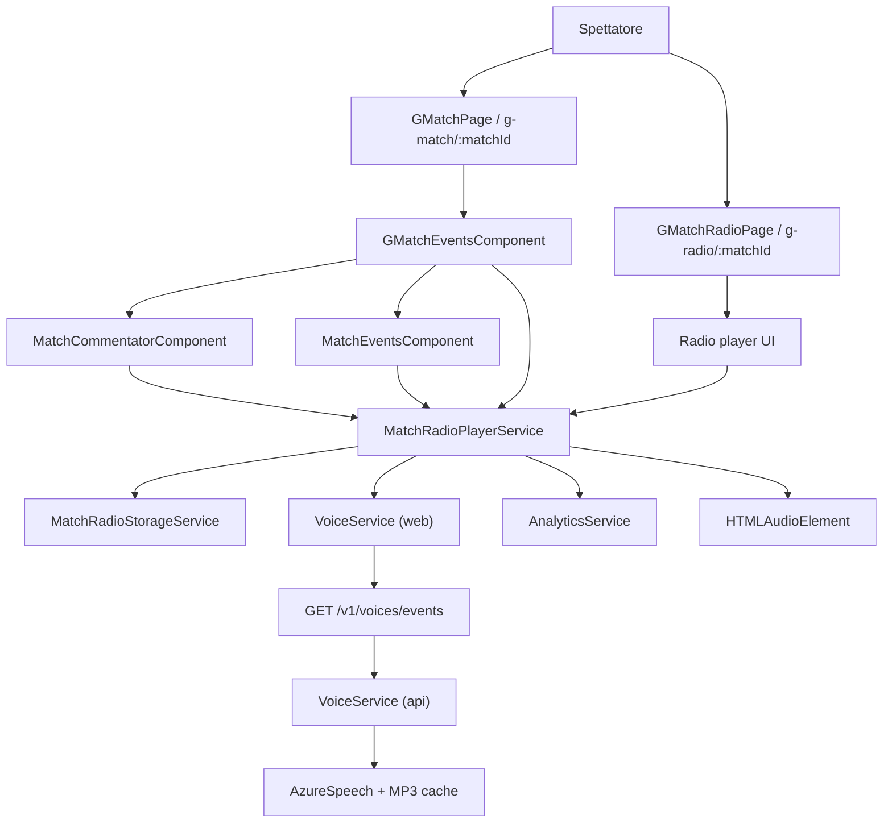
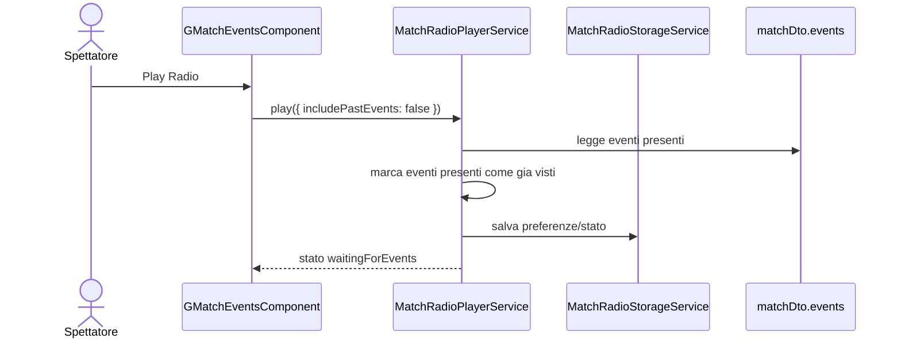
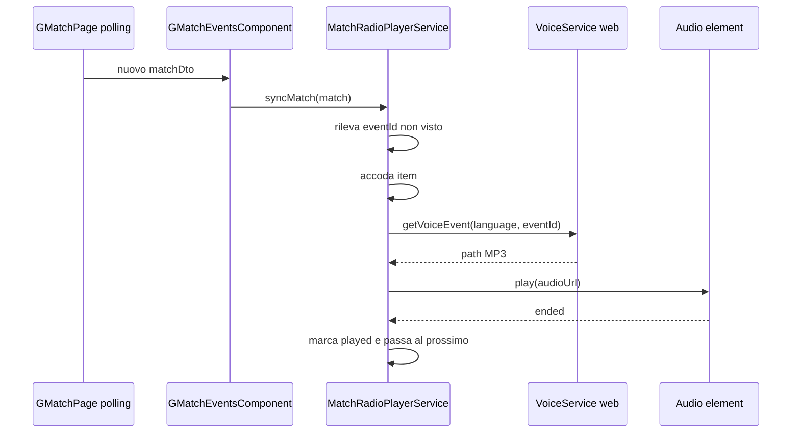
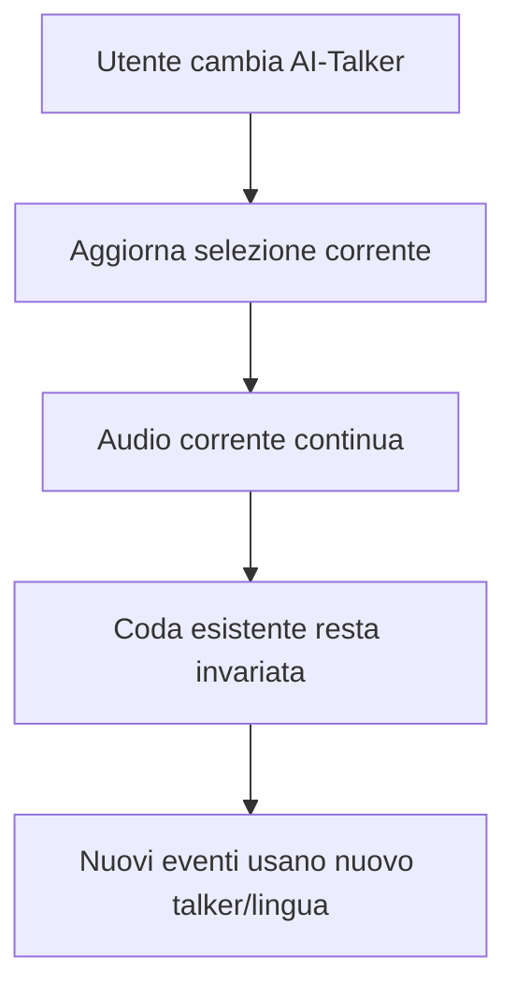

# Analisi architetturale - Modalita Radio Evento

## Contesto

Fonte funzionale: `projects/radio-evento/analysis/analisi-funzionale-radio-evento.md`.

La Modalita Radio Evento trasforma la riproduzione audio TTS gia disponibile per singolo evento in un'esperienza di ascolto continuo. La prima slice architetturale deve introdurre Auto Play Telecronaca nella pagina pubblica partita, mantenendo invariati workflow cronista, generazione eventi, TTS backend, database e assenza di AI realtime.

La soluzione si innesta sull'architettura esistente:

- pagina pubblica partita Angular: `src/RugbyRadioWeb/src/app/global/g-match/g-match.component.ts`
- wrapper eventi pubblici: `src/RugbyRadioWeb/src/app/global/g-match/g-match-events/g-match-events.component.ts`
- feed eventi comune: `src/RugbyRadioWeb/src/app/common/match-events/match-events.component.ts`
- selettore AI-Talker: `src/RugbyRadioWeb/src/app/common/match-commentator/match-commentator.component.ts`
- client TTS: `src/RugbyRadioWeb/src/app/services/voice.service.ts`
- endpoint TTS: `GET /v1/voices/events?language={language}&eventId={eventId}`

Decisione architetturale di base: l'MVP e frontend-first. Non introduce nuove API o nuove tabelle; usa `matchDto.events`, polling esistente della pagina partita e `VoiceService` per ottenere i path MP3.

## Driver architetturali

- Spettatore pubblico, senza login obbligatorio.
- Cronista invariato: nessun nuovo campo, pulsante o responsabilita.
- Audio generato da eventi e messaggi gia esistenti.
- Nessuno stream audio server-side.
- Nessuna AI realtime.
- Coda sequenziale con un solo audio alla volta.
- Default: ascolto solo dei nuovi eventi dall'attivazione.
- Opzione utente: ascolta dall'inizio.
- Cambio AI-Talker o lingua applicato solo agli eventi futuri.
- Persistenza locale su dispositivo di preferenze, coda e ultimo evento ascoltato.
- Eventi gia accodati poi eliminati o corretti: ignorati dalla coda esistente.
- Nessuna soglia funzionale massima di ritardo.
- Stop conserva l'ultimo stato locale fino a un nuovo Play.
- La coda persistita e limitata agli ultimi 5 item per match e viene ripulita dopo 10 giorni dall'ultimo elemento memorizzato.
- Pagina Radio pubblica condivisibile.
- Browser target: versioni moderne desktop/mobile, PWA/TWA; non supporto esteso a browser obsoleti.
- Analytics Firebase tramite `AnalyticsService.track`.

## Architettura proposta

La feature viene divisa in due livelli:

1. **Radio engine frontend**: servizio applicativo responsabile di coda, stato player, persistenza locale, deduplica, recupero path audio, riproduzione sequenziale e analytics.
2. **Superfici UI**: controlli radio integrati nella pagina partita per Slice 1 e route pubblica dedicata per Slice 2.



La responsabilita di riprodurre audio non deve restare duplicata nei componenti. `MatchEventsComponent.playAudio()` dovrebbe diventare un consumer del nuovo player service oppure delegare a un metodo condiviso, mantenendo la UX del click manuale esistente.

## Component design

### Frontend - servizi

#### `MatchRadioPlayerService`

Nuovo servizio consigliato:

`src/RugbyRadioWeb/src/app/services/match-radio-player.service.ts`

Responsabilita:

- mantenere stato runtime del player;
- ricevere snapshot successivi di `matchDto.events`;
- decidere quali eventi accodare;
- deduplicare per `eventId + talkerId + language`;
- richiedere path MP3 con `VoiceService.getVoiceEvent(language, eventId)`;
- costruire URL finale con `environment.audioUrl`;
- gestire un solo `HTMLAudioElement` attivo;
- emettere stato osservabile verso componenti UI;
- tracciare analytics;
- salvare preferenze, coda e ultimo evento ascoltato tramite storage locale;
- conservare lo stato locale su Stop fino a un nuovo Play;
- ignorare correzioni/eliminazioni sugli item gia accodati.

Stati minimi:

- `idle`
- `ready`
- `loadingAudio`
- `playing`
- `paused`
- `waitingForEvents`
- `errorRecoverable`
- `ended`

Metodi pubblici consigliati:

```typescript
configure(context: MatchRadioContext): void;
syncMatch(match: matchDto): void;
play(options?: { includePastEvents?: boolean }): void;
pause(): void;
resume(): void;
stop(): void;
changeCommentator(selection: RadioCommentatorSelection): void;
enqueueEvent(event: matchEventDto, source: 'past' | 'live'): void;
playSingleEvent(event: matchEventDto): void;
```

Note:

- `playSingleEvent` consente di riusare il servizio anche per il pulsante audio manuale.
- `changeCommentator` aggiorna la selezione per gli eventi futuri, senza mutare gli item gia in coda.
- `syncMatch` confronta gli eventi arrivati dal polling con un watermark locale; non rimuove item gia accodati se non compaiono piu nello snapshot successivo.
- `stop` conserva ultimo stato, preferenze, coda persistita e ultimo evento ascoltato fino al successivo `play`, che puo ripartire dal contesto aggiornato.

#### `MatchRadioStorageService`

Nuovo servizio consigliato:

`src/RugbyRadioWeb/src/app/services/match-radio-storage.service.ts`

Responsabilita:

- isolare `localStorage`;
- serializzare/deserializzare stato radio;
- proteggere da storage non disponibile, quota superata o JSON non valido;
- applicare namespace per match;
- mantenere solo gli ultimi 5 item di coda per match;
- memorizzare la data dell'ultimo elemento persistito;
- ripulire lo stato locale dopo 10 giorni dall'ultimo elemento memorizzato;
- offrire cleanup degli stati obsoleti.

Chiavi consigliate:

```text
rrl_radio_v1:{matchId}:preferences
rrl_radio_v1:{matchId}:queue
rrl_radio_v1:{matchId}:last_event
rrl_radio_v1:{matchId}:state
```

Persistenza locale:

- preferenze: `includePastEvents`, ultimo talker, lingua;
- coda: item serializzabili, senza oggetti `Audio`;
- ultimo evento ascoltato: `eventId`, `completedAt`, talker, lingua;
- stato player recuperabile: `paused`, `waitingForEvents`, eventuale item corrente.
- coda persistita: massimo 5 item piu recenti per match.
- cleanup: eliminazione dello storage radio del match dopo 10 giorni dalla data dell'ultimo item persistito.

Decisione consigliata: salvare solo dati tecnici necessari alla ripresa locale, non testi lunghi, commenti, dati personali o payload completi della partita. Gli eventi possono essere persistiti come riferimenti e metadati minimi.

### Frontend - componenti Slice 1

#### `GMatchEventsComponent`

Path esistente:

`src/RugbyRadioWeb/src/app/global/g-match/g-match-events/g-match-events.component.ts`

Responsabilita target:

- orchestrare `MatchCommentatorComponent`, `MatchEventsComponent` e controlli radio;
- passare al player service il match corrente quando cambia per polling;
- aggiornare il contesto radio con AI-Talker/lingua selezionati;
- mostrare controlli Play/Pause, stato, coda e opzione "ascolta dall'inizio";
- emettere analytics sourceView `g_match_events`.

Ragione: e il punto in cui oggi convivono selettore AI-Talker e feed eventi, quindi e il posto piu naturale per introdurre Auto Play senza spostare logica nel feed o nella pagina intera.

#### `MatchEventsComponent`

Path esistente:

`src/RugbyRadioWeb/src/app/common/match-events/match-events.component.ts`

Responsabilita target:

- continuare a mostrare feed, commenti, reazioni e audio manuale;
- delegare il click audio evento al `MatchRadioPlayerService.playSingleEvent`;
- visualizzare `isPlayingAudio` derivato dallo stato player, invece di creare direttamente `new Audio(...)`.

Migrazione raccomandata:

- mantenere firma UI invariata;
- sostituire gradualmente il corpo di `playAudio(eventId)` con delega al servizio condiviso;
- evitare due `HTMLAudioElement` concorrenti tra click manuale e radio.

#### `MatchCommentatorComponent`

Path esistente:

`src/RugbyRadioWeb/src/app/common/match-commentator/match-commentator.component.ts`

Responsabilita target:

- continuare a gestire selezione talker/lingua e preview;
- esporre selezione corrente a `GMatchEventsComponent`;
- notificare cambi selezione;
- lasciare al player service la decisione "solo eventi futuri".

Non deve gestire direttamente la coda.

### Frontend - Pagina Radio Slice 2

Nuovo componente consigliato:

`src/RugbyRadioWeb/src/app/global/g-match-radio/g-match-radio.component.ts`

Route proposta:

```typescript
{ path: 'g-radio/:matchId', component: GMatchRadioComponent }
```

Motivazione naming:

- coerente con il prefisso pubblico `g-*` gia usato da `g-match`, `g-channel`, `g-team`;
- URL breve e condivisibile;
- non interferisce con `g-match/:matchId`;
- esplicita l'intento di ascolto.

Alternative considerate:

- `/g-match/:matchId/radio`: semanticamente forte, ma richiede attenzione all'ordine route e rende l'URL piu lungo.
- `/radio/:matchId`: piu pulito lato marketing, ma meno allineato alla convenzione pubblica attuale.

Decisione consigliata: usare `/g-radio/:matchId` per la prima implementazione condivisibile.

Responsabilita pagina:

- caricare `matchDto` tramite `MatchService`, come `GMatchPage`;
- riusare `MatchRadioPlayerService`;
- mostrare layout essenziale da player: squadre, punteggio, minuto, copertina, talker, Play/Pause, stato;
- offrire link di ritorno a `/g-match/:matchId`;
- tracciare `trackPageView` e sourceView `g_radio`.

### Backend API

Per MVP e Slice 2 non sono richieste nuove API.

Contratti riusati:

- `GET /v1/matches/{matchId}` o endpoint esistente usato da `MatchService` per ottenere `matchDto` completo;
- `GET /v1/voices/events?language={language}&eventId={eventId}` per generare/recuperare MP3 evento;
- eventuali endpoint gia esistenti per follow/notifiche nelle fasi successive.

`VoicesV1Controller` continua a restituire `text/plain` con path relativo. La radio frontend e responsabile di costruire l'URL finale.

Non introdurre:

- endpoint streaming;
- endpoint "radio session";
- persistenza server-side della coda;
- tabelle per sessioni radio utente;
- nuovi job TTS realtime.
- hardening backend o rate limiting dedicato per `/v1/voices/events` in questa fase.

### Backend future phases

Fasi successive possono richiedere estensioni leggere:

- jingle globali RRL: preferire asset statici versionati o endpoint statico storage, non generazione dinamica;
- notifiche audio: riusare FCM e deep link verso `/g-radio/:matchId`;
- Radio Canale: valutare endpoint aggregato canale solo se le API esistenti non bastano a comporre cronologicamente partite/blog/contenuti.

## Data and APIs

### Modelli frontend nuovi

Interfacce suggerite:

```typescript
export interface MatchRadioContext {
	matchId: string;
	channelId?: string;
	isFullTime: boolean;
	sourceView: 'g_match_events' | 'g_radio';
}

export interface RadioCommentatorSelection {
	talkerId: string;
	language: string;
	isAudioAvailable: boolean;
}

export interface RadioQueueItem {
	queueKey: string;
	matchId: string;
	eventId: string;
	eventType?: number;
	minute?: number;
	talkerId: string;
	language: string;
	source: 'past' | 'live' | 'manual';
	status: 'pending' | 'loading' | 'ready' | 'playing' | 'played' | 'skipped' | 'failed';
	audioPath?: string;
	queuedAt: string;
	startedAt?: string;
	completedAt?: string;
	persistedAt?: string;
	errorReason?: string;
}

export interface MatchRadioState {
	status: 'idle' | 'ready' | 'loadingAudio' | 'playing' | 'paused' | 'waitingForEvents' | 'errorRecoverable' | 'ended';
	currentItem?: RadioQueueItem;
	queue: RadioQueueItem[];
	includePastEvents: boolean;
	lastListenedEventId?: string;
	lastPersistedQueueItemAt?: string;
	lastError?: string;
}
```

### Deduplica e ordinamento

Chiave coda:

```text
{eventId}:{talkerId}:{language}
```

Ordinamento:

- eventi passati: ordine cronologico, allineato all'ordine percepito dallo spettatore nella UI;
- eventi live: ordine cronologico di apparizione nel nuovo snapshot di polling;
- nessun salto per ritardo, per decisione funzionale.

Watermark consigliato:

- mantenere set locale degli `eventId` gia visti dopo il Play;
- se `includePastEvents = false`, inizializzare il set con gli eventi presenti al momento del Play e accodare solo eventi non presenti nei successivi snapshot;
- se `includePastEvents = true`, accodare subito gli eventi presenti e poi continuare con i nuovi.
- la codifica lingua/talker deve riusare la stessa logica gia esistente per visualizzare gli eventi o riprodurre l'audio; non introdurre un mapping parallelo.

### Persistenza locale

Storage owner: frontend web.

Backend owner: nessuno per la sessione radio.

Formato:

- JSON versionato (`version: 1`);
- scoped per `matchId`;
- tollerante a campi mancanti;
- massimo 5 item persistiti per match;
- data ultimo elemento persistito per abilitare cleanup;
- cleanup dopo 10 giorni dall'ultimo elemento persistito;
- validato in lettura prima di ripristinare.

Esempio:

```json
{
  "version": 1,
  "matchId": "match-id",
  "preferences": {
    "includePastEvents": false,
    "talkerId": "vox",
    "language": "it"
  },
  "lastListenedEventId": "event-id",
  "lastPersistedQueueItemAt": "2026-06-15T15:30:00.000Z",
  "queue": []
}
```

Sicurezza dati:

- non salvare token, dati account o credenziali;
- non salvare audio binario;
- non salvare path assoluti del filesystem backend;
- limitare dimensione coda persistita agli ultimi 5 item per match.

### API contracts invariati

`VoiceService.getVoiceEvent(language, eventId)` rimane il contratto primario:

```typescript
getVoiceEvent(language: string, eventId: string): Observable<string>
```

Il player deve normalizzare il risultato:

- rimuovere doppi apici;
- trim;
- concatenare con `environment.audioUrl`;
- gestire risposta vuota/null come errore recuperabile.

### Eventi analytics

Usare `AnalyticsService.track(eventName, params)`.

Eventi minimi:

- `radio_play`
- `radio_play_from_start_enabled`
- `radio_pause`
- `radio_resume`
- `radio_stop`
- `radio_event_play_start`
- `radio_event_play_complete`
- `radio_event_audio_error`
- `radio_queue_lag`

Parametri comuni consigliati:

- `match_id`
- `channel_id`
- `event_id`
- `event_type`
- `talker`
- `language`
- `source_view`
- `queue_length`
- `duration_seconds`
- `error_reason`

## Flussi tecnici

### Avvio radio con default solo nuovi eventi



### Nuovo evento da polling



### Cambio AI-Talker



## Non-functional considerations

### Performance

- Evitare prefetch aggressivo di tutti gli MP3: generare/caricare il prossimo item quando serve o con lookahead minimo.
- Deduplicare chiamate concorrenti verso `getVoiceEvent`.
- Limitare dimensione della coda persistita agli ultimi 5 item per match.
- Evitare change detection pesante: lo stato player puo essere esposto come `BehaviorSubject` o signal.

### Affidabilita

- Ogni errore audio e recuperabile.
- Fallimento di un item non ferma la radio.
- Se `Audio.play()` viene rifiutato dal browser, tornare a `ready` e richiedere nuova gesture.
- Se localStorage fallisce, la radio deve funzionare comunque senza persistenza.
- Se `VoiceService` restituisce path vuoto, marcare item `failed` e procedere.
- Lo Stop conserva lo stato locale fino a un nuovo Play.
- La pulizia degli stati locali obsoleti avviene dopo 10 giorni dall'ultimo elemento persistito.

### Privacy e sicurezza

- Sessione radio locale, non associata ad account.
- Nessun dato sensibile in localStorage.
- Nessuna nuova superficie auth.
- Gli endpoint TTS restano pubblici come oggi; rischio abuso gia esistente, non aumentato da nuove API.
- Non esporre configurazioni Azure o path filesystem.

### Accessibilita

- Controlli Play/Pause con label accessibili.
- Stato player comunicabile a screen reader.
- UI mobile con target touch adeguati.
- Pagina Radio con contenuto essenziale e contrasto coerente.

### Compatibilita browser

- HTMLAudioElement come base.
- Media Session API solo progressiva nella fase lock screen.
- Nessuna promessa di supporto browser obsoleti.
- Test manuali richiesti su browser moderni mobile/PWA/TWA.

### Osservabilita

- Analytics per uso e errori.
- Logging applicativo FE gia presente tramite `LoggingService` puo registrare passaggi tecnici non sensibili.
- Errori runtime possono passare da `ErrorHandlerService` dove coerente con pattern esistenti.

## Deployment and rollout

### Slice 1 - Auto Play nella pagina partita

Passi consigliati:

1. Aggiungere modelli radio frontend.
2. Aggiungere `MatchRadioStorageService`.
3. Aggiungere `MatchRadioPlayerService`.
4. Migrare `MatchEventsComponent.playAudio()` a usare il player service.
5. Aggiungere controlli radio in `GMatchEventsComponent`.
6. Collegare `syncMatch(match)` agli aggiornamenti da polling.
7. Aggiungere analytics.
8. Testare desktop e mobile moderni.

Rollout:

- opzionale feature flag frontend, ad esempio configurazione `environment.enableRadioEvent`;
- default off in sviluppo/staging se si vuole validare senza esporre subito;
- nessuna migrazione DB;
- nessuna modifica deployment backend.

### Slice 2 - Pagina Radio pubblica

Passi consigliati:

1. Creare `GMatchRadioComponent`.
2. Aggiungere route `g-radio/:matchId` in `app.routes.ts`.
3. Riusare `MatchService` per caricare match.
4. Riusare `MatchRadioPlayerService`.
5. Aggiungere link dalla pagina partita.
6. Tracciare page view e sourceView dedicato.

### Slice 3+ - evoluzioni

- Background/lock screen: aggiungere Media Session API in modo progressivo.
- Notifiche: deep link FCM verso `/g-radio/:matchId`.
- Jingle: asset statici globali RRL, accodati dal player con regole di distanza.
- Multi speaker: estendere `RadioQueueItem` o introdurre `RadioSegment` per piu clip per evento.
- Radio Canale: definire componente e fonte dati cronologica canale.

## Risks and trade-offs

| Rischio | Impatto | Mitigazione |
|---|---|---|
| Duplicazione player manuale/radio | Medio | Estrarre `MatchRadioPlayerService` e far delegare il click manuale. |
| Autoplay bloccato | Alto | Avvio solo dopo gesture Play, stato `ready` se `Audio.play()` fallisce. |
| Coda persistita obsoleta | Medio | Versionare storage, validare in lettura, salvare solo ultimi 5 item e ripulire dopo 10 giorni dall'ultimo elemento persistito. |
| TTS lento o fallito | Medio | Lookahead minimo, skip errore recuperabile, analytics `radio_event_audio_error`. |
| Eventi eliminati/corretti incoerenti | Basso/Medio | Decisione funzionale: ignorare modifiche retroattive sulla coda esistente. |
| Ritardo audio elevato | Medio | Nessuna soglia massima; mostrare coda/ritardo se utile, senza saltare eventi. |
| Browser background instabile | Alto | Trattare come fase separata con test reali su browser moderni. |
| LocalStorage indisponibile | Basso | Degradare a sessione in memoria. |
| Abuso endpoint TTS | Medio | Nessun hardening backend in questa fase; monitorare eventuali segnali prima di introdurre rate limiting dedicato. |

## Alternative considerate

### Coda backend

Descrizione: creare sessione radio server-side con stato coda e ultimo evento ascoltato.

Scartata per MVP perche:

- la persistenza richiesta e solo dispositivo;
- aggiunge API, storage e identita sessione;
- non serve al cronista o al backend;
- aumenta complessita senza valore immediato.

### Streaming audio server-side

Descrizione: backend compone e serve uno stream audio continuo.

Scartata perche:

- fuori scope funzionale;
- contraddice assenza di radio tradizionale/stream;
- richiede infrastruttura audio e gestione buffering;
- aumenta carico server.

### Logica radio dentro `MatchEventsComponent`

Descrizione: estendere il componente feed con coda e autoplay.

Scartata come direzione principale perche:

- il componente e gia responsabile di feed, reazioni, commenti, edit mode e audio manuale;
- la pagina radio dedicata avrebbe bisogno della stessa logica;
- renderebbe piu difficile evitare due player concorrenti.

## Requirement traceability

| Requisito funzionale | Decisione architetturale |
|---|---|
| FR-01, FR-02 | Controlli Play/Pause in `GMatchEventsComponent`, avvio solo da gesture utente. |
| FR-03 | `RadioCommentatorSelection` alimentata da `MatchCommentatorComponent` e `UserService`. |
| FR-04, FR-05, FR-06 | `MatchRadioPlayerService` con coda sequenziale e singolo `HTMLAudioElement`. |
| FR-07, FR-13 | Stati `failed`/`errorRecoverable`, skip item e analytics errore. |
| FR-08 | Chiave `{eventId}:{talkerId}:{language}`. |
| FR-09, FR-10 | Metodi `pause`, `resume`, `stop` nel player service; Stop conserva lo stato locale fino a nuovo Play. |
| FR-11 | `GMatchPage` mantiene polling e aggiornamento match; player riceve snapshot. |
| FR-12 | Stato `ended` dopo coda esaurita a partita terminata. |
| FR-14 | Controllo `isAudioAvailable` nella selezione talker. |
| FR-15 | Eventi `AnalyticsService.track`. |
| FR-16, FR-17 | Opzione `includePastEvents`, default `false`, watermark iniziale. |
| FR-18 | `changeCommentator` modifica solo selezione futura. |
| FR-19 | `MatchRadioStorageService` con localStorage scoped per match, ultimi 5 item persistiti e cleanup dopo 10 giorni. |
| FR-20 | Nuova route pubblica consigliata `/g-radio/:matchId`. |
| FR-21 | `syncMatch` non rimuove o ricostruisce item gia accodati. |

## Decisioni tecniche chiuse

- `matchDto.events` va trattato in ordine cronologico e la coda deve allinearsi all'ordine percepito dallo spettatore.
- Lo Stop conserva l'ultimo stato fino a un nuovo Play.
- Il localStorage persiste gli ultimi 5 item per match.
- Ogni item persistito deve avere una data; lo stato radio locale viene ripulito dopo 10 giorni dall'ultimo elemento memorizzato.
- La codifica lingua/talker deve essere la stessa gia esistente per visualizzare eventi o riprodurre audio; non introdurre mapping parallelo.
- Nessun hardening backend o rate limiting dedicato al momento.

## Open questions tecniche

Nessuna open question tecnica residua per l'MVP. Eventuali affinamenti su hardening backend, route marketing o politiche avanzate di background audio sono rimandati a fasi successive.

## Raccomandazione finale

Implementare prima Slice 1 con architettura frontend-first:

- nuovo `MatchRadioPlayerService`;
- nuovo `MatchRadioStorageService`;
- controlli radio in `GMatchEventsComponent`;
- delega del click audio manuale al servizio condiviso;
- nessun cambio API/backend/database.

Questa scelta massimizza riuso dell'architettura corrente, riduce rischio sul backend e lascia un percorso pulito per la Pagina Radio pubblica `/g-radio/:matchId`.
