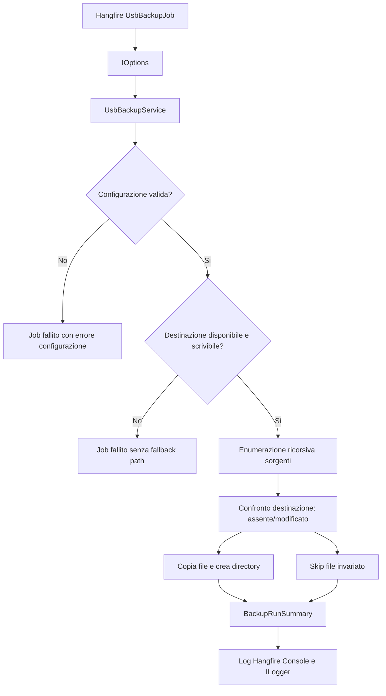

# TRRL-014 - Analisi architetturale backup su chiavetta USB

## Contesto

Questa analisi deriva da `TRRL-014-analisi-funzionale-backup-usb.md` e riguarda l'introduzione di un job Hangfire per copiare dati importanti di Rugby Radio Live verso una destinazione locale rimovibile, normalmente una chiavetta USB.

Il perimetro architetturale e' il progetto Hangfire `src/RugbyRadio/HF`, gia usato per manutenzione, backup database, generazione contenuti, sitemap, immagini e altri processi asincroni. Il job esistente `MaintenanceJob` esegue `sp_Maintenance`, `sp_Backup` e rimuove `.bak` obsoleti da `D:\Sql\Backup\`; contiene inoltre un TODO coerente con la card: copiare backup e storage su chiavetta e cloud, copiando solo file nuovi.

La soluzione proposta copre solo il backup locale USB. Backup cloud, cifratura, retention USB, checksum e notifiche restano fuori dallo scope MVP salvo decisione successiva.

## Driver funzionali

- Capacita' principale: eseguire da Hangfire una copia ricorsiva e incrementale da una o piu cartelle sorgenti verso una cartella destinazione.
- Attore operativo: operatore amministrativo RRL che configura percorsi, abilita il job e ne consulta l'esito dalla dashboard Hangfire.
- Sistema esecutore: processo HF, con accesso in lettura alle sorgenti e scrittura alla destinazione USB.
- Fonte dati primaria: filesystem locale del server/PC che esegue Hangfire.
- Destinazione: cartella locale esplicita, non dedotta automaticamente, normalmente montata su supporto USB.
- Regola chiave: la destinazione deve preservare una root distinguibile per ogni sorgente, evitando collisioni tra sottopercorsi uguali.
- Comportamento incrementale: copiare solo file assenti o modificati, confrontando almeno dimensione e timestamp di ultima modifica.
- Osservabilita': ogni esecuzione deve produrre riepilogo leggibile con sorgenti elaborate, file copiati, file saltati, errori, byte copiati e durata.
- Idempotenza operativa: riesecuzioni successive non devono ricopiare file invariati.
- Degrado controllato: destinazione assente o non scrivibile blocca il job; errori su singoli file non bloccano le altre copie.

## Architettura proposta

Implementare un job Hangfire dedicato, separato da `MaintenanceJob`, ad esempio `UsbBackupJob`. La separazione evita di legare la riuscita del backup SQL alla disponibilita' fisica della chiavetta USB e rende possibile schedulare o avviare manualmente il backup USB con cadenza autonoma.

Il job carica una configurazione tipizzata da `appsettings`, valida sorgenti e destinazione, scansiona ricorsivamente ogni sorgente, calcola per ciascun file un percorso relativo stabile, crea le directory di destinazione necessarie e copia solo i file assenti o modificati. L'esito viene scritto su Hangfire Console e nel logging applicativo gia integrato con Sentry per gli errori.

Flusso logico:



## Component design

### Hangfire job

Componente consigliato: `src/RugbyRadio/HF/Jobs/UsbBackupJob.cs`.

Responsabilita':

- Esporre `ExecuteAsync()` registrabile da Hangfire RecurringJobAdmin.
- Applicare `[AutomaticRetry(Attempts = 0)]` oppure un retry basso e consapevole. Per MVP e coerenza con `MaintenanceJob`, e' preferibile `Attempts = 0`, perche' la chiavetta assente non si risolve con retry immediati.
- Delegare la logica applicativa a un servizio dedicato, evitando filesystem logic direttamente nel job.
- Scrivere in Hangfire Console inizio, validazione, avanzamento sintetico e riepilogo finale.

### Servizio applicativo HF

Componenti consigliati:

- `src/RugbyRadio/HF/Services/IUsbBackupService.cs`
- `src/RugbyRadio/HF/Services/UsbBackupService.cs`

Responsabilita':

- Validare configurazione e percorsi.
- Normalizzare path sorgenti e destinazione con API filesystem .NET.
- Rifiutare la configurazione se `DestinationPath` e' dentro una sorgente.
- Rilevare collisioni tra root sorgenti con stesso nome o stessa chiave destinazione.
- Enumerare file ricorsivamente per singola sorgente.
- Decidere se copiare tramite confronto incrementale.
- Eseguire copia atomica per singolo file quando possibile: copia su file temporaneo nella directory destinazione e replace/move finale.
- Accumulare un riepilogo strutturato.
- Continuare sugli altri file in caso di errore puntuale.

### Configurazione

Componenti consigliati:

- `src/RugbyRadio/Lib/Settings/UsbBackupSettings.cs`, se si vuole mantenere le settings in `Lib.Settings` come `BlogSettings` e `SeoSitemapSettings`.
- In alternativa `src/RugbyRadio/HF/Settings/UsbBackupSettings.cs`, se la configurazione deve restare esclusiva del processo HF.

Configurazione minima:

```json
{
  "UsbBackup": {
    "Enabled": true,
    "DestinationPath": "E:\\RRL-Backup",
    "CopyOnlyChangedFiles": true,
    "PreserveSourceRootFolder": true,
    "FailOnMissingSource": false,
    "SourceFolders": [
      {
        "Name": "SqlBackup",
        "Path": "D:\\Sql\\Backup"
      },
      {
        "Name": "RugbyRadioStorage",
        "Path": "D:\\Web\\RugbyRadioStorage"
      }
    ]
  }
}
```

`Name` deve essere una chiave filesystem-safe e univoca. Usarla come root destinazione e' piu stabile del solo nome directory, perche' evita collisioni tra sorgenti diverse chiamate entrambe `Backup` o `Storage`.

Registrazione in `Program.cs`:

- `builder.Services.Configure<UsbBackupSettings>(builder.Configuration.GetSection(UsbBackupSettings.Node));`
- registrazione del servizio tramite scan esistente se vive sotto `HF.Services`.

### Osservabilita'

La soluzione deve usare:

- Hangfire Console, gia abilitata tramite `GlobalConfiguration.Configuration.UseConsole()`.
- `ILogger<UsbBackupJob>` o `ILogger<UsbBackupService>` per log applicativi.
- `SentryHangfireJobFilter`, gia registrato, per errori non gestiti.

Il servizio dovrebbe distinguere:

- errore bloccante di configurazione o destinazione;
- errore non bloccante su sorgente mancante con `FailOnMissingSource = false`;
- errore non bloccante su singolo file;
- esecuzione completata con errori parziali.

## Dati e API

Non sono richieste nuove API HTTP, nuove entity EF o modifiche a `AppDbContext`. Il dominio della feature e' operativo/filesystem, non applicativo.

Modelli dati runtime consigliati:

- `UsbBackupSettings`
- `UsbBackupSourceSettings`
- `UsbBackupRunSummary`
- `UsbBackupSourceSummary`
- `UsbBackupFileError`

Campi minimi di `UsbBackupRunSummary`:

- `StartedAt`
- `CompletedAt`
- `Duration`
- `SourcesConfigured`
- `SourcesProcessed`
- `SourcesMissing`
- `FilesScanned`
- `FilesCopied`
- `FilesSkipped`
- `FilesFailed`
- `BytesCopied`
- `Errors`

Contratto filesystem di destinazione:

```text
<DestinationPath>\
  <SourceName>\
    <relative path from source folder>
```

Esempio:

```text
E:\RRL-Backup\
  SqlBackup\
    RugbyRadio_20260528.bak
  RugbyRadioStorage\
    images\match\123.png
    audio\events\456.mp3
```

## Validazioni architetturali

Validazioni bloccanti:

- `Enabled = false`: il job termina come skipped controllato, senza errore.
- `DestinationPath` vuoto o non valido.
- destinazione inesistente.
- destinazione non scrivibile.
- lista sorgenti vuota.
- sorgente duplicata per `Name` o path normalizzato.
- destinazione contenuta dentro una sorgente.
- sorgente contenuta nella destinazione, se crea rischio di ricopiare backup precedenti.

Validazioni non bloccanti, se configurate:

- sorgente assente con `FailOnMissingSource = false`;
- file non leggibile o bloccato;
- file cancellato durante l'enumerazione;
- path troppo lungo o non supportato dal filesystem.

Decisione incrementale MVP:

- se il file destinazione non esiste, copiare;
- se dimensione diversa, copiare;
- se `LastWriteTimeUtc` sorgente e' piu recente della destinazione, copiare;
- altrimenti saltare.

Checksum post-copia e confronto hash sono deliberatamente differiti per contenere costo e complessita'.

## Non-functional considerations

### Sicurezza

Il job puo' copiare backup database e storage applicativo, quindi la dashboard Hangfire e la configurazione dei path sono superfici amministrative sensibili. La wiki segnala che `HangfireDashboard` e' esposta da `UseHangfireDashboard()` e che le regole auth non sono deducibili dai RAW: prima del rilascio va verificato che l'accesso alla dashboard sia limitato ad amministratori fidati.

I log non devono contenere contenuto dei file, stringhe lette dai backup o dati personali. Sono accettabili percorsi, nomi file, contatori e messaggi tecnici di I/O.

La cifratura della chiavetta non e' in scope MVP, ma resta un rischio rilevante se il supporto contiene dump DB o media non pubblici.

### Affidabilita'

Il job deve essere idempotente: una seconda esecuzione con sorgenti immutate non deve alterare l'esito ne' ricopiare inutilmente i file. La copia su file temporaneo riduce il rischio di lasciare un file destinazione corrotto se la chiavetta viene rimossa durante una copia.

La destinazione assente non deve produrre fallback automatici su dischi locali diversi, per evitare falsa sicurezza operativa.

### Performance

La scansione ricorsiva puo' essere costosa su storage grandi. L'MVP puo' usare enumerazione streaming (`Directory.EnumerateFiles`) invece di caricare tutti i file in memoria. La copia deve essere sequenziale o con parallelismo disabilitato di default, per non saturare I/O e worker Hangfire.

### Operativita'

Il riepilogo finale deve essere leggibile anche senza aprire Sentry. Un'esecuzione completata con errori parziali dovrebbe risultare evidente nel log Hangfire; la scelta se fallire il job in presenza di file error dipende dalla policy operativa. Raccomandazione MVP: se ci sono errori file, terminare con eccezione finale dopo il riepilogo, cosi' Hangfire evidenzia lo stato failed pur avendo copiato il copiabile.

### Manutenibilita'

Percorsi come `D:\Sql\Backup\` non devono essere hardcoded nel nuovo job. Possono comparire come default di configurazione locale, ma non nel codice. La lista delle sorgenti ufficiali va mantenuta in configurazione, perche' le cartelle importanti possono cambiare senza rilascio applicativo.

## Deployment e rollout

Sequenza consigliata:

1. Aggiungere `UsbBackupSettings` e registrazione in `Program.cs`.
2. Implementare `UsbBackupService` con unit test su path temporanei.
3. Implementare `UsbBackupJob` e collegarlo a Hangfire Console.
4. Aggiungere sezione `UsbBackup` in `appsettings.json` con `Enabled = false` o sorgenti placeholder non produttive.
5. Configurare manualmente in ambiente operativo destinazione e sorgenti reali.
6. Eseguire una run manuale su cartelle di test.
7. Eseguire una run controllata con `D:\Sql\Backup\` dopo conferma.
8. Abilitare schedulazione ricorrente solo dopo verifica della lettera disco USB e dei permessi del processo HF.

Compatibilita':

- Nessuna migrazione database.
- Nessuna modifica frontend.
- Nessuna modifica agli endpoint API.
- Nessuna dipendenza esterna nuova necessaria per MVP.

Rollback:

- impostare `UsbBackup:Enabled = false`;
- rimuovere o sospendere la recurring job dalla dashboard Hangfire;
- nessun rollback DB richiesto.

## Rischi e trade-off

| Tema | Decisione proposta | Trade-off |
|---|---|---|
| Job dedicato vs step in `MaintenanceJob` | Job dedicato | Piu componenti, ma schedulazione e fallimenti indipendenti dal backup SQL |
| Confronto timestamp/dimensione vs checksum | Timestamp/dimensione per MVP | Piu veloce e semplice, ma non rileva ogni corruzione |
| Configurazione `Name` per sorgente | Obbligatoria | Richiede configurazione piu esplicita, ma previene collisioni |
| Fallimento su errori parziali | Riepilogo e poi failed se `FilesFailed > 0` | Copia il possibile ma rende evidente che l'esecuzione non e' perfetta |
| Parallelismo copia | Sequenziale di default | Meno veloce, ma piu prevedibile su USB e meno impattante sulla macchina |

Rischi principali:

- chiavetta non cifrata con dati sensibili;
- lettera disco USB variabile tra riavvii o dispositivi;
- sorgenti molto grandi che allungano la durata del job;
- auth Hangfire non verificata;
- spazio insufficiente a meta' copia;
- confronto senza checksum non adatto a scenari di verifica forte.

Mitigazioni:

- documentare la procedura operativa di inserimento chiavetta e verifica lettera disco;
- usare `Enabled = false` finche' i path produttivi non sono confermati;
- mantenere log sintetico ma esplicito;
- differire checksum e retention come storie successive;
- verificare permessi e accesso dashboard prima del go-live.

## Tracciabilita' requisiti

| Requisito funzionale | Elemento architetturale |
|---|---|
| Definire lista sorgenti | `UsbBackupSettings.SourceFolders` |
| Definire destinazione USB | `UsbBackupSettings.DestinationPath` |
| Validare destinazione esistente e scrivibile | `UsbBackupService` validation phase |
| Validare sorgenti e gestire assenze | `UsbBackupService` + `FailOnMissingSource` |
| Scansione ricorsiva | `Directory.EnumerateFiles(source, "*", SearchOption.AllDirectories)` o equivalente |
| Preservare alberatura sorgente | mapping `<DestinationPath>\<SourceName>\<relative path>` |
| Copiare solo file assenti/modificati | confronto dimensione e `LastWriteTimeUtc` |
| Creare cartelle destinazione | servizio prima della copia file |
| Continuare dopo errore singolo file | gestione errori per-file e `UsbBackupFileError` |
| Riepilogo esecuzione | `UsbBackupRunSummary` su Hangfire Console e logger |
| Fallire su configurazione o destinazione invalida | eccezione bloccante in validazione |
| Osservabilita' Hangfire | `UseConsole()` gia presente + log nel job |

## Indicazioni implementative

File probabili:

- `src/RugbyRadio/HF/Jobs/UsbBackupJob.cs`
- `src/RugbyRadio/HF/Services/IUsbBackupService.cs`
- `src/RugbyRadio/HF/Services/UsbBackupService.cs`
- `src/RugbyRadio/Lib/Settings/UsbBackupSettings.cs` oppure `src/RugbyRadio/HF/Settings/UsbBackupSettings.cs`
- `src/RugbyRadio/HF/appsettings.json`
- eventuali test in progetto test esistente, se presente, o nuovo test project mirato per logica filesystem.

Pseudocodice di alto livello:

```csharp
public async Task<UsbBackupRunSummary> RunAsync(CancellationToken cancellationToken)
{
    var settings = options.Value;
    ValidateSettings(settings);
    EnsureDestinationWritable(settings.DestinationPath);

    foreach (var source in settings.SourceFolders)
    {
        foreach (var sourceFile in Directory.EnumerateFiles(source.Path, "*", SearchOption.AllDirectories))
        {
            var relativePath = Path.GetRelativePath(source.Path, sourceFile);
            var destinationFile = Path.Combine(settings.DestinationPath, source.Name, relativePath);

            if (!ShouldCopy(sourceFile, destinationFile, settings.CopyOnlyChangedFiles))
            {
                summary.FilesSkipped++;
                continue;
            }

            CopyFile(sourceFile, destinationFile);
            summary.FilesCopied++;
        }
    }

    return summary;
}
```

## Open questions

- Quali cartelle sono ufficialmente "dati importanti" per RRL?
- `D:\Sql\Backup\` deve essere sempre incluso nella prima configurazione produttiva?
- `D:\Web\RugbyRadioStorage\` deve essere incluso integralmente o filtrato per sottocartelle?
- La destinazione USB avra' sempre la stessa lettera disco?
- La schedulazione deve essere manuale, giornaliera o settimanale?
- In presenza di errori parziali su singoli file, il job deve risultare failed o succeeded-with-warnings?
- Serve cifratura del supporto o procedura esterna di protezione fisica?
- Serve retention sulla chiavetta per evitare saturazione?
- Deve essere prevista una notifica email/push in una card successiva?

## Fonti consultate

- `llm-wiki/artifacts/analysis/TRRL-014-analisi-funzionale-backup-usb.md`
- `llm-wiki/wiki/index.md`
- `llm-wiki/wiki/summary.md`
- `llm-wiki/wiki/architecture/Rugby Radio Live (architecture).md`
- `llm-wiki/wiki/backend/api/jobs/MaintenanceJob (api).md`
- `llm-wiki/wiki/backend/api/security/HangfireDashboard (api).md`
- `llm-wiki/wiki/frontend/web/pages/AdminMaintenancePage (web).md`
- `llm-wiki/wiki/data/schemas/AppDbContext (api).md`
- `src/RugbyRadio/HF/Jobs/MaintenanceJob.cs`
- `src/RugbyRadio/HF/Program.cs`
