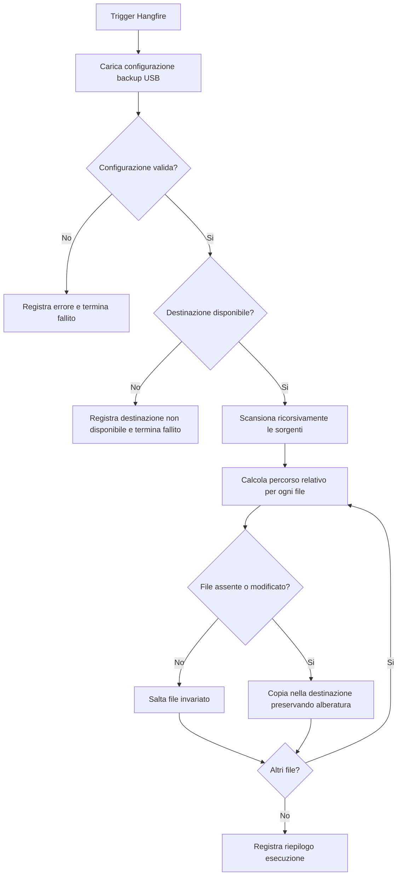

# TRRL-014 - Analisi funzionale backup su chiavetta USB

## Fonte richiesta

- Monday item: `TRRL-014`
- Titolo: `Job HF per eseguire backup su chiavetta USB.`
- Tipo: Feature
- Stato: Ready to start
- Descrizione: salvare su chiavetta USB dati importanti per RRL; creare job Hangfire con parametri di input per serie di folder da copiare e folder destinazione; le folder sorgenti devono essere scansionate ricorsivamente e nella destinazione va mantenuta l'alberatura delle folder sorgenti.

## Contesto di prodotto

Rugby Radio Live usa un'applicazione Hangfire per job ricorrenti di manutenzione, generazione contenuti, sitemap, immagini, audio e blog statico. Il job `MaintenanceJob` esegue gia manutenzione e backup database tramite stored procedure e cancella i `.bak` piu vecchi di 5 giorni da `D:\Sql\Backup\`.

Nel codice esiste un TODO coerente con questa card: copiare backup e storage su chiavetta e su cloud, copiando solo file nuovi. La richiesta `TRRL-014` copre la parte locale su chiavetta USB.

## Obiettivo

Permettere all'operatore RRL di eseguire, tramite Hangfire, una copia ricorsiva dei dati importanti verso una destinazione rimovibile USB, preservando la struttura delle cartelle sorgenti e riducendo il rischio di perdita dati in caso di guasto del server o del PC.

## Attori e stakeholder

- Operatore amministrativo RRL: configura cartelle sorgenti, destinazione e schedulazione del job.
- Sistema Hangfire: esegue il job, registra esito e dettagli operativi.
- Sistema operativo/filesystem: espone cartelle sorgenti e chiavetta USB.

## Scope

In scope:

- Job Hangfire configurabile per copiare una o piu cartelle sorgenti verso una cartella destinazione.
- Scansione ricorsiva delle cartelle sorgenti.
- Preservazione dell'alberatura per ogni cartella sorgente nella destinazione.
- Copia incrementale dei file nuovi o modificati.
- Log esecutivo leggibile da Hangfire Console o logging applicativo.
- Gestione controllata di destinazione assente, sorgente assente, errori di I/O e spazio insufficiente.

Out of scope:

- Backup cloud, citato nel TODO ma non richiesto dalla card.
- Cifratura dei file copiati, salvo decisione successiva.
- Versioning storico completo con snapshot multipli.
- Interfaccia frontend per configurare il backup.
- Ripristino automatico dei dati da chiavetta.

Deferred:

- Retention dei backup USB.
- Verifica checksum post-copia.
- Notifiche email o push su fallimento.
- Configurazione multi-profilo per piu chiavette o ambienti.

## Processo target

## Requisiti funzionali

- Il sistema deve permettere di definire una lista di cartelle sorgenti da includere nel backup USB.
- Il sistema deve permettere di definire una cartella destinazione, normalmente collocata su chiavetta USB o disco rimovibile.
- Il sistema deve validare che la destinazione esista e sia scrivibile prima di avviare la copia dei file.
- Il sistema deve validare ogni sorgente configurata e segnalare in log le sorgenti mancanti o non accessibili.
- Il sistema deve scansionare ogni cartella sorgente in modo ricorsivo.
- Il sistema deve preservare nella destinazione il nome della cartella sorgente e la sua alberatura interna.
- Il sistema deve copiare solo i file assenti o modificati rispetto alla destinazione.
- Il sistema deve creare le cartelle destinazione necessarie prima di copiare un file.
- Il sistema deve continuare la copia degli altri file quando un singolo file fallisce, salvo errori bloccanti sulla destinazione.
- Il sistema deve produrre un riepilogo con numero di sorgenti elaborate, file copiati, file saltati, errori, byte copiati e durata.
- Il sistema deve fallire il job quando la configurazione e invalida o la destinazione non e disponibile.
- Il sistema deve rendere l'esecuzione osservabile dalla dashboard Hangfire.

## Regole di business

- La chiavetta USB non deve essere considerata archivio primario: e una copia operativa di sicurezza.
- La destinazione deve mantenere cartelle sorgenti distinguibili per evitare collisioni tra sorgenti con sottopercorsi uguali.
- I file invariati non devono essere ricopiati a ogni esecuzione, per ridurre durata e usura del supporto USB.
- Le cartelle sorgenti devono essere esplicite in configurazione; non devono essere dedotte automaticamente dall'intero disco.
- I percorsi configurati devono essere trattati come percorsi locali del server che esegue Hangfire.

## Dati e configurazione

Campi minimi suggeriti per configurazione:

- `Enabled`: abilita o disabilita il job senza rimuovere la schedulazione.
- `DestinationPath`: cartella root della chiavetta USB.
- `SourceFolders`: lista di cartelle da copiare.
- `CopyOnlyChangedFiles`: default `true`.
- `PreserveSourceRootFolder`: default `true`.
- `FailOnMissingSource`: default `false`, per non bloccare tutto se una sorgente opzionale e assente.

Esempi di sorgenti candidate da confermare:

- `D:\Sql\Backup\` per i backup `.bak` gia prodotti da `MaintenanceJob`.
- `D:\Web\RugbyRadioStorage\` per immagini, audio e media statici, se considerati dati importanti.
- Output statici blog/SEO se non gia ricostruibili o pubblicati altrove.

## Permessi e sicurezza

- Il processo Hangfire deve avere permessi di lettura sulle sorgenti e scrittura sulla destinazione.
- La dashboard Hangfire e una superficie amministrativa: la sicurezza di accesso resta rilevante perche il job puo copiare dati potenzialmente sensibili.
- La configurazione non deve includere segreti.
- I log non devono stampare contenuto dei file o dati sensibili; sono accettabili percorsi, contatori ed errori tecnici.

## Errori e stati limite

- Destinazione non presente: job fallito con messaggio esplicito.
- Destinazione non scrivibile: job fallito con messaggio esplicito.
- Sorgente non presente: errore per sorgente; comportamento dipende da `FailOnMissingSource`.
- File bloccato da altro processo: errore sul file, job continua e riepiloga.
- Spazio insufficiente: job fallito o parzialmente fallito, con indicazione del file in corso.
- Collisione tra sorgenti con stesso nome cartella: da evitare con validazione o normalizzazione configurata.
- Percorso destinazione dentro una sorgente: configurazione non valida, per evitare ricorsione o crescita infinita.

## Criteri di accettazione

- Dato un job configurato con due cartelle sorgenti valide e una destinazione valida, quando il job viene eseguito, allora la destinazione contiene una cartella root per ogni sorgente e tutti i file interni sono copiati ricorsivamente.
- Dato un file gia copiato e non modificato, quando il job viene rieseguito, allora il file non viene ricopiato e viene conteggiato tra gli invariati o saltati.
- Dato un file modificato nella sorgente, quando il job viene rieseguito, allora il file nella destinazione viene aggiornato.
- Dato che la chiavetta USB non e montata o la destinazione non esiste, quando il job parte, allora termina in errore senza copiare file parziali in percorsi alternativi.
- Dato che una sorgente configurata non esiste e `FailOnMissingSource` e `false`, quando il job parte, allora registra l'errore della sorgente e continua con le altre sorgenti.
- Dato che la destinazione si trova dentro una delle sorgenti, quando il job valida la configurazione, allora rifiuta l'esecuzione.
- Dato un errore di copia su un singolo file, quando altri file sono copiabili, allora il job continua e il riepilogo finale indica almeno un errore.
- Al termine di ogni esecuzione, Hangfire mostra un esito leggibile con contatori principali e durata.

## Non funzionali

- Performance: la copia deve evitare lavoro inutile sui file invariati.
- Affidabilita: il job deve essere idempotente rispetto a riesecuzioni successive.
- Osservabilita: ogni esecuzione deve produrre log diagnostici sufficienti a capire cosa e stato copiato e cosa no.
- Manutenibilita: percorsi e opzioni devono essere configurabili, non hardcoded nel job.
- Operativita: il job deve degradare in modo leggibile quando la chiavetta non e inserita.

## Dipendenze

- Hangfire e Hangfire RecurringJobAdmin gia presenti nel progetto HF.
- Accesso filesystem locale dal processo HF.
- Configurazione applicativa HF per percorsi e opzioni.
- Eventuale decisione su quali cartelle RRL siano "dati importanti".

## Rischi

- La copia su USB puo fallire silenziosamente se i log non sono consultati: valutare notifica successiva.
- Una chiavetta non cifrata puo esporre dati se smarrita.
- File grandi o molti file possono allungare il job e occupare la worker queue.
- Percorsi hardcoded gia presenti nel sistema possono rendere fragile il deploy su ambienti diversi.
- Senza checksum, confronto su timestamp e dimensione puo non rilevare tutti i casi di corruzione.

## Domande aperte

- Quali cartelle sono ufficialmente "dati importanti" per RRL?
- La cartella `D:\Sql\Backup\` deve essere sempre inclusa?
- La cartella `D:\Web\RugbyRadioStorage\` deve essere inclusa integralmente o solo alcune sottocartelle?
- La destinazione USB avra sempre la stessa lettera disco?
- Il job deve essere separato da `MaintenanceJob` o integrato come step successivo al backup SQL?
- E richiesta cifratura del contenuto copiato?
- E richiesta una retention sulla chiavetta?
- Quale frequenza operativa e desiderata: giornaliera, settimanale o manuale da dashboard?

## MVP consigliato

Implementare un job Hangfire dedicato, configurabile da `appsettings`, che copia incrementale e ricorsiva da `SourceFolders` a `DestinationPath`, preserva l'alberatura, valida i percorsi critici e scrive un riepilogo in Hangfire Console. Includere inizialmente `D:\Sql\Backup\` come sorgente candidata solo dopo conferma, e lasciare il backup cloud fuori da questa card.

## Fonti consultate

- Monday item `TRRL-014`, board `Tasks`.
- `llm-wiki/wiki/index.md`
- `llm-wiki/wiki/summary.md`
- `llm-wiki/wiki/backend/api/jobs/MaintenanceJob (api).md`
- `llm-wiki/wiki/backend/api/security/HangfireDashboard (api).md`
- `llm-wiki/wiki/data/schemas/AppDbContext (api).md`
- `src/RugbyRadio/HF/Jobs/MaintenanceJob.cs`
- `src/RugbyRadio/HF/Program.cs`
