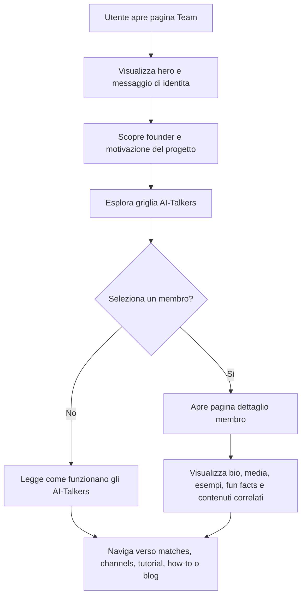

# Analisi funzionale - Meet the Team

## Fonte

- Idea di partenza: `llm-wiki/artifacts/ideas/idea-meet-team.md`
- Risposte di prodotto ricevute il 2026-06-06: URL principale `/team`, rimozione pura di `/ai-talkers`, pagine statiche, naming dettagli `/team-{slug}.html`, tutti gli AI-Talkers attuali in prima release, tutte le lingue attuali, contenuti founder placeholder, link founder LinkedIn, slot AdSense `2308901507`, commentary inventati in base allo stile del Talker.
- Contesto progetto: `llm-wiki/wiki/index.md`, `llm-wiki/wiki/summary.md`
- Pagine wiki consultate: `Rugby Radio Live (product)`, `AI-Talker (concept)`, `Cronista (actor)`, `Spettatore (actor)`, `HomePage (web)`, `GMatchesPage (web)`, `GChannelsPage (web)`, `Public Sitemap (article)`, `Static Blog SEO Headers (article)`, `Product Updates 2026 (article)`
- Stato corrente osservato: `src/RugbyRadioWeb/src/assets/static/ai-talkers.html`, `src/RugbyRadioWeb/src/sitemap.xml`

## Sintesi

La feature trasforma l'attuale pagina pubblica `ai-talkers.html` da pagina descrittiva degli AI-Talkers a hub editoriale "Meet the Team" di Rugby Radio Live.

Il nuovo hub deve presentare il progetto come un ecosistema composto da fondatore, AI-Talkers, storia, tono, contenuti media e collegamenti verso le aree pubbliche del prodotto. L'obiettivo funzionale non e introdurre una nuova capacita di telecronaca, ma aumentare fiducia, memorabilita, SEO, condivisione social, monetizzazione e profondita narrativa attorno a un concetto gia documentato come elemento di branding.

## Obiettivi di business

- Rendere evidente che Rugby Radio Live nasce da una storia reale e da un bisogno concreto: seguire e condividere partite di rugby amatoriale e giovanile.
- Posizionare gli AI-Talkers come personaggi riconoscibili del mondo Rugby Radio Live, non solo come opzioni tecniche.
- Creare nuove pagine pubbliche indicizzabili con contenuti unici, condivisibili e collegabili da home, tutorial, blog, canali e partite.
- Aumentare fiducia e curiosita negli utenti anonimi prima che visitino partite, canali o tutorial.
- Aggiungere inventario AdSense coerente con le pagine statiche pubbliche gia presenti.

## Attori e stakeholder

| Attore | Bisogno | Impatto atteso |
|---|---|---|
| Spettatore anonimo | Capire chi c'e dietro la piattaforma e perche gli AI-Talkers sono rilevanti | Maggiore fiducia e navigazione verso partite/canali |
| Spettatore autenticato | Riconoscere e scegliere lo stile narrativo preferito | Maggiore affezione ai Talkers e ritorno sul prodotto |
| Cronista | Presentare il progetto a famiglie, amici e community del club | Maggiore facilita nel condividere RRL |
| Fondatore/prodotto | Raccontare motivazione, identita e roadmap emotiva del progetto | Migliore branding e credibilita |
| Motori di ricerca/social network | Ricevere pagine con metadati, contenuti strutturati e immagini coerenti | Migliore indicizzazione e anteprime social |

## Scope

### In scope

- Nuova pagina index pubblica Meet the Team con URL canonico `/team`.
- Rimozione pura del vecchio URL `/ai-talkers`, senza mantenerlo come alias o pagina tecnica.
- Sezione founder con foto, biografia breve, motivazione, link social e CTA a pagina dettaglio.
- Sezione AI-Talkers con griglia di card, immagine, nome, stile, descrizione breve, lingue supportate e CTA.
- Sezione "Come funziona" che chiarisce il ruolo degli AI-Talkers: non sostituiscono il cronista, trasformano eventi partita in commenti con stile/persona.
- Collegamenti verso Matches, Channels, Tutorial, How It Works e Blog.
- Pagine dettaglio statiche per il founder e per tutti gli AI-Talkers presenti nella pagina attuale: Vox, Nitro, Beat Breaker, Orfeo, Zoe, Maul, Zorblax, Elixir, Bulldog, El Mangiapolenta, Trasteverino, Newsly, Brushy.
- Naming dei file dettaglio nel formato `/team-{slug}.html`.
- Contenuti in tutte le lingue gia presenti nella pagina statica attuale.
- Foto e bio founder inizialmente compilati con placeholder e testi di esempio, da sostituire prima del rilascio in produzione.
- Link social founder limitato a LinkedIn: `https://www.linkedin.com/in/stefanobonfiglio/`.
- Esempi di commentary inventati editorialmente in base allo stile del singolo Talker.
- Meta tag, canonical, Open Graph, Twitter Card, sitemap e valutazione structured data.
- Tracciamento analytics degli eventi principali.
- Inserimento AdSense su index e pagine dettaglio usando lo slot `2308901507`.

### Out of scope

- Modifica della logica di generazione delle frasi AI-Talker.
- Generazione AI realtime durante il click evento.
- Nuove funzionalita di scelta Talker dentro la pagina partita, salvo link informativi.
- Sistema CMS completo per gestire profili, media e traduzioni.
- Login, commenti o interazioni social native nelle pagine Team.
- Route Angular indicizzabili per la pagina Team e i dettagli membro.

### Deferred

- Gallerie estese e video per ogni membro.
- Sostituzione dei placeholder founder con foto e bio ufficiali prima del rilascio in produzione.
- A/B test su URL, hero, CTA e posizionamenti pubblicitari.
- Structured data avanzati oltre `Person` e `ProfilePage`.

## Stato corrente

La pagina `ai-talkers.html` e una pagina statica pubblica con:

- Meta title, description, canonical, Open Graph, Twitter Card e immagine social.
- Contenuti localizzati in piu lingue.
- Griglia di AI-Talkers gia esistenti: Vox, Nitro, Beat Breaker, Orfeo, Zoe, Maul, Zorblax, Elixir, Bulldog, El Mangiapolenta, Trasteverino, Newsly, Brushy.
- Immagini avatar da storage pubblico.
- Video YouTube per molti Talkers.
- Slot AdSense esistente.

La pagina non deve restare come esperienza pubblica separata: la nuova esperienza Team su `/team` deve sostituirla e `/ai-talkers` deve essere rimosso senza alias o redirect.

La wiki definisce l'AI-Talker come personaggio virtuale che determina stile e lingua delle frasi di telecronaca generate per gli eventi. La stessa wiki specifica una decisione importante: non c'e chiamata AI realtime al click evento; le frasi sono gia pronte e salvate nel database.

## Target experience

L'utente apre la pagina Team da home, footer, pagina statica o link social. Nella prima schermata capisce immediatamente che Rugby Radio Live ha una storia, una persona dietro e personaggi AI con identita proprie. Da li puo:

- scoprire il fondatore;
- esplorare i Talkers;
- capire il loro ruolo nella telecronaca;
- aprire una pagina dettaglio;
- continuare verso partite, canali, tutorial, how-to o blog.

## Flusso funzionale

## Requisiti funzionali

### Pagina index Team

| ID | Requisito |
|---|---|
| MT-001 | Il sistema deve esporre una pagina pubblica Meet the Team accessibile senza autenticazione. |
| MT-001A | Il sistema deve rendere `/team` l'URL pubblico canonico della pagina Meet the Team. |
| MT-002 | La pagina deve mostrare un hero con titolo, sottotitolo, immagine o visual coerente e CTA verso le sezioni founder e AI-Talkers. |
| MT-003 | La pagina deve includere una sezione founder con foto, biografia sintetica, motivazione del progetto, link LinkedIn e CTA alla pagina dettaglio founder; in MVP foto e bio possono essere placeholder esplicitamente sostituibili prima del rilascio in produzione. |
| MT-004 | La pagina deve includere una griglia di AI-Talkers con immagine, nome, stile, descrizione breve, lingue supportate e CTA alla pagina dettaglio. |
| MT-005 | La pagina deve spiegare che gli AI-Talkers trasformano eventi partita in commenti con personalita diverse e non sostituiscono il cronista. |
| MT-006 | La pagina deve collegare le aree pubbliche Matches, Channels, Tutorial, How It Works e Blog. |
| MT-007 | La pagina deve gestire stati di contenuto mancante mostrando solo sezioni o CTA disponibili, senza link rotti. |
| MT-008 | La pagina deve mantenere coerenza con il comportamento pubblico delle pagine statiche esistenti e non richiedere login. |
| MT-009 | Il sistema deve rimuovere la pagina pubblica separata `/ai-talkers` senza alias o redirect. |
| MT-010 | La pagina index deve essere disponibile in tutte le lingue gia presenti nella pagina `ai-talkers.html`. |

### Pagine dettaglio membro

| ID | Requisito |
|---|---|
| MT-101 | Il sistema deve esporre una pagina pubblica statica dedicata per il founder e per ogni AI-Talker gia presente nella pagina attuale. |
| MT-102 | Ogni pagina dettaglio deve mostrare hero con immagine principale, nome, slogan e ruolo. |
| MT-103 | Ogni pagina dettaglio founder deve raccontare storia personale, nascita del progetto, motivazioni e obiettivi futuri; nell'MVP puo usare testo e immagine di esempio in attesa dei contenuti ufficiali. |
| MT-104 | Ogni pagina dettaglio AI-Talker deve raccontare personalita, stile comunicativo e caratteristiche distintive. |
| MT-105 | Ogni pagina dettaglio deve poter mostrare galleria immagini, video, esempi di commentary, fun facts e contenuti correlati. |
| MT-106 | Ogni pagina dettaglio deve offrire link di ritorno all'index Team e link verso altri membri. |
| MT-107 | Le pagine dettaglio devono essere create come pagine statiche, non come route Angular indicizzabili. |
| MT-108 | Le pagine dettaglio devono essere disponibili in tutte le lingue gia presenti nella pagina statica attuale. |
| MT-109 | Gli esempi di commentary devono essere inventati editorialmente in base allo stile del Talker e non devono essere presentati come frasi generate in tempo reale. |
| MT-110 | Le pagine dettaglio devono usare il naming statico `/team-{slug}.html`. |

### SEO e social

| ID | Requisito |
|---|---|
| MT-201 | Ogni pagina deve avere title, meta description e canonical coerenti con l'URL pubblico scelto. |
| MT-202 | Ogni pagina deve avere Open Graph e Twitter Card con titolo, descrizione e immagine dedicata. |
| MT-203 | Le pagine pubblicate devono essere incluse nella sitemap pubblica o nella sitemap statica generata. |
| MT-204 | La pagina founder deve valutare structured data `Person` e `ProfilePage`. |
| MT-205 | Le pagine AI-Talker devono valutare structured data coerenti con profili/personaggi evitando affermazioni non verificabili. |
| MT-206 | Il vecchio URL `/ai-talkers` non deve restare come pagina tecnica separata, alias o redirect; deve essere rimosso dalla navigazione e dalla sitemap. |

### Analytics

| ID | Requisito |
|---|---|
| MT-301 | Il sistema deve tracciare la visualizzazione della pagina Team. |
| MT-302 | Il sistema deve tracciare il click su una card membro. |
| MT-303 | Il sistema deve tracciare il play video quando tecnicamente rilevabile. |
| MT-304 | Il sistema deve tracciare click verso matches, channels, tutorial, how-to e blog. |
| MT-305 | Gli eventi analytics devono distinguere index Team e pagine dettaglio. |

### Monetizzazione

| ID | Requisito |
|---|---|
| MT-401 | La pagina index deve prevedere almeno uno slot AdSense coerente con le pagine statiche esistenti. |
| MT-402 | Le pagine dettaglio devono prevedere posizionamenti AdSense non invasivi, ad esempio sotto hero, meta pagina o fine pagina. |
| MT-403 | Le pagine Team devono usare lo slot AdSense `2308901507` per index e dettagli. |

## Business rules

- Gli AI-Talkers devono essere presentati come personaggi virtuali di stile e lingua, non come telecronisti umani.
- Il testo "non sostituiscono il match reporter" deve essere esplicito o chiaramente equivalente.
- Le promesse funzionali devono rispettare la decisione architetturale documentata: nessuna AI realtime al click evento.
- Founder e AI-Talkers possono convivere nello stesso hub, ma i ruoli devono restare distinti.
- I contenuti delle pagine dettaglio devono essere pubblicati solo se hanno almeno nome, ruolo, immagine, descrizione e metadati SEO.
- Per il founder, nell'MVP sono ammessi immagine e testo di esempio fino alla sostituzione con contenuti ufficiali.
- Il founder deve esporre solo il link LinkedIn `https://www.linkedin.com/in/stefanobonfiglio/` come link social.
- Tutti gli AI-Talkers presenti nella pagina attuale devono avere pagina dettaglio nella prima release.
- Gli esempi di commentary possono essere inventati, ma devono rispettare lo stile dichiarato del Talker.
- I link verso contenuti esterni o social devono aprire destinazioni valide e riconoscibili.
- Le pagine devono rimanere fruibili da utenti anonimi.

## Data e contenuti richiesti

| Area | Campi minimi |
|---|---|
| Membro | slug, nome, tipo membro, ruolo, slogan, descrizione breve, descrizione estesa, stato pubblicazione |
| Media | immagine card, immagine hero, alt text, eventuali immagini galleria, URL video |
| AI-Talker | stile, lingue supportate, esempi di commentary inventati, fun facts, contenuti correlati |
| Founder | foto placeholder, bio placeholder, motivazione placeholder, link LinkedIn, pagina personale placeholder se necessaria, obiettivi futuri placeholder |
| SEO | title, meta description, canonical, og title, og description, og image, twitter image |
| Analytics | page_id, member_id, member_type, CTA target, video_id |
| Ads | pagina, posizione slot, ad slot id `2308901507` |

## Permission matrix

| Capacita | Anonimo | Autenticato | Admin/editor |
|---|---:|---:|---:|
| Visualizzare Team index | Si | Si | Si |
| Visualizzare dettaglio membro pubblicato | Si | Si | Si |
| Aprire link verso partite/canali/tutorial/blog | Si | Si | Si |
| Accedere a contenuti non pubblicati | No | No | Si, se esiste tooling editoriale |
| Modificare contenuti Team | No | No | Da definire |

## Acceptance criteria

### Index Team

- Given un utente anonimo, when apre l'URL Team, then vede hero, founder, AI-Talkers, come funziona e link di scoperta senza richiesta di login.
- Given un utente o crawler, when apre `/team`, then la pagina restituisce il contenuto canonico Meet the Team.
- Given un utente o crawler, when tenta di raggiungere `/ai-talkers`, then non deve ricevere una pagina pubblica, un alias o un redirect verso `/team`.
- Given un AI-Talker presente nella pagina attuale, when la pagina carica la griglia, then la card mostra nome, immagine, stile, descrizione, lingue e CTA alla relativa pagina dettaglio.
- Given un utente seleziona "Meet Stefano", when clicca la CTA, then viene aperta la pagina dettaglio founder.
- Given un utente clicca un link verso Matches o Channels, when la navigazione parte, then l'evento analytics registra target e origine Team.
- Given una lingua supportata dalla pagina attuale, when l'utente seleziona o riceve quella lingua, then la pagina Team mostra contenuti coerenti in quella lingua.

### Pagine dettaglio

- Given un membro pubblicato, when l'utente apre la pagina statica dettaglio del membro sotto l'esperienza `/team`, then vede nome, ruolo, slogan, immagine e contenuto esteso.
- Given un membro pubblicato, when l'utente apre `/team-{slug}.html`, then vede la pagina dettaglio statica del membro.
- Given ciascuno degli AI-Talkers attuali, when la release e pubblicata, then esiste una pagina dettaglio statica raggiungibile dalla griglia.
- Given un dettaglio AI-Talker, when l'utente legge la sezione "Example Commentary", then gli esempi sono coerenti con la personalita descritta.
- Given un dettaglio AI-Talker, when l'utente legge un esempio di commentary, then il testo non dichiara che l'esempio sia stato generato in realtime.
- Given un video presente, when l'utente avvia il video, then il play viene tracciato se l'integrazione lo consente.
- Given una pagina dettaglio, when l'utente arriva da social, then l'anteprima usa titolo, descrizione e immagine del membro.
- Given la pagina founder in MVP, when il contenuto ufficiale non e ancora disponibile, then immagine e bio placeholder sono presenti e facili da sostituire.
- Given la pagina founder in MVP, when sono presenti link social, then viene mostrato solo il link LinkedIn `https://www.linkedin.com/in/stefanobonfiglio/`.

### SEO e sitemap

- Given una pagina Team pubblicata, when viene ispezionata, then contiene title, description, canonical, OG e Twitter Card.
- Given una pagina dettaglio pubblicata, when viene generata o aggiornata la sitemap, then l'URL compare nella sitemap pubblica o statica prevista.
- Given la rimozione pura di `/ai-talkers`, when viene aggiornata la sitemap, then `/ai-talkers` non compare piu come URL pubblico indicizzato.

### Monetizzazione

- Given la pagina Team caricata, when AdSense e disponibile, then lo slot previsto viene renderizzato senza coprire contenuti o CTA.
- Given la pagina Team o una pagina dettaglio caricata, when AdSense e disponibile, then lo slot `2308901507` viene usato per la monetizzazione.

## Analytics proposal

| Evento | Trigger | Parametri minimi |
|---|---|---|
| `team_page_view` | Caricamento index Team | `language`, `page_path` |
| `team_member_click` | Click card/CTA membro | `member_id`, `member_type`, `source_section` |
| `team_detail_view` | Caricamento dettaglio membro | `member_id`, `member_type`, `language` |
| `team_video_play` | Avvio video | `member_id`, `video_id`, `provider` |
| `team_discovery_click` | Click verso area prodotto | `target_area`, `target_url`, `source_page` |
| `team_social_click` | Click social founder o share | `member_id`, `platform` |

## Non-functional requirements

- Le pagine devono essere responsive e mobile-first, in linea con l'uso da campo e con le pagine pubbliche esistenti.
- Le immagini devono avere dimensioni ottimizzate, alt text e caricamento lazy dove opportuno.
- I video incorporati non devono bloccare il rendering iniziale.
- La pagina deve restare leggibile anche se script analytics, YouTube o AdSense non si caricano.
- Le URL pubbliche devono essere stabili per SEO e condivisione social.
- I contenuti devono evitare affermazioni che possano confondere AI-Talkers con persone reali.
- Le pagine devono essere statiche e indicizzabili come gli altri contenuti pubblici statici del sito.

## Edge case e stati vuoti

- Contenuti founder ufficiali non pronti: usare placeholder espliciti e sostituibili.
- Video mancante: nascondere la sezione video per quel membro.
- Galleria mancante: non mostrare placeholder vuoti.
- Lingua non disponibile: usare lingua predefinita o contenuto fallback definito.
- Immagine non disponibile: usare immagine fallback con alt text coerente.
- URL storico `/ai-talkers`: non deve restare nella navigazione o nella sitemap e non deve essere mantenuto come alias o redirect.

## Rischi

- Rischio SEO durante la rimozione pura di `/ai-talkers`, perche eventuali URL gia indicizzati non riceveranno redirect verso `/team`.
- Rischio di contenuti placeholder troppo generici per il founder se non vengono marcati e sostituiti prima della comunicazione ufficiale.
- Rischio di contenuti incompleti perche tutti gli AI-Talkers attuali devono avere pagina dettaglio nella prima iterazione.
- Rischio di promessa funzionale eccessiva se gli AI-Talkers vengono descritti come generativi in realtime.
- Rischio performance se molte immagini e iframe YouTube vengono caricati insieme.
- Rischio manutenzione se i profili restano hardcoded e crescono numero, lingue e varianti media.

## Decisioni prese

1. URL canonico della nuova esperienza: `/team`.
2. Vecchio URL `/ai-talkers`: rimozione pura, senza alias o redirect.
3. Primo set di pagine dettaglio: founder e tutti gli AI-Talkers nella pagina attuale.
4. Lingue richieste per MVP: tutte le lingue gia presenti nella pagina statica attuale.
5. Tipo pagina dettaglio: pagine statiche, non route Angular indicizzabili.
6. Naming pagine dettaglio: `/team-{slug}.html`.
7. Contenuti founder: usare placeholder visual e testi di esempio, da sistemare prima del rilascio in produzione.
8. Link social founder: solo LinkedIn `https://www.linkedin.com/in/stefanobonfiglio/`.
9. Slot AdSense per index e dettagli: `2308901507`.
10. Esempi di commentary: inventati editorialmente in base allo stile del Talker.

## Punti operativi residui

- Compilare o sostituire prima della produzione i placeholder visual e testuali del founder.
- Definire gli slug finali dei membri, rispettando il formato file `/team-{slug}.html`.
- Verificare che `/ai-talkers` sia rimosso da file statici, navigazione, sitemap e link interni.

## MVP consigliato

### Slice 1 - Hub pubblico

- Pubblicare la pagina statica `/team` con hero, founder placeholder, griglia di tutti gli AI-Talkers attuali, "Come funziona", discovery links, SEO/social tag, AdSense e analytics base.
- Rimuovere `/ai-talkers` come pagina pubblica separata, senza alias o redirect.
- Inserire `/team` nella sitemap statica e rimuovere `/ai-talkers`.

### Slice 2 - Dettagli completi prima release

- Pubblicare pagine dettaglio statiche nel formato `/team-{slug}.html` per Stefano e per tutti gli AI-Talkers attuali: Vox, Nitro, Beat Breaker, Orfeo, Zoe, Maul, Zorblax, Elixir, Bulldog, El Mangiapolenta, Trasteverino, Newsly, Brushy.
- Ogni pagina include hero, bio/personality, un video o immagine, esempi commentary, fun facts, related content, SEO/social tag e analytics.
- Ogni pagina e disponibile nelle lingue gia presenti nella pagina attuale.

### Slice 3 - Espansione contenuti

- Sostituire i placeholder founder con foto e bio ufficiali.
- Aggiungere gallerie e contenuti social piu ricchi.
- Monitorare GA, Search Console e AdSense per decidere ottimizzazioni.

## Tracciabilita verso prodotto esistente

- La feature rafforza il concetto documentato di AI-Talker come elemento di branding.
- La feature resta coerente con il prodotto: RRL e una piattaforma per telecronache testuali di rugby amatoriale e giovanile, non una radio audio live.
- La feature supporta gli attori esistenti: spettatore e cronista.
- La feature si collega alle aree pubbliche gia documentate: partite, canali, home, tutorial/how-to e blog statico.
- La feature richiede attenzione alla sitemap pubblica e agli header SEO, gia trattati come area strategica nella wiki.
